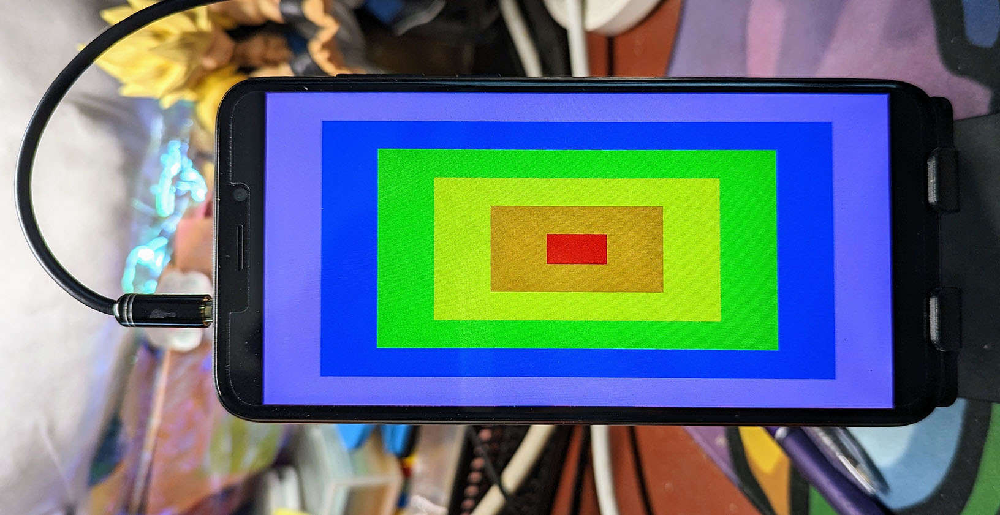
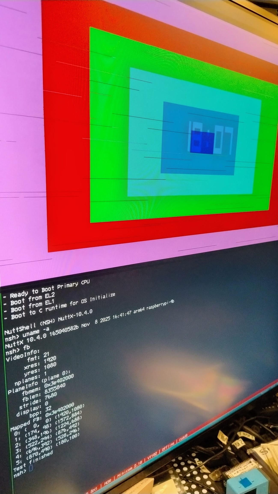

==================
``fb`` Framebuffer
==================

This application is a simple demonstration which serves to test the
:doc:`framebuffer character driver
</components/nxgraphics/framebuffer_char_driver>`.

The program interacts with the framebuffer through the interfaces described in
the linked page in order to render a very simple image consisting of 6
concentric, colourful rectangles. Note that between each rectangle, the program
sleeps for 500 milliseconds. Rectangle are drawn from outermost to innermost, in
descending size.

   The image displayed by the ``fb`` example, shown on the Pinephone. Credit to
   Lup Yuen Lee.

.. warning::

   The application renders directly to the framebuffer provided by the character
   driver. On some devices, the entire rendering operation may not be complete
   in time for the video synchronization, causing screen tearing or skips. This
   is the case for the :doc:`Raspberry Pi 4B
   </platforms/arm64/bcm2711/boards/raspberrypi-4b/index>`, and the results can
   be seen below.

   The framebuffer example output, but with skipped pixels.

Skipping issues like this one can generally be avoided by rendering to a
separate buffer first, and then copying that buffer to the framebuffer in one
operation.

Feature support
---------------

The application ignores the pixel format provided by the framebuffer character
driver, and only inspects the 'bits per pixel' (depth) field. Currently, only
the following bits per pixel are supported (with the corresponding formats
assumed):

* 1: Monochrome
* 8: RGB_332
* 16: RGB_565
* 24: RGB
* 32: ARGB

The program supports different features depending on the characteristics of the
framebuffer driver. If the framebuffer requires ``FB_UPDATE``, this example
behaves accordingly.

If the framebuffer supports ``FB_OVERLAY``, then the application also supports
getting and displaying the overlay information.

If the virtual y resolution is double that of the y resolution when the
framebuffer is initially queried, the application will attempt to use
double-buffer rendering by fetching a second framebuffer corresponding to the
``display + 1``, where ``display`` is the display number that was associated
with the first framebuffer.
