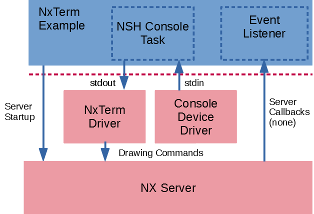

================================================
``nxterm`` Display NuttShell (NSH) as NX Console
================================================

This directory contains yet another version of the NuttShell (NSH). This version
uses the NX console device defined in ``include/nuttx/nx/nxterm.h`` for output.
the result is that the NSH input still come from the standard console input
(probably a serial console). But the text output will go to an NX winbdow.
Prerequisite configuration settings for this test include:

- ``CONFIG_NX=y`` – NX graphics must be enabled
- ``CONFIG_NXTERM=y`` – The NX console driver must be built
- ``CONFIG_DISABLE_MQUEUE=n`` – Message queue support must be available.
- ``CONFIG_DISABLE_PTHREAD=n`` – pthreads are needed
- ``CONFIG_NX_BLOCKING=y`` – pthread APIs must be blocking
- ``CONFIG_NSH_CONSOLE=y`` – NSH must be configured to use a console.

The following configuration options can be selected to customize the test:

- ``CONFIG_EXAMPLES_NXTERM_BGCOLOR`` – The color of the background. Default
  Default is a darker royal blue.
- ``CONFIG_EXAMPLES_NXTERM_WCOLOR`` – The color of the window. Default is a light
  slate blue.
- ``CONFIG_EXAMPLES_NXTERM_FONTID`` – Selects the font (see font ID numbers in
  ``include/nuttx/nx/nxfonts.h``).
- ``CONFIG_EXAMPLES_NXTERM_FONTCOLOR`` – The color of the fonts. Default is black.
- ``CONFIG_EXAMPLES_NXTERM_BPP`` – Pixels per pixel to use. Valid options include
  ``2``, ``4``, ``8``, ``16``, ``24`` and ``32``. Default is ``32``.
- ``CONFIG_EXAMPLES_NXTERM_TOOLBAR_HEIGHT`` – The height of the toolbar. Default:
  ``16``.
- ``CONFIG_EXAMPLES_NXTERM_TBCOLOR`` – The color of the toolbar. Default is a
  medium grey.
- ``CONFIG_EXAMPLES_NXTERM_MINOR`` – The NX console device minor number. Default
  is ``0`` corresponding to ``/dev/nxterm0``.
- ``CONFIG_EXAMPLES_NXTERM_DEVNAME`` – The quoted, full path to the NX console
  device corresponding to ``CONFIG_EXAMPLES_NXTERM_MINOR``. Default:
  ``/dev/nxterm0``.
- ``CONFIG_EXAMPLES_NXTERM_PRIO`` – Priority of the NxTerm task. Default:
  ``SCHED_PRIORITY_DEFAULT``.
- ``CONFIG_EXAMPLES_NXTERM_STACKSIZE`` – Stack size allocated for the NxTerm task.
  Default: ``2048``.
- ``CONFIG_EXAMPLES_NXTERM_STACKSIZE`` – The stacksize to use when creating the NX
  server. Default: ``2048``.
- ``CONFIG_EXAMPLES_NXTERM_CLIENTPRIO`` – The client priority. Default: ``100``.
- ``CONFIG_EXAMPLES_NXTERM_SERVERPRIO`` – The server priority. Default: ``120``.
- ``CONFIG_EXAMPLES_NXTERM_LISTENERPRIO`` – The priority of the event listener
  thread. Default: ``80``.

Initialization
==============

NX Server
---------

The NxTerm example initializes the NX Server through the following steps:

* Calls ``boardctl(BOARDIOC_NX_START, 0)`` to start the NX server, then
* Calls ``nx_connect()`` to connect to the NX server.
* It also creates a separate thread at entry ``nxterm_listener()`` to listen for
  NX server events.

Window Creation
---------------

The Nxterm Example then initializes the Windows:

* Calls ``nxtk_openwindow()`` to create a bordered window,
* Calls ``nxtk_setposition()`` and ``nxtk_setsize()`` to position the window in
  the display,
* Calls ``nxtk_opentoolbar()`` to create a toolbar sub-window on the main window
  (This toolbar window is not used by the example, it is just for illustration).

A more practical use case for, say, a handheld device with a single NxTerm display
would be to use the background window.  The background is a window like any other
with these special properties:  It cannot be moved; it is always positioned at (0,0).
It cannot be resized; it is always the full size of the display.  And it cannot be
raised, it is always the lowest windows in the z-axis.

NxTerm Driver
-------------

And binds the Nxterm driver to the permit drawing in the window. This is done when it:

* Calls ``boardctl(BOARDIOC_NXTERM, (uintptr_t)&nxcreate)``

Console Task
------------

Finally, it sets up the NxTerm and starts the console task:

* Opens the NxTerm driver,
* It then re-directs stdout and stderr to the NxTerm driver. This will cause all
  standard output to be rendered into the main windows, and
* It then starts a separate console daemon that inherits the re-directed output
  and exits.

Character I/O
=============

Normal Keyboard Input
---------------------

Keyboard and mouse inputs are received by the application through window callbacks,
just like with the Xorg X server.  Some listener needs to inject the keyboard input
via ``nx_kbdin()`` (``libs/libnx/nx_kbdin.c``) which sends a message containing the
keyboard input to the NX server.  The NX server will forward that keyboard input to
the window that has focus.

The Window application listens for NX server events by calling ``nx_eventhandler()``
(``libs/libnx/nx_eventhandler``) on another listener thread.  If the window has
focus when the key press is entered, ``nx_eventhandler()`` will forward the key
press information to the registered window event handler.

In ``apps/examples/nxterm``, ``nxterm_listener.c`` is the thread that drives
``nx_eventhandler()``. The window NX keyboard callback is the function ``nxwndo_kbdin()``
in ``nxterm_wndo.c``.  That callback function is just a stub that writes the keyboard
data to stdout.  It is a stub because keyboard input is not received from the NxTerm
in this example.

The apps/examples/nxterm/ Kludge
--------------------------------

``apps/examples/nxterm`` does not do things in the normal way.  NSH does not receive
keyboard input from NX; it gets keyboard input directly from the default stdin which
is probably not a keyboard at all but more likely the host PC serial console. This is
okay because only a single window is used and that example does not need the help of
NX to select the window that has focus.

Re-direction of stdout and stderr
---------------------------------

stdin in and stderr are re-directed to the NxTerm character driver in ``nxterm_main.c``
just before starting the console task.  That logic looks like this:

.. code-block:: C

   /* Now re-direct stdout and stderr so that they use the NX console driver.
    * Note that stdin is retained (file descriptor 0, probably the serial
    * console).
    */

    printf("nxterm_main: Starting the console task\n");

    fflush(stdout);
    fflush(stderr);

    fclose(stdout);
    fclose(stderr);

    dup2(fd, 1);
    dup2(fd, 2);

Note that stdin is not re-directed in this example!  This means that keyboard
input does not come from the NxTerm driver but, rather, from whatever input
device was previously configured for stdin, often a serial console.

There is a configuration option that determines if NxTerm receives keyboard
input or not:  ``CONFIG_NXTERM_NXKBDIN``,  For this NxTerm example, that option can be disabled.

What Is BOARDIOC_NXTERM_IOCTL and Where Is It Used?
---------------------------------------------------

The ``boardctl()`` command ``BOARDIOC_NXTERM_IOCTL`` allows an application to
inject keyboard data into NX for forwarding to the window with focus.
In ``apps/examples/nxterm``, the ``BOARDIOC_NXTERM_IOCTL`` is only called for the
case of a redraw event. A redraw event may happen when a window above the current
window is moved and the text is exposed.

If you use only a single window for the NxTerm example, then that window will
always have focus. It will always have focus and will never be redrawn and the
``BOARDIOC_NXTERM_IOCTL`` will never be used (Unless, perhaps, you choose to implement
pop-up error messages or menus on top of the NxTerm window).

Redraw callbacks will not be received even in a multi-window configuration if you
use per-window frame buffers, either. In that case, the system will automatically
redraw windows as needed using the per-window frame buffer shadow memory.  This is
controlled by the option ``CONFIG_NX_RAMBACKED``. This option is recommended for
performance reasons if you have sufficient memory to support it.

Character Data Flow:  Keyboard to Display
=========================================

Character Data Flow in apps/examples/nxterm
-------------------------------------------

* Character input driver receives input
* NSH receives input on stdin and processes it (stdin is not redirected)
* Data is output to stdout (redirected to the NxTerm driver)

In this simple, single-window case, ``BOARDIOC_NXTERM_IOCTL`` will never be used.

Character Data Flow in the Generic Window Case
----------------------------------------------

See, for an example, ``apps/graphics/nxwm/src/cnxterm.cxx``.  In this case, the
behavior will change, depending on the selection of ``CONFIG_NXTERM_NXKBDIN``:
If ``CONFIG_NXTERM_NXKBDIN`` is not selected, then the behavior will be similar
to ``apps/examples/nxterm``; stdin will not be redirected an keyboard input will
come directly from the the system console.

But is ``CONFIG_NXTERM_NXKBDIN`` is select, NSH's stdin will be re-redirected to
the to the NxTerm character driver. Keyboard input will arrive on stdin from the
NxTerm driver rather than from the system console.  The following sequence describes
the keyboard input in this latter case:

* Character input driver receives input,
* Some keyboard listener thread receives input and injects it into NX via
  a call to ``nx_kbdin()``,
* NX sends an event to the registered ``kbdin()`` method of the window that has
  focus, providing the keyboard input to the window application.  In this case,
  the window application of interest is the window bound to the NxTerm character
  driver by the application.  The ``kbin()`` callback provides the focused keyboard
  input to the NxTerm driver via ``boardctl(BOARDIOC_NXTERM_IOCTL, (uintptr_t)&iocargs)``,
* The NxTerm character driver receives keyboard data, buffers it, and provides
  that keyboard input for the next read operation,
* NSH receives input on stdin which was re-directed to the NxTerm character driver.
  NSH processes the input, and
* ,NSH outputs data to stdout which was re-directed to the NxTerm character driver.
