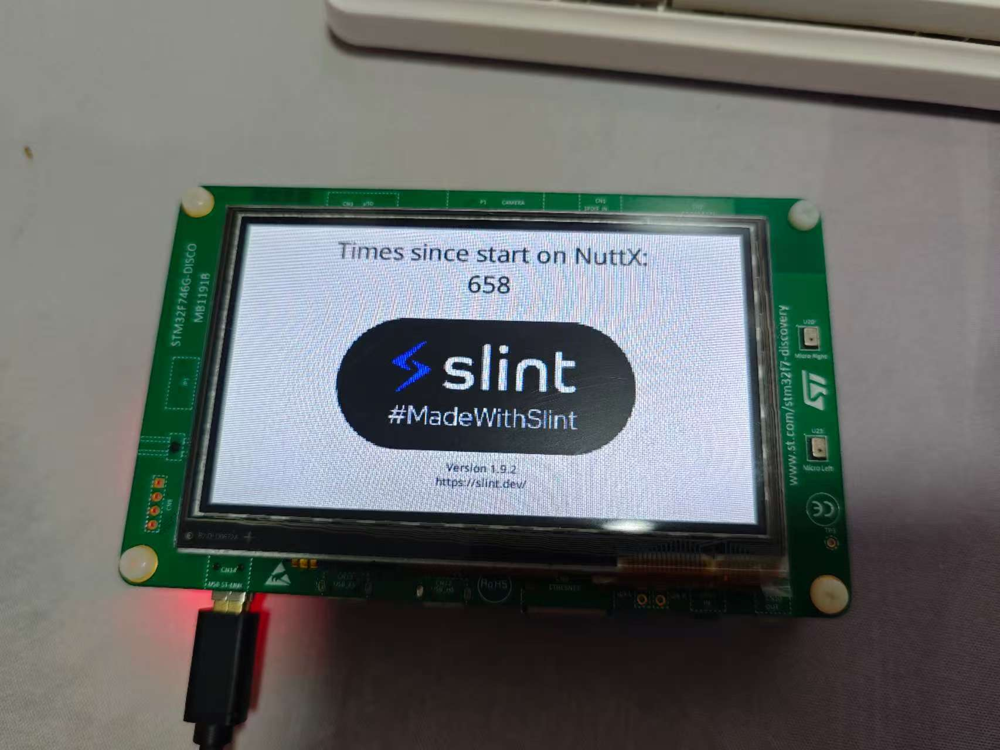

==================================
`slint` UI Framework Example
==================================

This example demonstrates how to use the Slint UI framework in a NuttX environment with Rust. It shows how to create a simple GUI application that:

- Displays a counter that increments every second
- Uses NuttX's framebuffer device for rendering
- Handles touchscreen input
- Implements a software renderer for the Slint UI

Key Features
------------

1. **Framebuffer Integration**
   - Opens and configures the NuttX framebuffer device (/dev/fb0)
   - Supports RGB565 pixel format
   - Implements a custom line buffer provider for efficient rendering

2. **Touchscreen Input**
   - Opens and reads from the touchscreen device (/dev/input0)
   - Handles touch press, move, and release events
   - Maps touch coordinates to UI elements

3. **Slint UI Framework**
   - Creates a simple window with a text element showing a counter
   - Uses Slint's software renderer backend
   - Implements a custom NuttX platform adapter
   - Handles window events and animations

4. **Rust Integration**
   - Uses nuttx crate to interface with NuttX devices
   - Implements safe Rust abstractions for framebuffer and touchscreen
   - Demonstrates Rust's memory safety features with unsafe blocks

The example shows how modern Rust UI frameworks can be used in embedded systems while maintaining compatibility with NuttX's device model.

This serves as a foundation for building more complex Rust GUI applications in NuttX that need to handle graphical output and touch input.
