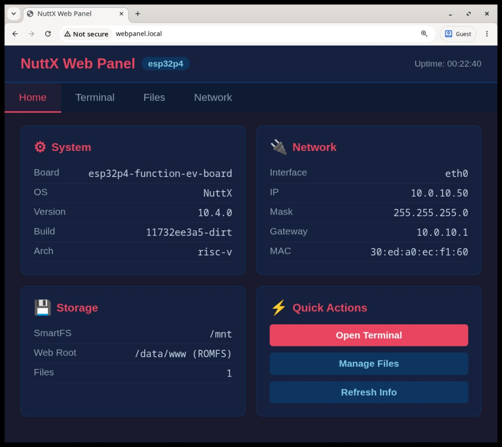

.. _nuttx-webpanel:

====================================
``webpanel`` NuttX Web Panel
====================================

This guide explains how to run the NuttX Web Panel.

The NuttX Web Panel is a self-hosted web interface for device management. It
provides a browser-based dashboard with system information, an NSH terminal,
file management on SmartFS, and network configuration. The application is
implemented in ``apps/examples/webpanel/`` and is inspired by consumer IoT
management panels.

   NuttX Web Panel home page on ESP32-P4 (``esp32p4-function-ev-board:webpanel``)

How Does it Work?
=================

The web panel combines several NuttX components:

1. **THTTPD** serves static HTML/CSS/JavaScript from a ROMFS image mounted at
   ``/data/www``.
2. **BINFS** and **UNIONFS** expose built-in CGI programs under
   ``/data/www/cgi-bin`` for dynamic requests (system info, file listing,
   upload, and DHCP renew).
3. **libwebsockets** provides a WebSocket server (TCP port 8080) that spawns
   an NSH session over a POSIX pseudo-terminal for the browser terminal.
4. **mDNS** advertises the HTTP service as ``webpanel.local`` (``_http._tcp``
   on port 80). The ``mdnsd_event`` application starts the mDNS daemon when
   an IP address is assigned.
5. **SmartFS** on SPI flash (mounted at ``/mnt``) stores user files, including
   uploaded Python scripts.

On boot, ``/etc/init.d/rcS`` (enabled via ``CONFIG_ETC_ROMFS``) sets the
hostname to ``webpanel``, starts ``webpanel`` in the background, and launches
``mdnsd_event`` to register the HTTP service once DHCP completes.

Building and Running the Web Panel
==================================

ESP32-P4-Function-EV-Board
--------------------------

For this example, use the ESP32-P4-Function-EV-Board with Ethernet connected
to the board PHY port. The ``esp32p4-function-ev-board:webpanel`` defconfig
requires **16 MB** flash (see ``CONFIG_ESPRESSIF_FLASH_16M``).

This defconfig includes the CPython interpreter and produces a large firmware
image. A full clean build may take several minutes.

Build and flash the board with the following commands:

.. code:: console

   $ cd nuttx
   $ make distclean
   $ ./tools/configure.sh esp32p4-function-ev-board:webpanel
   $ make -j$(nproc) flash ESPTOOL_PORT=/dev/ttyACM0

On **v1.5.2**, use ``/dev/ttyACM0`` (USB Serial/JTAG) for flashing. UART0
(GPIO37/GPIO38) remains the serial console; attach an external USB-to-UART
adapter to monitor NSH while the web panel runs.

After flashing, connect the Ethernet cable and wait for DHCP. Then open a browser
on the same LAN:

.. code:: text

   http://webpanel.local

If mDNS is unavailable, check the assigned address on the serial console:

.. code:: console

   nsh> ifconfig
   eth0    Link encap:Ethernet HWaddr 30:ed:a0:ec:f1:60 at RUNNING mtu 1500
           inet addr:10.0.10.50 DRaddr:10.0.10.1 Mask:255.255.255.0

and browse to ``http://<inet-addr>`` instead.

The interface provides four sections:

* **Home** — live system and network information
* **Terminal** — browser NSH shell over WebSocket
* **Files** — browse, upload, and run scripts on ``/mnt``
* **Network** — interface details and DHCP lease renewal

Python scripts can be uploaded through the **Files** tab and executed from the
**Terminal** tab or via the **Run** button for ``.py`` files. See also the
:doc:`Python Interpreter </applications/interpreters/python/index>` page.

Configuration
=============

The web panel is enabled with ``CONFIG_EXAMPLES_WEBPANEL``. The defconfig also
enables the dependencies selected by that option, including THTTPD,
libwebsockets (server mode), BINFS, UNIONFS, and pseudo-terminal support.

Key Kconfig options (under ``Application Configuration`` →
``Examples`` → ``Web Panel for device management``):

* ``CONFIG_EXAMPLES_WEBPANEL_NETIF`` — network interface name (default
  ``eth0``)
* ``CONFIG_EXAMPLES_WEBPANEL_WS_PORT`` — WebSocket terminal port (default
  ``8080``)
* ``CONFIG_EXAMPLES_MDNS_SERVICE`` / ``CONFIG_EXAMPLES_MDNS_SERVICE_PORT`` —
  mDNS service type and port advertised by ``mdnsd_event``
