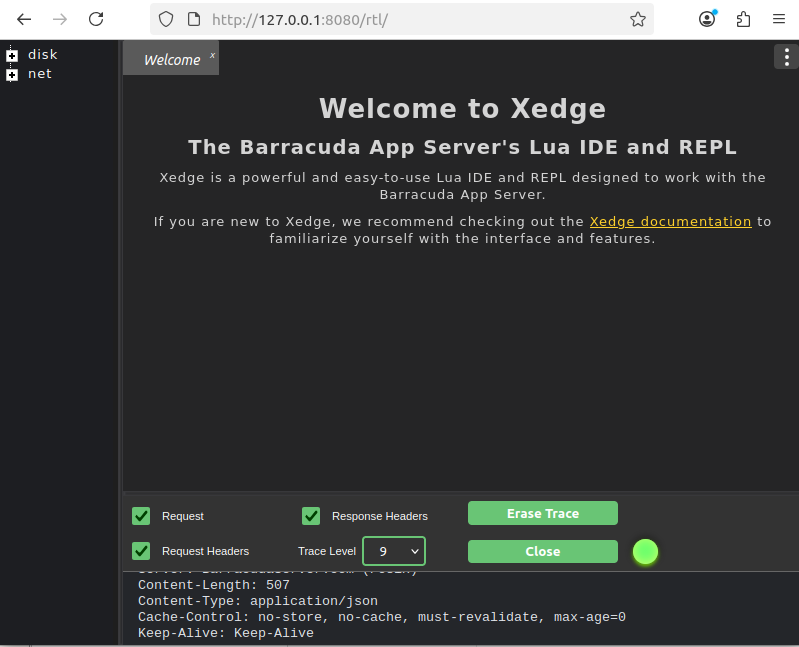

``xedge_demo`` a lightweight Lua-based web framework for building secure, real-time IoT applications
====================================================================================================

`Xedge <https://realtimelogic.com/products/xedge/>`_ is a robust IoT and web framework that is designed for microcontrollers. It is based on the industrial-grade Barracuda Application Server, designed for seamless OEM integration. Xedge accelerates embedded firmware development by providing a flexible, Lua-based environment and a full stack of industrial-strength protocols, including:

- OPC UA
- Modbus
- MQTT
- SMQ
- WebSockets
- HTTP/HTTPS

This Xedge port for NuttX comes pre-configured and requires:

- TCP/IP v4 and v6 support
- File System support
- 2 MB RAM allocated statically in ``xedge_demo/xedge_main.c``
- QEMU
- Toolchain aarch64-none-elf (gcc-arm-11.2-2022.02 or higher)

.. note::
   These instructions set up Xedge in **development mode**. Xedge supports many configuration options that differ between development and production builds. For production settings and optimization, refer to the general Xedge build instructions (details below).

Why Use Lua and Xedge in Embedded Systems
------------------------------------------

Great Lua developers don't treat it as a "better C"; they treat it as a complement. Lua is an extension language, which means it's designed to work alongside C, not replace it. Smart embedded programmers use C for performance-critical, low-level code and Lua for high-level business logic, such as processing sensor data and managing secure cloud connectivity.

Writing embedded business logic purely in C often means hundreds of lines of boilerplate code to manage memory, handle complex APIs, and handle errors. Lua, especially when paired with a framework like Xedge, lifts that burden. It provides high-level libraries and modules out of the box for protocols, networking, file systems, and more.

This shift doesn't just make development easier; it makes it faster. What used to take weeks in C can now be done in days. Lua's simplicity encourages rapid prototyping and quick iteration, which is essential in modern IoT and embedded development, where both time-to-market and security are critical. For a conceptual overview of why this hybrid development model is so powerful, check out the tutorial `Why Smart C Coders Love Lua <https://realtimelogic.com/articles/Using-Lua-for-Embedded-Development-vs-Traditional-C-Code>`_.

.. figure:: https://realtimelogic.com/blogmedia/lots-of-embedded-c-code-cartoon-600.jpg
   :align: center
   :alt: Too much C code

Getting Started
---------------

To compile Xedge for NuttX, follow these steps:

**1. Configure NuttX for Xedge.**

For this example, we're using **QEMU** and **aarch64-none-elf-gcc** with the **qemu-armv8a** board. You can use any NuttX-supported board,
but Xedge requires boards with external RAM since it defines a 2MB static array in xedge_main.c. We recommend at least 2MB RAM for stable performance.

To install and configure **QEMU** and **aarch64-none-elf-gcc**, follow the instructions in the `NuttX Getting Started Guide <https://nuttx.apache.org/docs/latest/quickstart/quickstart.html>`_.

**2. Build NuttX.**

   Run xedge example with qemu-armv8a board ::

      $ ./tools/configure.sh qemu-armv8a:xedge_demo
      $ make

   Running with QEMU::

      $ qemu-system-aarch64 -cpu cortex-a53 -smp 4 -nographic \
      -machine virt,virtualization=on,gic-version=3 \
      -chardev stdio,id=con,mux=on -serial chardev:con \
      -netdev user,id=u1,hostfwd=tcp:127.0.0.1:8080-10.0.2.15:80,hostfwd=tcp:127.0.0.1:8443-10.0.2.15:443,hostfwd=tcp:127.0.0.1:10023-10.0.2.15:23 \
      -device virtio-net-device,netdev=u1 \
      -fsdev local,security_model=none,id=fsdev0,path=/mnt/xxx \
      -device virtio-9p-device,id=fs0,fsdev=fsdev0,mount_tag=host \
      -mon chardev=con,mode=readline -kernel ./nuttx

.. note:: Replace **/mnt/xxx** with your actual host directory path. This directory will be shared between your host system and the NuttX environment.

Setting up the filesystem mount point
-------------------------------------

Before running Xedge, you need to create and mount a filesystem that Xedge will use for storing configuration files and web content::

      nsh> mkdir mnt
      nsh> mount -t v9fs -o trans=virtio,tag=host mnt
      nsh> mkdir /mnt/lfs

Running Xedge
-------------

Running Xedge in NuttX terminal::

      nsh> xedge_demo
      [   18.490000] [CPU0] Xedge: Server listening on IPv4 port 80
      [   18.500000] [CPU0] Xedge: SharkSSL server listening on IPv4 port 443
      [   18.510000] [CPU0] Xedge: Configuration file: /mnt/lfs/xcfg.bin: enoent
      [   38.240000] [CPU1] 10.0.2.2 GET "rtl/"
      [   38.240000] [CPU1] Mozilla/5.0 (X11; Linux x86_64) AppleWebKit/537.36 (KHTML, like Gecko) Chrome/138
      [   38.240000] [CPU1] .0.0.0 Safari/537.36
      [   38.240000] [CPU1] Host: 127.0.0.1:8080
      [   38.240000] [CPU1] Connection: keep-alive
      [   38.240000] [CPU1] sec-ch-ua: "Not)A;Brand";v="8", "Chromium";v="138", "Google Chrome";v="138"
      [   38.240000] [CPU1] sec-ch-ua-mobile: ?0
      [   38.240000] [CPU1] sec-ch-ua-platform: "Linux"
      [   38.240000] [CPU1] Upgrade-Insecure-Requests: 1
      [   38.240000] [CPU1] User-Agent: c
      [   38.240000] [CPU1] Mozilla/5.0 (X11; Linux x86_64) AppleWebKit/537.36 (KHTML, like Gecko) Chrome/138
      [   38.240000] [CPU1] .0.0.0 Safari/537.36
      [   38.240000] [CPU1] Sec-Purpose: prefetch;prerender
      [   38.240000] [CPU1] Purpose: prefetch
      [   38.240000] [CPU1] Accept:
      [   38.240000] [CPU1] text/html,application/xhtml+xml,application/xml;q=0.9,image/avif,image/webp,image
      [   38.240000] [CPU1] /apng,*/*;q=0.8,application/signed-exchange;v=b3;q=0.7
      [   38.240000] [CPU1] Sec-Fetch-Site: none
      [   38.240000] [CPU1] Sec-Fetch-Mode: navigate
      [   38.240000] [CPU1] Sec-Fetch-User: ?1
      [   38.240000] [CPU1] Sec-Fetch-Dest: document
      [   38.240000] [CPU1] Accept-Encoding: gzip, deflate, br, zstd
      [   38.240000] [CPU1] Accept-Language: pt,en-US;q=0.9,en;q=0.8
      [   38.240000] [CPU1]
      [   38.240000] [CPU0] 10.0.2.2 Response:
      ,
      [   38.240000] [CPU0] no-store, no-cache, must-revalidate, max-age=0
      Transfer-Encoding: chunked
      Keep-
      [   38.240000] [CPU0] Alive: Keep-Alive

Launch your web browser and access 127.0.0.1:8080

You should see the Xedge IDE, which is enabled in developer mode:

Further Reading
===============

To learn more about Xedge and how to work with it effectively, see the following resources:

- **Using Xedge in Developer Mode:**
  Learn how to configure and work with Xedge during development, including dynamic Lua scripting, file system layout, and runtime behavior.
  
  `How to use Xedge when in developer mode <https://realtimelogic.com/ba/doc/en/Xedge.html>`_

- **Building Xedge for Developer or Production Mode:**
  Understand the differences between development and production builds, and follow detailed instructions for compiling Xedge appropriately for your target environment.
  
  `How to compile Xedge for developer or production mode <https://realtimelogic.com/ba/examples/xedge/readme.html>`_
