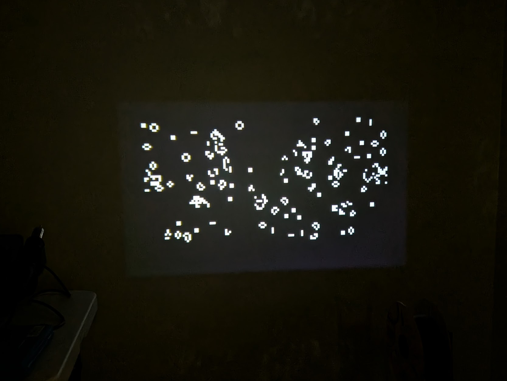

=====================
Conway's Game of Life
=====================

A classic "game" is Conway's Game of Life (CGOL). It is not a game in the
playable sense, but is an entertaining curiosity. CGOL is a type of cellular
automata: complex behaviour arising from a simplistic set of rules. It has been
widely studied, especially by mathematicians. Conway himself was a
mathematician.

   An example of rendered output from the CGOL game.

Requirements
------------

The CGOL implementation for NuttX relies on a frame buffer driver, that is:
:doc:`/components/nxgraphics/framebuffer_char_driver`. If you have
``VIDEO_FB`` enabled, you should be able to use the app. The visuals for the
game are rendered to a display through the provided frame buffer.

.. note::

   CGOL currently only supports devices with 32, 24, 16 or 8 bpp rendering.
   Since the game is only two colours, 1 bpp rendering can be supported as well,
   I just didn't want to bother playing with individual bit operations any more
   by the time I got to the end of writing the application. By all means, please
   send patches!

   The implementation was only tested on a 32bpp frame buffer device.

This game works for frame buffers that require ``FB_UPDATE`` as well. It does
nothing special with overlays.

Usage
-----

The game can be played by simply running it in the NSH console:

.. code:: console

   nsh> cgol

The game will use the frame buffer device specified by
``CONFIG_GAMES_CGOL_FBDEV`` to render the image. By default, that is
``/dev/fb0``. If you wish to use a different device at run-time, you can pass
the frame buffer device path as the first argument:

.. code:: console

   nsh> cgol /dev/fb1

Note that the game will loop forever and render the output to the screen. After
a certain point, CGOL reaches a "stable" configuration and there is not really
anything interesting to watch. At this point, you can terminate the application
with ``CTRL + C``. You can also run the app in the background by adding the
``&`` character after the command in NSH, which is recommended if you want to do
things in the console after running it.

.. warning::

   This program has not been tested with ``bpp`` values other than 32. It may
   have unknown bugs.

   It has also not been tested with devices that have a word size
   (``sizeof(unsigned int)``) other than 32 bits.

Configuration options
---------------------

There are a few options you can customize in order to modify the game. The first
two are very obvious: the map width and map height.

* ``CONFIG_GAMES_CGOL_MAPWIDTH``
* ``CONFIG_GAMES_CGOL_MAPHEIGHT``

These options select the width and height of the game map in cells. You must
pick a width which is a multiple of ``sizeof(unsigned int) * 8``. This is a
necessary evil in order to implement CGOL efficiently on embedded device. Often
times, this value is your device's natural word size in bits. So, if you're
using a 32 bit machine, pick a map width that is a multiple of 32. There is no
such restriction for the map height.

To change the amount of cells used to populate the map initially, you can modify
the density: ``CONFIG_GAMES_CGOL_DENSITY``. The number of cells that are
generated at start is then ``TOTAL_CELLS * (1 / density)``, where total cells
is the map area.

The next thing you can change is the delay between frames in microseconds, using
the option: ``CONFIG_GAMES_CGOL_FRAMEDELAY``. By default this value is 0 (no
delay). Use this if the rendering is too fast for you to appreciate each frame.

Purely for rendering reasons, the last option you can change is
``CONFIG_GAMES_CGOL_DBLBUF``. This enables double buffering for rendering, which
allocates a RAM buffer of equal size to the actual framebuffer. All rendering is
performed directly on the RAM buffer, and then copied to the framebuffer once
done. This is only necessary on some devices. For instance, the :doc:`Raspberry
Pi 4b </platforms/arm64/bcm2711/boards/raspberrypi-4b/index>` experiences
significant artifacts and completely incorrect rendering if double buffering is
not used.

Implementation
--------------

The game itself is implemented using bit-fields to represent living and dead
cells. A ``1`` bit is alive, and a ``0`` is dead. I used the natural word size
of the machine to store the bits, which is why I impose the restriction that the
map width must be a multiple of the number of bits in an ``unsigned int``.

More bits in a word equates to more parallelism. When rendering living cells, I
can skip over 32 cells at once on a 32-bit machine if the word evaluates to 0.
This saves 32 iterations. The bit-fields themselves are also a space saver, as
opposed to using 1 byte per cell, for instance. Even representing living cells
as (x, y) pairs consumes more memory, and also takes significantly more CPU
power to advance the game state at each step.

The main loop consists of the following steps:

1. Render living cells
2. Sleep if user configured frame delay
3. Display render
4. Advance the state of the game
5. Clear the render

The map is randomly initialized with living cells using ``rand()``, which is a
uniform distribution. This isn't always the best for CGOL; a certain density
needs to be achieved for interesting evolutions. I have settled on a density of
1/6 of the map.

The game is auto-scaled to fill as much of the frame buffer as possible. The
minimum resolution is one pixel per cell. If the configuration has a map size
larger than the frame buffer, the program will exit with an error.

Finally, the map wraps around from right to left. It does not wrap from top to
bottom to allow a more memory efficient method of buffering the next state as it
is calculated.

.. todo::

   This program could be improved with:

   * 1 bit support
   * Optional input device support for re-initializing the game, maybe drawing
     cells
   * Optional ability to load seeds
   * Runtime speed controls
