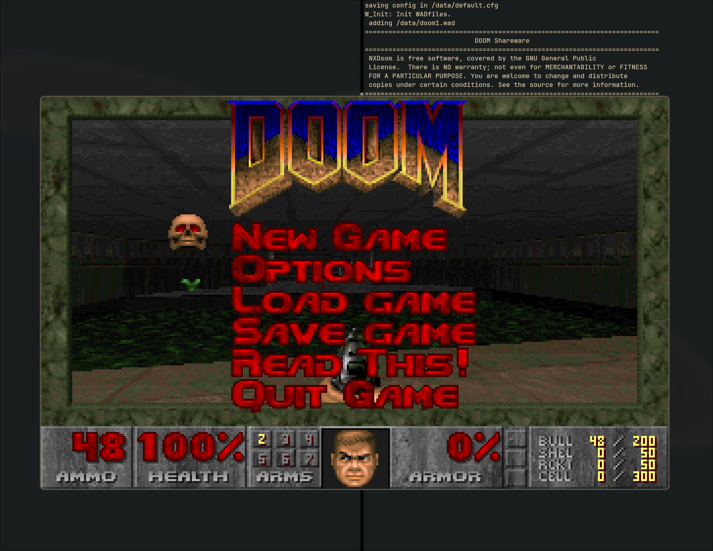

======
NXDoom
======

This game is a port of the `Chocolate DOOM
<https://github.com/chocolate-doom/chocolate-doom>`_ DOOM port to NuttX. The
original Chocolate DOOM port is highly featured, and also adheres well to the
vanilla DOOM experience. NXDoom is tailored instead for embedded devices and
will likely have to forego some features or sacrifice some vanilla DOOM
experience for better memory/CPU performance.

NXDoom is maintained inside the NuttX source tree because it will diverge
heavily from the original Chocolate DOOM port in order to target embedded
devices. It is for this reason that we do not take the approach of downloading
Chocolate DOOM and apply patches (there would be too many large patches to
apply).

   The shareware version of DOOM being played on the NuttX simulator

.. warning::

   Not all features are implemented for NXDoom. There is currently no support
   for game sounds or music, nor does any of the networked logic for multiplayer
   games work.

   Some code was stripped during the initial port to simplify the port. If those
   features are needed/desired later, they can be added back. This includes some
   sound-library interfaces which are not available on NuttX, some input
   options, etc.

   It is recommended that if you are making any significant changes to the
   source code, you try compiling with and without the sound/networking feature
   flags enabled to catch any possible errors.

.. todo::

   This port is a massive work in progress. Any contributions are welcome. Since
   memory is the primary constraint for many of the embedded devices running
   NuttX, memory optimizations are particularly welcome.

   Sound support, multiplayer support, support for any of the wide array of
   input devices NuttX can provide are also highly welcomed.

.. warning::

   Currently, the only supported input device is keyboard input. However,
   NuttX's keyboard codec is highly non-standard and therefore some things do
   not work as intended. For instance, pressing CTRL to fire does nothing since
   NuttX's codec has no concept of CTRL. The keyboard codec will need to be
   amended before this works properly, but the port is upstreamed in the hopes
   of encouraging those changes or getting more contributors to add different
   input devices. The keyboard codec needs to be treated delicately since other
   things in the kernel depend on it.

Minimum requirements
--------------------

The minimum requirements for playing NXDoom are:

* A device running NuttX
* A device with graphics output controlled via a frame buffer driver (320x240
  screen minimum resolution)
* Some way of getting sufficient input for up/down/left/right/fire controls
  (limited out-of-the-box input support is available)
* A pretty good amount of memory (I haven't verified the total amount required
  yet, but the original DOOM needed 4MB of RAM and NXDoom isn't much better
  optimized)
* Non-volatile memory sufficiently large for the WAD file you choose to play

.. note::

   The NXDoom port was tested using the shareware version of DOOM, whose WAD
   file is commonly named DOOM1.wad. You may find this online on various sites.
   Other WAD files are available online but are not guaranteed to work (i.e.,
   the `OTTAWAU.wad
   <https://www.doomworld.com/files/file/1651-ottawauwad-ver-09-pre-release/>`_
   file I tried did not run properly)

Playing
-------

To launch the game, just run:

.. code:: console

   nsh> nxdoom -iwad /path/to/my/iwadfile.wad

and replace the path with your WAD file's path.

Other Notes
-----------

Translations
^^^^^^^^^^^^

The game does support different translations via headers with game strings. One
such example is ``src/doom/d_french``, which was my half-attempt at translating
the game strings to French (I stopped halfway). The main problem with
translations is that the game seems unable to render non-ASCII text (i.e. any
French words with accents have missing letters where the accents were). A way
around this would be great, and other translations are welcome.

Source Comments
^^^^^^^^^^^^^^^

I made an effort to preserve all the original comments from the Chocolate DOOM
source, which in turn seems to have made an effort to preserve the original DOOM
code comments. Some are quite vulgar.

Optimizations
^^^^^^^^^^^^^

DOOM uses 32-bit wide, signed fixed-point numbers for calculations. This should
be entirely compatible with the NuttX fixed-point library. However, in my
attempt to switch to the NuttX-native library, the textures began to render
strangely and I experienced periodic crashes. This would be one good
optimization.

Another useful optimization would be to eliminate the lookup tables used for
sine, cosine and tangent. These make the game logic fast, but they also take up
the most amount of memory in the binary. Removing them could save several
hundred KB. CPUs have come a long way since DOOM was written and the compute hit
might be worth it for the memory reduction on embedded.

Another good optimization would be to examine the use of 32-bit natural ``int``
variables and decided if smaller sizes could be used. I imagine this was
originally done for the native word-size optimizations on the computers of the
era, but it results in extra memory use on large internal arrays especially.
