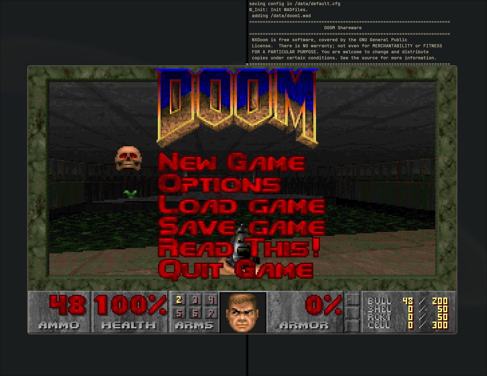

======
NXDoom
======

This game is a port of the `Chocolate DOOM
<https://github.com/chocolate-doom/chocolate-doom>`_ DOOM port to NuttX. The
original Chocolate DOOM port is highly featured, and also adheres well to the
vanilla DOOM experience. NXDoom is tailored instead for embedded devices and
will likely have to forego some features or sacrifice some vanilla DOOM
experience for better memory/CPU performance.

NXDoom is maintained inside the NuttX source tree because it will diverge
heavily from the original Chocolate DOOM port in order to target embedded
devices. It is for this reason that we do not take the approach of downloading
Chocolate DOOM and apply patches (there would be too many large patches to
apply).

   The shareware version of DOOM being played on the NuttX simulator

.. warning::

   Not all features are implemented for NXDoom. There is currently no support
   for game sounds or music, nor does any of the networked logic for multiplayer
   games work.

   Some code was stripped during the initial port to simplify the port. If those
   features are needed/desired later, they can be added back. This includes some
   sound-library interfaces which are not available on NuttX, some input
   options, etc.

   It is recommended that if you are making any significant changes to the
   source code, you try compiling with and without the sound/networking feature
   flags enabled to catch any possible errors.

.. todo::

   This port is a massive work in progress. Any contributions are welcome. Since
   memory is the primary constraint for many of the embedded devices running
   NuttX, memory optimizations are particularly welcome.

   Sound support, multiplayer support, support for any of the wide array of
   input devices NuttX can provide are also highly welcomed.

.. note::

   Keyboard input is the only input device supported so far, and other ones
   are welcome.

   The game binds fire, run and strafe to Ctrl, Shift and Alt. Those reach
   an application only if the keyboard driver reports a modifier as a key in
   its own right, which the codec keycodes ``KEYCODE_LCTRL`` through
   ``KEYCODE_RGUI`` exist for.

   The simulator always reports them. A USB HID keyboard reports them when
   ``CONFIG_HIDKBD_REPORT_MODIFIERS`` is enabled, which is off by default,
   so a configuration that plays the game over USB has to turn it on. A
   driver that reports no modifiers at all, a matrix keyboard for instance,
   leaves those three actions on keys the game cannot see, and they have to
   be rebound to play.

Minimum requirements
--------------------

The minimum requirements for playing NXDoom are:

* A device running NuttX
* A device with graphics output controlled via a frame buffer driver (320x240
  screen minimum resolution)
* Some way of getting sufficient input for up/down/left/right/fire controls
  (limited out-of-the-box input support is available)
* A pretty good amount of memory (I haven't verified the total amount required
  yet, but the original DOOM needed 4MB of RAM and NXDoom isn't much better
  optimized)
* Non-volatile memory sufficiently large for the WAD file you choose to play

.. note::

   The NXDoom port was tested using the shareware version of DOOM, whose WAD
   file is commonly named DOOM1.wad. You may find this online on various sites.
   Other WAD files are available online but are not guaranteed to work (i.e.,
   the `OTTAWAU.wad
   <https://www.doomworld.com/files/file/1651-ottawauwad-ver-09-pre-release/>`_
   file I tried did not run properly)

Playing
-------

To launch the game, just run:

.. code:: console

   nsh> nxdoom -iwad /path/to/my/iwadfile.wad

and replace the path with your WAD file's path.

Tuning the display for a board
------------------------------

DOOM renders a 320x200 image with 8 bits per pixel and a palette, and the port
scales that up and converts it to whatever the frame buffer wants. How much
that costs depends a great deal on the board, so the following options are
available. All of them are disabled by default, which leaves the behaviour
unchanged, and each is worth enabling only where it pays.

``CONFIG_GAMES_NXDOOM_FB_CMAP``
  Load the DOOM palette into the frame buffer's colour map and blit the
  palette indices unconverted, letting the display convert them while it scans
  out. This needs a frame buffer that is 8 bits per pixel and supports
  ``FBIOPUT_CMAP``, such as an STM32 LTDC layer configured for L8. It removes
  the conversion from the blit and halves the amount of data written per
  frame.

``CONFIG_GAMES_NXDOOM_FILLSCREEN``
  Stretch the image over the whole display instead of scaling it by the
  largest whole number that fits. This fills a display whose size is not an
  exact multiple of 320x200, at the cost of a scale factor that is not uniform
  across the image. Without it the image is scaled by a whole number and
  centred, leaving a border.

``CONFIG_GAMES_NXDOOM_ROWSTAGE``
  Build each output row in a staging buffer and copy it out, rather than
  writing the frame buffer a pixel at a time, so that the frame buffer only
  ever sees burst-friendly copies. Costs a few kilobytes of ``.bss``. This is
  worth a lot when the frame buffer is external memory and the data cache is
  in write-through mode, and little otherwise.

``CONFIG_GAMES_NXDOOM_STATIC_SCRNBUF``
  Place the buffer DOOM renders into in ``.bss`` rather than taking it from the
  heap, which puts it in internal RAM on a board whose heap is mostly external
  memory. The renderer draws in vertical columns, so consecutive writes are
  one screen width apart and none of them coalesce, which makes external memory
  close to the worst case for it. Costs 64000 bytes of RAM whether the game
  runs or not.

As an illustration of the effect, on an STM32H753 driving a 1024x600 panel
whose frame buffer lives in SDRAM, ``ROWSTAGE`` and ``STATIC_SCRNBUF`` are
worth 2.7 times the frame rate between them.

Other Notes
-----------

Translations
^^^^^^^^^^^^

The game does support different translations via headers with game strings. One
such example is ``src/doom/d_french``, which was my half-attempt at translating
the game strings to French (I stopped halfway). The main problem with
translations is that the game seems unable to render non-ASCII text (i.e. any
French words with accents have missing letters where the accents were). A way
around this would be great, and other translations are welcome.

Source Comments
^^^^^^^^^^^^^^^

I made an effort to preserve all the original comments from the Chocolate DOOM
source, which in turn seems to have made an effort to preserve the original DOOM
code comments. Some are quite vulgar.

Optimizations
^^^^^^^^^^^^^

DOOM uses 32-bit wide, signed fixed-point numbers for calculations. This should
be entirely compatible with the NuttX fixed-point library. However, in my
attempt to switch to the NuttX-native library, the textures began to render
strangely and I experienced periodic crashes. This would be one good
optimization.

Another useful optimization would be to eliminate the lookup tables used for
sine, cosine and tangent. These make the game logic fast, but they also take up
the most amount of memory in the binary. Removing them could save several
hundred KB. CPUs have come a long way since DOOM was written and the compute hit
might be worth it for the memory reduction on embedded.

Another good optimization would be to examine the use of 32-bit natural ``int``
variables and decided if smaller sizes could be used. I imagine this was
originally done for the native word-size optimizations on the computers of the
era, but it results in extra memory use on large internal arrays especially.
