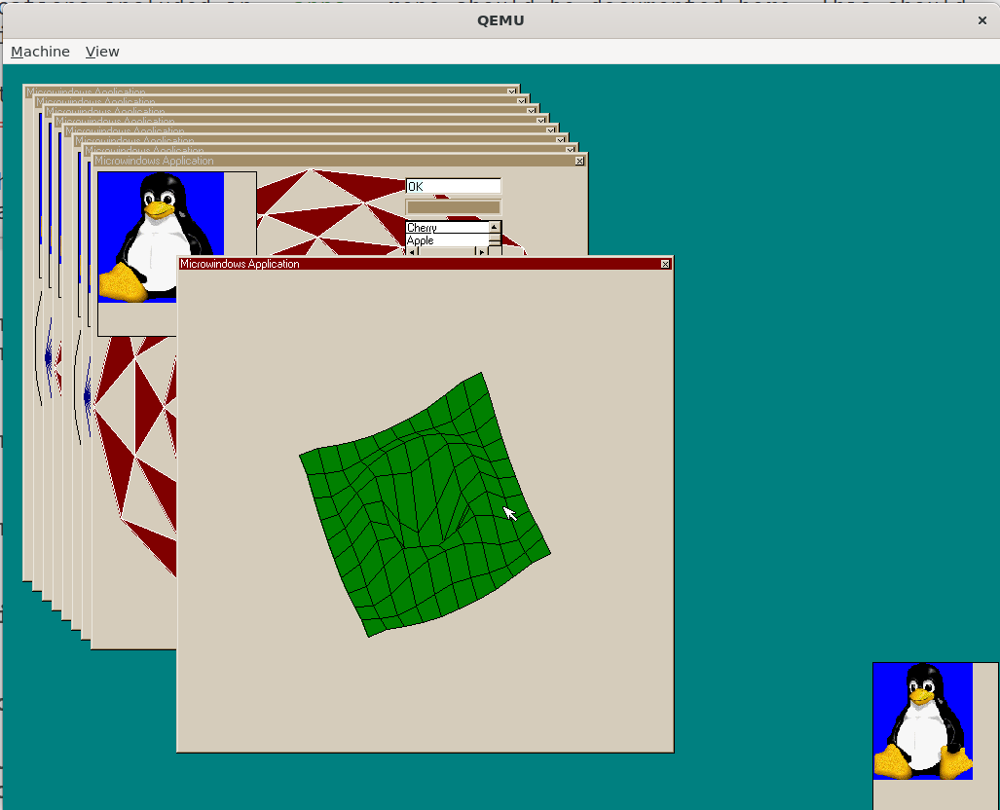
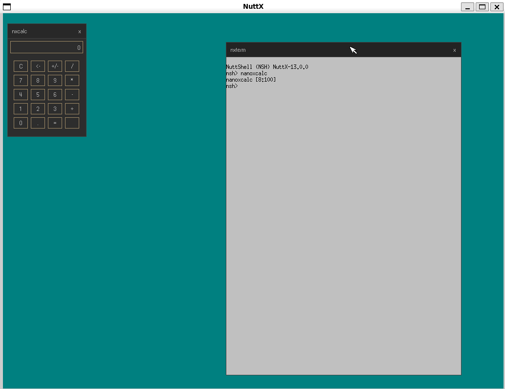

.. _applications_graphics_microwindows:

Microwindows
============

Microwindows is a lightweight windowing system for small- to medium-footprint
embedded systems.  It provides:

- **GDI / Win32 API** -- a low-level C graphics library for direct framebuffer
  drawing, suitable for tiny single-threaded applications.
- **mwin** -- a widget toolkit built on the Win32 API, supporting windows,
  menus, buttons, edit boxes, list boxes, scroll bars, progress bars, and
  timers.
- **Nano-X / X11 API** -- an X11-compatible client/server window system,
  enabled with ``CONFIG_MICROWINDOWS_NANOX``.

The NuttX integration includes the Microwindows core and GDI API.  The
optional mwin widget toolkit provides a Win32-style API and is enabled with
``CONFIG_MICROWINDOWS_MWIN=y``.  The Nano-X client library and server can
also be built, giving access to the X11-style ``GrXXX`` API from multiple
client applications.

Quick Start
===========

Microwindows requires a framebuffer device (``CONFIG_VIDEO_FB=y``).

The build and run instructions for the supported configurations are documented
on their board pages:

* :doc:`/platforms/sim/sim/boards/sim/index` (``sim:mw`` and ``sim:nanox``)
* :doc:`/platforms/x86_64/intel64/boards/qemu-intel64/index` (``qemu-intel64:mw`` and ``qemu-intel64:nanox``)

Nano-X (X11 API)
----------------

For the Nano-X client/server window system, the ``sim:nanox`` configuration
boots directly into the ``nxterm`` terminal emulator::

   cd nuttx
   tools/configure.sh sim:nanox
   make -j$(nproc)

This opens an X11-style terminal window running an NSH shell; typing
``nanoxcalc`` inside it starts the calculator demo.

For QEMU, use the ``qemu-intel64:nanox`` configuration instead::

   cd nuttx
   tools/configure.sh qemu-intel64:nanox
   make -j$(nproc)

See :doc:`/platforms/x86_64/intel64/boards/qemu-intel64/index` for the QEMU
ISO creation and run instructions.

Available Configurations
========================

To enable Microwindows, set ``CONFIG_GRAPHICS_MICROWINDOWS=y``.
The library is located at ``apps/graphics/microwindows``.

Dependencies
------------

All configurations require ``CONFIG_VIDEO_FB=y``.

For **qemu-intel64:mw** and **qemu-intel64:nanox**, the following
input-related options are required:

  ``CONFIG_USBHOST=y``, ``CONFIG_USBHOST_HIDKBD=y``, ``CONFIG_USBHOST_HIDMOUSE=y``,
  ``CONFIG_USBHOST_XHCI_PCI=y``, ``CONFIG_USBHOST_WAITER=y``,
  ``CONFIG_MICROWINDOWS_KBD_EVENT=y``,
  ``CONFIG_MICROWINDOWS_KBD_EVENT_PATH="/dev/kbda"``

The USB HID keyboard exposes ``keyboard_event_s`` records at ``/dev/kbda``;
it is not the raw byte-stream keyboard driver.

For **sim:mw** and **sim:nanox** the following input options are required:

  ``CONFIG_INPUT=y``, ``CONFIG_SIM_KEYBOARD=y``, ``CONFIG_SIM_TOUCHSCREEN=y``

Keyboard Drivers
----------------

``choice`` prompt: ``"Keyboard driver"``

``MICROWINDOWS_KBD_EVENT``
    Reads ``keyboard_event_s`` events from ``/dev/kbd`` (path configurable).
    Supports key press/release tracking and modifier keys (Shift, Ctrl, Alt).

    Device path config: ``MICROWINDOWS_KBD_EVENT_PATH`` (default ``/dev/kbd``).

``MICROWINDOWS_KBD_RAW``
    Reads raw byte stream from ``/dev/kbda`` (path configurable).  Decodes
    escape sequences via the ``kbd_codec`` library.  Requires
    ``LIBC_KBDCODEC=y``.  Suitable for USB HID keyboards.

    Device path config: ``MICROWINDOWS_KBD_RAW_PATH`` (default ``/dev/kbda``).

``MICROWINDOWS_KBD_NONE``
    No keyboard driver is compiled.  Microwindows uses a null driver that
    never produces input.  Suitable for display-only applications.

``MICROWINDOWS_KBD_CUSTOM``
    No built-in keyboard driver is compiled.  The application or BSP must
    provide its own ``kbddev`` symbol and ``KBDDEVICE`` implementation, and
    add the source file to the build (e.g. via ``CSRCS`` in its Makefile).

Mouse / Touchscreen Drivers
---------------------------

``choice`` prompt: ``"Mouse/touchscreen driver"``

``MICROWINDOWS_MOUSE_RELATIVE``
    Reads ``mouse_report_s`` events from ``/dev/mouse0`` (path configurable).
    Supports three buttons and scroll wheel.

    Device path config: ``MICROWINDOWS_MOUSE_PATH`` (default ``/dev/mouse0``).

``MICROWINDOWS_MOUSE_TS``
    Reads ``touch_sample_s`` events from ``/dev/input0`` (path configurable).
    Supports absolute positioning.

    Device path config: ``MICROWINDOWS_TS_PATH`` (default ``/dev/input0``).

``MICROWINDOWS_MOUSE_NONE``
    No pointing device driver is compiled.  Microwindows uses a null driver
    that hides the cursor and produces no input.

``MICROWINDOWS_MOUSE_CUSTOM``
    No built-in pointing device driver is compiled.  The application or BSP
    must provide its own ``mousedev`` symbol and ``MOUSEDEVICE``
    implementation, and add the source file to the build.

Framebuffer
-----------

``MICROWINDOWS_FB_PATH``
    Path to the NuttX framebuffer device.  Default ``/dev/fb0``.

Nano-X Client/Server Support
----------------------------

Enable the Nano-X (X11 API) client/server window system with
``CONFIG_MICROWINDOWS_NANOX=y``.  It builds the Nano-X server core and the
Nano-X client library from the bundled Microwindows tree.

``MICROWINDOWS_NANOX``
    Build the Nano-X server core and client library.  Applications can start
    the server as a separate task; client applications connect to it through
    a local stream socket and use the X11-like API (``GrXXX`` calls).  In
    this network mode, it requires ``CONFIG_NET=y``, ``CONFIG_NET_LOCAL=y``
    and ``CONFIG_NET_LOCAL_STREAM=y``.  The NuttX build enables
    ``NX_PER_CLIENT_DATA`` and stores each client's state in POSIX thread-local
    storage, so several client tasks can run at the same time in a flat build.

``MICROWINDOWS_NANOX_NONETWORK``
    Build the Nano-X client library and server in the linked-in
    (``NONETWORK``) mode: client applications are linked directly with the
    server and run in the same task, so no network stack or socket is
    required and the memory footprint is minimal.  Only a single client
    application can be active at a time.

``MICROWINDOWS_NANOX_NANOWM``
    Link the built-in window manager (``wm*.c``, ``nxdraw.c``) into the
    Nano-X server, providing window decorations (title bar, 3D frame),
    cascaded placement, move/resize and focus handling.

Microwindows Demo Application
=============================

Enable with ``CONFIG_EXAMPLES_MICROWINDOWS=y``.  The example is located at
``apps/examples/microwindows``.

It ports ``mwdemo.c`` from upstream, which exercises the mwin widget toolkit
(buttons, edit boxes, list boxes, scroll bars, progress bars).  The demo uses
``GdOpenScreen()`` to initialise the framebuffer and enters a Win32-style
message loop with ``GetMessage()`` / ``DispatchMessage()``.

   The mwdemo application running on the NuttX simulator (``sim:mw``).

``EXAMPLES_MICROWINDOWS_PROGNAME``
    Program name for the NSH ELF install (default ``"mwexample"``).
``EXAMPLES_MICROWINDOWS_PRIORITY``
    Task priority (default ``100``).  For setups where input threads
    have a lower priority, consider lowering this value.

    .. warning::

       On ``qemu-intel64:mw`` the default USB HID mouse thread priority
       (``CONFIG_HIDMOUSE_DEFPRIO``, default 50) is lower than the demo
       application priority (100).  When dragging a window, Microwindows'
       ``MwSelect`` switches to polling (``select`` with timeout 0), which can
       starve the USB input thread and make the whole system appear frozen.
       Raise ``CONFIG_HIDMOUSE_DEFPRIO`` (e.g. to 120), lower
       ``EXAMPLES_MICROWINDOWS_PRIORITY``, or fix the drag loop to use a small
       non-zero timeout.

``EXAMPLES_MICROWINDOWS_STACKSIZE``
    Stack size in bytes (default ``32768``).

Nano-X Terminal Emulator Example
================================

Enable with ``CONFIG_EXAMPLES_NANOXTERM=y``.  The example is located at
``apps/examples/nanoxterm``.

It is a port of the ``nxterm`` demo from upstream Microwindows.  It starts
the Nano-X server as a separate task, connects to it and creates a terminal
window backed by a pseudo terminal.  The configured NSH program is started
with ``posix_spawn()``.  Requires ``CONFIG_PSEUDOTERM=y``,
``CONFIG_LIBC_EXECFUNCS=y`` and ``CONFIG_SYSTEM_NSH=y``.

It can be used as the init entry point: setting
``CONFIG_INIT_ENTRYPOINT="nanoxterm_main"`` boots directly into the
terminal window, e.g. the ``sim:nanox`` configuration.

   The nxterm terminal emulator running on the NuttX simulator (``sim:nanox``),
   with an NSH shell.

In the ``NONETWORK`` mode (``MICROWINDOWS_NANOX_NONETWORK``) the server task
is not started, since the application runs the server inside ``main()``.

``EXAMPLES_NANOXTERM_PROGNAME``
    Program name for the NSH ELF install (default ``"nanoxterm"``).
``EXAMPLES_NANOXTERM_PRIORITY``
    Task priority (default ``100``).
``EXAMPLES_NANOXTERM_STACKSIZE``
    Stack size in bytes (default ``16384``).

Nano-X Calculator Example
=========================

Enable with ``CONFIG_EXAMPLES_NANOXCALC=y``.  The example is located at
``apps/examples/nanoxcalc``.

It is a port of the ``nxcalc`` demo from upstream Microwindows.  It connects
to the running Nano-X server and shows a calculator keypad operated by the
mouse or keyboard.  Requires ``CONFIG_LIBC_FLOATINGPOINT=y``.  To invoke it
as an NSH command, also enable ``CONFIG_NSH_BUILTIN_APPS=y``; both Nano-X
defconfigs enable this option.

``EXAMPLES_NANOXCALC_PROGNAME``
    Program name for the NSH ELF install (default ``"nanoxcalc"``).
``EXAMPLES_NANOXCALC_PRIORITY``
    Task priority (default ``100``).
``EXAMPLES_NANOXCALC_STACKSIZE``
    Stack size in bytes (default ``16384``).

Porting to New Hardware
=======================

The Microwindows source is downloaded at build time from the upstream
repository.  NuttX-specific screen, keyboard, and mouse drivers live
in upstream ``src/drivers/`` (``scr_nuttx.c``, ``kbd_nuttx_event.c``,
``kbd_nuttx_raw.c``, ``mou_nuttx_mouse.c``, ``mou_nuttx_ts.c``).

A board with a working framebuffer and input devices needs:

#. A ``defconfig`` enabling ``CONFIG_VIDEO_FB``, ``GRAPHICS_MICROWINDOWS``,
   and the appropriate keyboard/mouse driver choice.
#. For framebuffer-only (display-only) use, select ``KBD_NONE`` and
   ``MOUSE_NONE``.

If the board's input hardware does not fit the built-in drivers, select
``KBD_CUSTOM`` and/or ``MOUSE_CUSTOM`` and provide your own driver source.

Resources
=========

- `Microwindows upstream repository <https://github.com/ghaerr/microwindows>`_
- `NuttX Discussion Issue #18566 <https://github.com/apache/nuttx/issues/18566>`_
