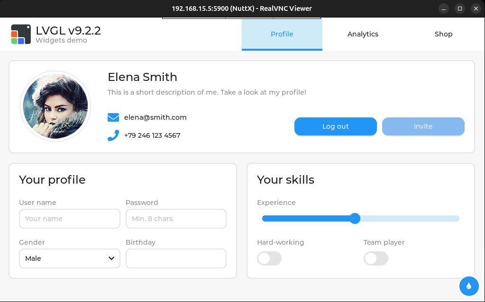

==================================
``fbvnc`` Framebuffer VNC Server
==================================

Serves a framebuffer the board already has over VNC, with no cooperation from
the application drawing on it.  The panel keeps working;  a viewer somewhere
else sees the same pixels, and its mouse and keyboard reach the application as
a touchscreen and a keyboard.

It is a service rather than part of an application, so it can be started before
or after whatever draws on the screen, and it survives that application being
restarted.

This is not the server in ``drivers/video/vnc``.  That one allocates a
framebuffer of its own and registers a second, virtual display, which is the
answer for a board with no panel.  ``fbvnc`` serves a framebuffer that already
exists, the panel's, or a virtual one from ``CONFIG_VIDEO_VFB``, and does
not care what put the pixels there.

Features
========

- RFB 3.7, with TRLE, Hextile and Raw encodings.  No zlib, no jpeg.
- 8, 16 and 32 bit true-colour pixel formats, converted from the
  framebuffer's own when they differ.
- Dirty areas from the kernel (``FBIOC_WATCHAREA``, ``FBIOC_GETDIRTY``), so
  only what changed is sent and nothing is scanned.
- Remote input delivered through the uinput touch and keyboard devices, so it
  enters the system the way a finger or a key would.
- Reading and sending on separate threads:  input does not wait behind a frame
  that is still going out.

Prepare
=======

.. code-block:: bash

   CONFIG_NET_TCP=y
   CONFIG_VIDEO_FB=y
   CONFIG_NETUTILS_FBVNC=y
   CONFIG_SYSTEM_FBVNC=y

For remote input, the uinput devices the board registers:

.. code-block:: bash

   CONFIG_INPUT_UINPUT=y
   CONFIG_UINPUT_TOUCH=y
   CONFIG_UINPUT_KEYBOARD=y

Usage
=====

.. code-block:: bash

   fbvnc start [<framebuffer>] [--diff | --full]
   fbvnc stop
   fbvnc status

``<framebuffer>`` is ``/dev/fb0`` unless another is named.

.. code-block:: bash

   nsh> fbvnc start /dev/fb0
   fbvnc: listening on port 5900
   fbvnc: serving /dev/fb0 (1024x600) on port 5900
   nsh> lvgldemo &
   nsh> fbvnc status
   fbvnc: serving 1024x600 on port 5900, client connected

Then, from the host::

   $ vncviewer <board-ip>:5900

   The stock ``lvgldemo`` on a linum-stm32h753bi, served from the panel the
   board is already driving.  The pointer and keyboard of the viewer reach
   the demo through the uinput devices.

How what changed is decided
===========================

By default the kernel is asked.  Every application that draws through the
framebuffer issues ``FBIO_UPDATE`` with the area it redrew, LVGL's fbdev
driver among them, and those areas are what gets sent. This costs nothing:
no pixel is compared.

``--diff`` adds a shadow frame and compares against it.  It serves two
purposes. For an application that draws without reporting anything, a game
writing straight into its mapping, it is the only way to know what changed.
And where the kernel does report, each reported area is narrowed to the rows
inside it that actually differ:  what an application reports is what it
*redrew*, which is not the same as what changed, and a toolkit that animates
one element inside a panel invalidates the panel.  It costs a frame of memory
and a comparison bounded by the reported area.

``--full`` sends a whole frame per update request, for a framebuffer with no
dirty reporting at all.

Options
=======

``CONFIG_NETUTILS_FBVNC_PORT``
   TCP port to listen on.  5900 by default.

``CONFIG_NETUTILS_FBVNC_MIN_UPDATE_MS``
   A floor between updates.  A client that asks again the instant it has
   finished parsing would otherwise keep a full screen permanently in flight.

``CONFIG_NETUTILS_FBVNC_ENCODING_TRLE``, ``..._ENCODING_HEXTILE``
   Encodings offered.  TRLE is preferred where the client takes it:  a tile of
   few colours costs bits per pixel there against a sub-rectangle each in
   Hextile, and a widget toolkit draws flat panels and text.

``CONFIG_NETUTILS_FBVNC_TRACE``
   Report what every update cost, rectangles, pixels, bytes on the wire, and
   how long the snapshot and the queueing each took.  It is how one tells a
   slow link from a slow application.  A line per update, so it is off by
   default.

Limitations
===========

- The framebuffer must be 16 bits per pixel.  What the client negotiates is
  converted;  what the board draws is not.
- One client at a time.
- No authentication.  Anyone who can reach the port sees the screen.
- With LVGL applications, a key of the on-screen keyboard clicked from a viewer
  is typed twice, and a remote keyboard does not reach LVGL widgets at all,
  LVGL's NuttX port has a touchscreen input device and no keyboard one.  An
  application that reads the keyboard itself, as ``lvglterm`` does, is
  unaffected.
