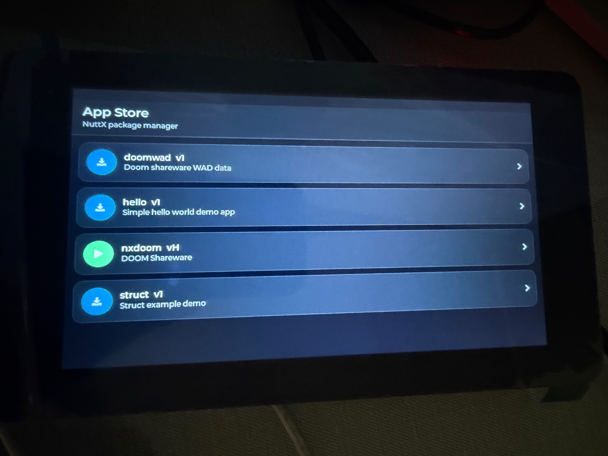

===========
``nxstore``
===========

``nxstore`` is an LVGL front end for :doc:`../nxpkg/index`.  It displays the
packages in the synchronized catalog, installs a selected package on a worker
thread, launches installed Dynamic ELF applications, and supervises the one
application currently using the display.

   NXStore package catalog running on a Waveshare
   ESP32-S3-Touch-LCD-7 board.

Configuration
=============

Enable ``CONFIG_SYSTEM_NXSTORE``.  It depends on
``CONFIG_GRAPHICS_LVGL`` and ``CONFIG_SYSTEM_NXPKG``.  Its principal options
are:

* ``CONFIG_SYSTEM_NXSTORE_PROGNAME``
* ``CONFIG_SYSTEM_NXSTORE_PRIORITY``
* ``CONFIG_SYSTEM_NXSTORE_STACKSIZE``
* ``CONFIG_SYSTEM_NXSTORE_FBDEVPATH``
* ``CONFIG_SYSTEM_NXSTORE_INPUT_DEVPATH``

The framebuffer and input paths default to ``/dev/fb0`` and ``/dev/input0``.
The board must provide LVGL-compatible display and input drivers.  ``nxpkg``
must use a writable storage root, and remote synchronization additionally
requires the networking options described in the ``nxpkg`` documentation.

Starting the store
==================

With no argument, ``nxstore`` opens the last catalog synchronized by
``nxpkg``:

.. code-block:: console

   nsh> nxstore

An optional index URL asks the store to synchronize before drawing the list:

.. code-block:: console

   nsh> nxstore http://192.0.2.1:8000/index.json

Transient network failures are retried for a bounded interval.  If
synchronization still fails, the UI reports the failure and uses the last
valid cached catalog when one exists.  Invalid metadata and local storage
errors are not retried.

Interaction
===========

Each catalog package appears once, using its newest compatible version.

* Tap an uninstalled package to install and launch it.
* Tap an installed package to launch its current installed version.
* Long-press an installed package to remove all its installed versions.
* Tap ``Close`` on the running-application screen to request termination.

Installation runs outside the LVGL thread so progress remains visible.  LVGL
objects are updated only by the main UI thread.  Launch arguments are read
from the stored manifest for the current installed version, including after a
rollback.

Application termination contract
================================

The ``Close`` control sends ``SIGTERM`` to the launched process.  A
long-running application should install a signal handler that performs only
an async-signal-safe action, such as setting a ``volatile sig_atomic_t`` flag,
and then poll that flag from its main loop.  The normal execution path should
release framebuffer, input, and other resources before returning.

``nxstore`` does not force-delete an application that ignores ``SIGTERM``.
Forceful task deletion can interrupt display, heap, or filesystem operations
and leave the system in an unsafe state.  Until the child exits, the store
keeps the running-application screen visible and does not hand the display
back to the package list.

The store and the launched application share one framebuffer.  A
framebuffer application must leave the top ``NXSTORE_BAR_HEIGHT`` pixels
untouched so the supervisor bar remains visible.  Include
``<system/nxstore_chrome.h>`` instead of duplicating the current height.

Current limitations
===================

Only one install worker and one supervised application are supported at a
time.  The launcher currently uses one fixed, generous stack size for all
packages because the manifest format does not carry a per-application stack
requirement.  Applications that cannot reserve the supervisor strip are not
currently suitable for launch from ``nxstore``.
