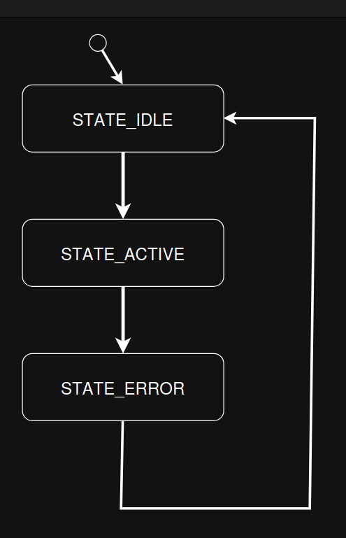
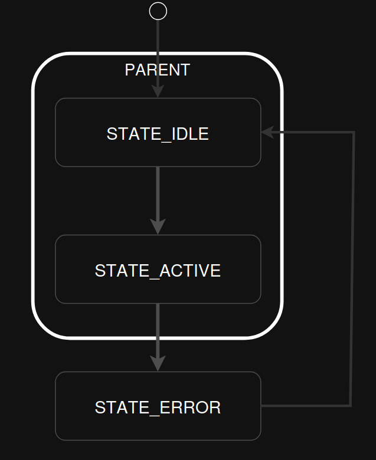

.. _smf:

=================================
``smf`` State Machine Framework
=================================

Overview
========

The State Machine Framework (SMF) is a lightweight, application-agnostic
framework for implementing finite and hierarchical state machines in NuttX.

SMF provides:
- Deterministic state transition semantics
- Optional hierarchical state machine (HSM) support
- Explicit entry, run, and exit actions
- No dynamic memory allocation
- Full control over the event loop by the application

The framework is suitable for deeply embedded systems where predictability,
low overhead, and explicit control flow are required.

Conceptually, this implementation is a direct port of the SMF originally
introduced in Zephyr RTOS, adapted to NuttX coding standards, build system,
and documentation conventions.

Architecture
============

SMF separates responsibilities clearly:

- **Framework responsibilities**
  - State transitions
  - Entry/exit sequencing
  - Hierarchy resolution (LCA)
  - Termination handling

- **Application responsibilities**
  - Event acquisition
  - Event dispatching
  - State machine scheduling
  - Data model ownership

This separation ensures that SMF remains fully reusable across applications
and execution models.

State Model
===========

Each state is defined by up to three optional callbacks:

- **Entry action**
- **Run action**
- **Exit action**

All actions operate on a user-defined object whose first member is
``struct smf_ctx``.

.. code-block:: c

   struct app_object
   {
     struct smf_ctx ctx;
     /* Application-specific data */
     int counter;
     bool error;
   };

This layout enables zero-cost casting using the ``SMF_CTX()`` macro.

State Machine Creation
======================

A state machine is created by defining a table of states that’s indexed by an enum.
For example, the following creates three flat states:

.. code-block:: c

   enum demo_state
   {
     STATE_IDLE,
     STATE_ACTIVE,
     STATE_ERROR,
   };

   static const struct smf_state demo_states[] = {
     [STATE_IDLE]   = SMF_CREATE_STATE(idle_entry, idle_run, idle_exit, NULL, NULL),
     [STATE_ACTIVE] = SMF_CREATE_STATE(active_entry, active_run, active_exit, NULL, NULL),
     [STATE_ERROR]  = SMF_CREATE_STATE(error_entry, error_run, error_exit, NULL, NULL),
   };

The example below creates three hierarchical states:

.. code-block:: c

   enum demo_state
   {
      STATE_IDLE,
      STATE_ACTIVE,
      STATE_ERROR,
    };
  
    static const struct smf_state demo_states[] =
    {
      [STATE_IDLE]   = SMF_CREATE_STATE(idle_entry, idle_run, idle_exit, parent_idle, NULL),
      [STATE_ACTIVE] = SMF_CREATE_STATE(active_entry, active_run, active_exit, parent_active, NULL),
      [STATE_ERROR]  = SMF_CREATE_STATE(error_entry, error_run, error_exit, parent_error, NULL),
    };

The next example creates a three-level hierarchical state machine with initial transitions from
parent state idle to child state error:

.. code-block:: c

   enum demo_state
   {
      STATE_IDLE,
      STATE_ACTIVE,
      STATE_ERROR,
    };
  
    static const struct smf_state demo_states[] =
    {
      [STATE_IDLE]   = SMF_CREATE_STATE(idle_entry, idle_run, idle_exit, NULL, demo_states[STATE_ERROR]),
      [STATE_ACTIVE] = SMF_CREATE_STATE(active_entry, active_run, active_exit, demo_states[STATE_IDLE], NULL),
      [STATE_ERROR]  = SMF_CREATE_STATE(error_entry, error_run, error_exit, demo_states[STATE_IDLE], NULL),
    };

To set the initial state of the state machine, call ``smf_set_initial()``.
To transition between states, call ``smf_set_state()`` from entry or run actions.

.. note::

   If ``CONFIG_SYSTEM_SMF_INITIAL_TRANSITION`` is not set, ``smf_set_initial()`` and ``smf_set_state()`` function
   should not be passed a parent state as the parent state does not know which child state to transition to.
   Transitioning to a parent state is OK if an initial transition to a child state is defined.
   A well-formed HSM should have initial transitions defined for all parent states.

.. note::
    While the state machine is running, ``smf_set_state()`` should only be called
    from the Entry or Run function. Calling ``smf_set_state()`` from Exit functions will generate a warning
    in the log and no transition will occur.

State Machine Execution
=======================

To run the state machine, ``smf_run_state()`` function should be called in some application dependent way.
An application should cease calling smf_run_state if it returns a non-zero value.

State Machine Termination
=========================

To terminate the state machine, the ``smf_set_terminate()`` function should be called.
It can be called from the entry, run, or exit actions.
The function takes a non-zero user defined value that will be returned by the ``smf_run_state()`` function.

Retrieving Current State
========================

**Leaf State**: In the context of a hierarchical state machine, a leaf state is a state that does not contain
any child states. It represents the most granular level of state in the hierarchy,
where no further decomposition is possible.

**Executing State**: The executing state refers to the state whose entry, run, or exit action is currently
being executed by the state machine. This may be a parent or leaf state, depending on the current operation.

To retrieve the current leaf state, the ``smf_get_current_leaf_state()`` function should be called.
For example:

.. code-block:: c

   const struct smf_state *leaf_state;
   leaf_state = smf_get_current_leaf_state(SMF_CTX(&s_obj));

.. note::
   If ``CONFIG_SYSTEM_SMF_INITIAL_TRANSITION`` is not enabled, or if the initial state of a parent state is not
   defined, always set the state to a leaf state. Otherwise, the state machine may enter a parent state
   directly, and ``smf_get_current_leaf_state()`` may return a parent state instead of a leaf state.
   Ensure initial transitions are properly configured for all parent states to avoid malformed
   hierarchical state machines.

To retrieve the state whose entry, run, or exit action is currently being executed,
use the ``smf_get_current_executing_state()`` function.

UML State Machines
==================
SMF follows UML hierarchical state machine rules for transitions i.e., the entry and exit actions of the least
common ancestor are not executed on transition, unless said transition is a transition to self.

The UML Specification for StateMachines may be found in chapter 14 of the UML specification,
available here: https://www.omg.org/spec/UML/

SMF breaks from UML rules in:

1. Transition actions execute in the source state context, rather than after the exit actions are performed.

2. Only allowing external transitions to self, not to sub-states. A transition from a superstate to a child state is treated as a local transition.

3. Prohibiting transitions using ``smf_set_state()`` in exit actions.

SMF also does not provide any pseudostates except the Initial Pseudostate.
Terminate pseudostates can be modelled by calling ``smf_set_terminate()`` from the entry action of a
‘terminate’ state. Orthogonal regions are modelled by calling ``smf_run_state()`` for each region.

State Machine Examples
======================

Flat State Machine Example
--------------------------
This example turns the following state diagram into code using the SMF, where the initial state is STATE_IDLE.

   Flat state machine example implemented using SMF.

.. code-block:: c

  #include <system/smf.h>

  /* Forward declaration of state table */
  static const struct smf_state demo_states[];

  /* List of demo states */
     enum demo_state
   {
     STATE_IDLE,
     STATE_ACTIVE,
     STATE_ERROR,
   };

  /* User defined object */
  struct s_object {
          /* This must be first */
          struct smf_ctx ctx;

          /* Other state specific data add here */
  } s_obj;

  /* State idle */
  static void idle_entry(void *o)
  {
    /* Do something */
  }

  static enum smf_state_result idle_run(void *o)
  {
    smf_set_state(SMF_CTX(&s_obj), &demo_states[STATE_ACTIVE]);
    return SMF_EVENT_HANDLED;
  }

  static void idle_exit(void *o)
  {
    /* Do something */
  }

  /* State active */
  static void active_entry(void *o)
    {
      /* Do something */
    }

  static enum smf_state_result active_run(void *o)
  {
    smf_set_state(SMF_CTX(&s_obj), &demo_states[STATE_ERROR]);
    return SMF_EVENT_HANDLED;
  }

  static void active_exit(void *o)
  {
    /* Do something */
  }

  /* State error */
  static void error_entry(void *o)
  {
    /* Do something */
  }

  static enum smf_state_result error_run(void *o)
  {
    smf_set_state(SMF_CTX(&s_obj), &demo_states[STATE_IDLE]);
    return SMF_EVENT_HANDLED;
  }

  static void error_exit(void *o)
  {
    /* Do something */
  }

  /* Populate state table */
  static const struct smf_state demo_states[] = {
    [STATE_IDLE]   = SMF_CREATE_STATE(idle_entry, idle_run, idle_exit, NULL, NULL),
    /* State ACTIVE does not have an entry action */
    [STATE_ACTIVE] = SMF_CREATE_STATE(NULL, active_run, active_exit, NULL, NULL),
    /* State ERROR does not have an exit action */
    [STATE_ERROR]  = SMF_CREATE_STATE(error_entry, error_run, NULL, NULL, NULL),
  };

  int main(void)
  {
    int32_t ret;

    /* Set initial state */
    smf_set_initial(SMF_CTX(&s_obj), &demo_states[STATE_IDLE]);

    /* Run the state machine */
    while(1) {
      /* State machine terminates if a non-zero value is returned */
      ret = smf_run_state(SMF_CTX(&s_obj));
      if (ret) {
        /* handle return code and terminate state machine */
        break;
      }
      sleep(1);
    }
  }

Hierarchical State Machine (HSM)
--------------------------------

When ``CONFIG_SYSTEM_SMF_ANCESTOR_SUPPORT`` is enabled, states may define a parent.
The example below turns the following state diagram into code using SMF, where IDLE and ACTIVE share a parent
state and IDLE is the initial state.

   Hierarchical state machine example implemented using SMF.

Code

.. code-block:: c

  #include <system/smf.h>

  /* Forward declaration of state table */
  static const struct smf_state demo_states[];

  /* List of demo states */
  enum demo_state { PARENT, IDLE, ACTIVE, ERROR };

  /* User defined object */
  struct s_object {
    /* This must be first */
    struct smf_ctx ctx;

    /* Other state specific data add here */
  } s_obj;

  /* Parent State */
  static void parent_entry(void *o)
  {
    /* Do something */
  }
  static void parent_exit(void *o)
  {
    /* Do something */
  }

  /* State IDLE */
  static enum smf_state_result idle_run(void *o)
  {
    smf_set_state(SMF_CTX(&s_obj), &demo_states[ACTIVE]);
    return SMF_EVENT_HANDLED;
  }

  /* State ACTIVE */
  static enum smf_state_result active_run(void *o)
  {
    smf_set_state(SMF_CTX(&s_obj), &demo_states[ERROR]);
    return SMF_EVENT_HANDLED;
  }

  /* State ERROR */
  static enum smf_state_result error_run(void *o)
  {
    smf_set_state(SMF_CTX(&s_obj), &demo_states[IDLE]);
    return SMF_EVENT_HANDLED;
  }

  /* Populate state table */
  static const struct smf_state demo_states[] = {
    /* Parent state does not have a run action */
    [PARENT] = SMF_CREATE_STATE(parent_entry, NULL, parent_exit, NULL, NULL),
    /* Child states do not have entry or exit actions */
    [IDLE] = SMF_CREATE_STATE(NULL, idle_run, NULL, &demo_states[PARENT], NULL),
    [ACTIVE] = SMF_CREATE_STATE(NULL, active_run, NULL, &demo_states[PARENT], NULL),
    /* State ERROR do not have entry or exit actions and no parent */
    [ERROR] = SMF_CREATE_STATE(NULL, error_run, NULL, NULL, NULL),
  };

  int main(void)
  {
    int32_t ret;

    /* Set initial state */
    smf_set_initial(SMF_CTX(&s_obj), &demo_states[IDLE]);

    /* Run the state machine */
    while(1) {
      /* State machine terminates if a non-zero value is returned */
      ret = smf_run_state(SMF_CTX(&s_obj));
      if (ret) {
        /* handle return code and terminate state machine */
        break;
      }
      sleep(1);
    }
  }

When designing hierarchical state machines, the following should be considered:

- Ancestor entry actions are executed before the sibling entry actions. For example,
  the parent_entry function is called before the ``idle_entry`` function.

- Transitioning from one sibling to another with a shared ancestry does not re-execute the ancestor's entry
  action or execute the exit action. For example, the parent_entry function is not called when transitioning
  from IDLE to ACTIVE, nor is the parent_exit function called.

- Ancestor exit actions are executed after the exit action of the current state.
  For example, the idle_exit function is called before the parent_exit function is called.

- The parent_run function only executes if the child_run function does not call either ``smf_set_state()``
  or return ``SMF_EVENT_HANDLED``.

- Avoid malformed hierarchical state machines by ensuring the state always transitions to a leaf state when
  ``CONFIG_SYSTEM_SMF_INITIAL_TRANSITION`` is not enabled, or when a parent state's initial state is undefined.

Initial Transitions
===================

If ``CONFIG_SYSTEM_SMF_INITIAL_TRANSITION`` is enabled, a parent state may define an
initial child state.

.. code-block:: c

   static const struct smf_state demo_states[] =
   {
     [STATE_PARENT]  = SMF_CREATE_STATE(parent_entry, NULL, parent_exit, NULL, &demo_states[STATE_CHILD_A]),
     [STATE_CHILD_A] = SMF_CREATE_STATE(NULL, child_a_run, NULL, &demo_states[STATE_PARENT], NULL),
   };

When entering ``STATE_PARENT``, the framework automatically transitions to
``STATE_CHILD_A``.

.. note::

   Without initial transition support enabled, applications must always
   transition directly to a leaf state.

State Execution Model
=====================

The application controls execution explicitly.

1. Set the initial state using ``smf_set_initial()``
2. Call ``smf_run_state()`` from an event loop
3. Stop execution when a non-zero value is returned

.. code-block:: c

   smf_set_initial(SMF_CTX(&app), &demo_states[STATE_IDLE]);

   while (1)
     {
       int32_t rc = smf_run_state(SMF_CTX(&app));
       if (rc != 0)
         {
           break;
         }

       /* Block, poll, or wait for an event */
     }

State Run Semantics
-------------------

The run action returns:

- ``SMF_EVENT_HANDLED`` – event consumed
- ``SMF_EVENT_PROPAGATE`` – propagate to parent (HSM only)

If ``smf_set_state()`` is called, propagation stops immediately.

State Transitions
=================

Transitions are requested explicitly by calling ``smf_set_state()`` from
entry or run actions.

.. code-block:: c

   static enum smf_state_result active_run(void *obj)
   {
     struct s_object *s = (struct s_object *)obj;

     if (s->error)
       {
         smf_set_state(SMF_CTX(s), &demo_states[STATE_ERROR]);
         return SMF_EVENT_HANDLED;
       }

     return SMF_EVENT_HANDLED;
   }

Calling ``smf_set_state()`` from exit actions is rejected by design.

Termination
===========

To terminate a state machine, call ``smf_set_terminate()``.

.. code-block:: c

   smf_set_terminate(SMF_CTX(&app), -ECANCELED);

The value passed is returned by ``smf_run_state()`` and can be used to signal
the termination reason.

State Introspection
===================

SMF exposes two helper APIs:

- ``smf_get_current_leaf_state()``
- ``smf_get_current_executing_state()``

These functions are primarily intended for diagnostics, logging, and testing.

UML Compliance
==============

SMF follows UML hierarchical state machine semantics:

- Entry/exit actions execute according to the least common ancestor (LCA)
- Self-transitions execute full exit/entry sequences
- Local transitions are supported implicitly

Differences from UML:

1. Transition actions execute in the source state context
2. Only external self-transitions are supported
3. No explicit terminate pseudostate

Notes and Constraints
=====================

- SMF performs no dynamic allocation
- State tables are typically ``static const``
- Thread safety is the responsibility of the application
- One SMF instance represents one execution region
- Orthogonal regions require multiple SMF instances

Configuration Options
=====================

- ``CONFIG_SYSTEM_SMF``
- ``CONFIG_SYSTEM_SMF_ANCESTOR_SUPPORT``
- ``CONFIG_SYSTEM_SMF_INITIAL_TRANSITION``

Code Location
=============

- ``apps/system/smf`` – Framework implementation
- ``apps/include/system/smf.h`` – Public API
