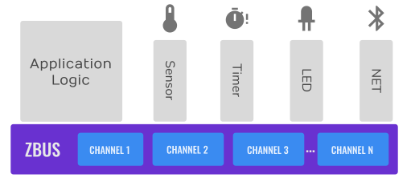
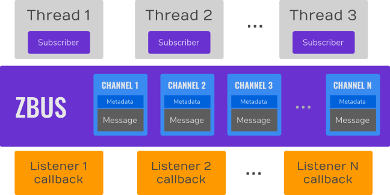
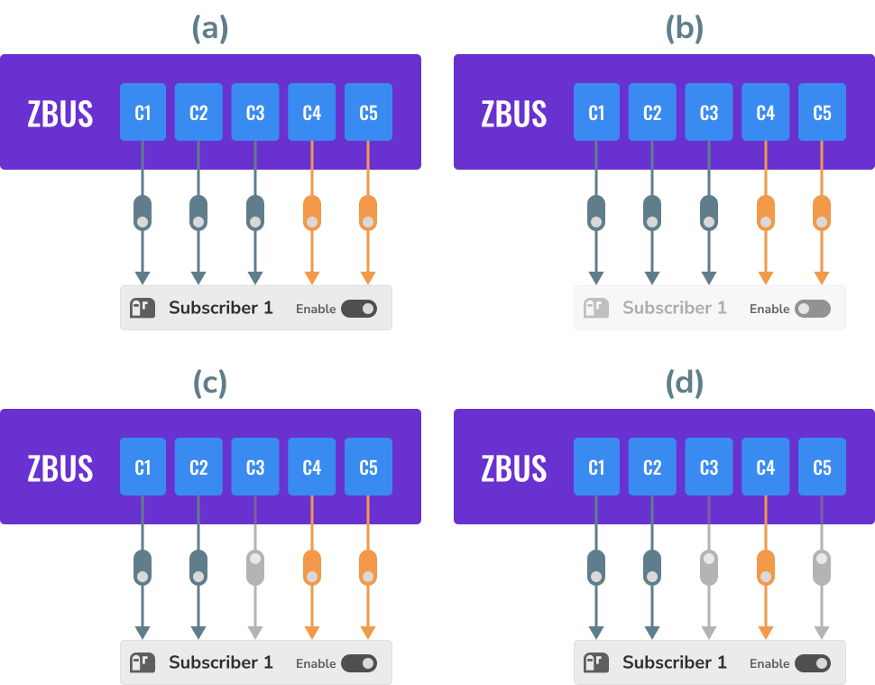
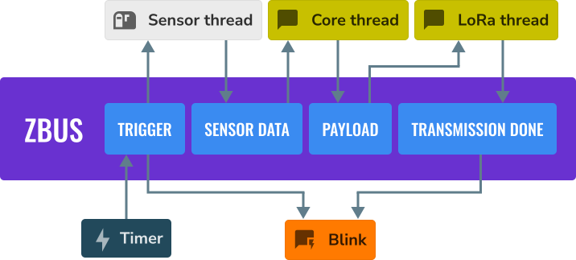

==========================
``zbus`` ZBus message bus
==========================

Port of the `zbus <https://docs.zephyrproject.org/latest/services/zbus/index.html>`_
message bus to NuttX, built entirely on native NuttX primitives.  ZBus
implements many-to-many communication through **channels** (typed shared
messages) observed by **observers**, keeping publishers and consumers
fully decoupled.

    A typical zbus application architecture.

Channels and observers are defined statically, in any source file, with
declarative macros.  The definitions are collected at link time through
iterable sections (see the Iterable Sections component documentation) --
there is no runtime registration and no central list to maintain.

    ZBus anatomy: channels, observers and observations.

Observer types
==============

    The four observer types.

========================  ===================================================
Type                      Behavior
========================  ===================================================
Listener                  Callback executed synchronously in the publisher
                          context (``ZBUS_LISTENER_DEFINE``).
Subscriber                Receives channel references through a message
                          queue; waits with ``zbus_sub_wait()``
                          (``ZBUS_SUBSCRIBER_DEFINE``).
Message subscriber        Receives a *copy* of every published message, in
                          order; waits with ``zbus_sub_wait_msg()``
                          (``ZBUS_MSG_SUBSCRIBER_DEFINE``,
                          ``CONFIG_ZBUS_MSG_SUBSCRIBER``).
Async listener            Callback executed on a dedicated task with a
                          copy of the message
                          (``ZBUS_ASYNC_LISTENER_DEFINE``,
                          ``CONFIG_ZBUS_ASYNC_LISTENER``).
========================  ===================================================

Runtime observers (``zbus_chan_add_obs()``/``zbus_chan_rm_obs()``,
``CONFIG_ZBUS_RUNTIME_OBSERVERS``), per-observation notification masks,
observer enable/disable, message validators and channel user data are
also supported.

    Observer enable/disable and per-observation masks: disabling the
    observer (b) silences every channel; masking observations (c, d)
    silences individual channels.

Example
=======

The figure below shows the kind of decoupled architecture zbus enables:
every block only talks to channels, so each one can be replaced without
touching the others.

    A sensor-based application built on zbus.

.. code-block:: c

   #include <system/zbus.h>

   struct acc_msg
   {
     int x;
     int y;
     int z;
   };

   static void listener_cb(const struct zbus_channel *chan)
   {
     const struct acc_msg *msg = zbus_chan_const_msg(chan);
     printf("x=%d y=%d z=%d\n", msg->x, msg->y, msg->z);
   }

   ZBUS_LISTENER_DEFINE(acc_listener, listener_cb);
   ZBUS_SUBSCRIBER_DEFINE(acc_subscriber, 4);

   ZBUS_CHAN_DEFINE(acc_chan,                      /* Name */
                    struct acc_msg,                /* Message type */
                    NULL,                          /* Validator */
                    NULL,                          /* User data */
                    ZBUS_OBSERVERS(acc_listener,   /* Observers, in */
                                   acc_subscriber),/* priority order */
                    ZBUS_MSG_INIT(.x = 0, .y = 0, .z = 0));

   /* Publisher: */

   struct acc_msg msg = { 1, 10, 100 };
   zbus_chan_pub(&acc_chan, &msg, 1000);

   /* Subscriber thread: */

   const struct zbus_channel *chan;
   if (zbus_sub_wait(&acc_subscriber, &chan, ZBUS_FOREVER) == 0)
     {
       zbus_chan_read(chan, &msg, 500);
     }

A complete runnable example is available in ``apps/examples/zbus``
(``CONFIG_EXAMPLES_ZBUS``), and a cmocka test suite covering the whole
API in ``apps/testing/zbus`` (``CONFIG_TESTING_ZBUS``).

Not ported
==========

The following Zephyr zbus features are **not available** in this port:

* **Multi-domain proxy agent** (``CONFIG_ZBUS_PROXY_AGENT``): bridges
  channels between domains/cores over IPC.  Experimental upstream and
  tied to the Zephyr IPC service; a NuttX equivalent would be built on
  rpmsg and is left as future work.
* **Publishing from interrupt handlers**: the Zephyr original allows
  ``zbus_chan_pub()`` from ISRs with ``K_NO_WAIT``.  This port is a
  userspace library and its primitives (semaphores, message queues, lazy
  initialization) are not ISR-safe: interrupt handling belongs to the
  driver, which should hand the data to a thread (the usual NuttX
  pattern) that then publishes it.  ``test_timer_driven_publisher`` in
  ``apps/testing/zbus`` shows the pattern with a kernel timer interrupt
  delivering a signal to a sampling thread.
* **Priority boost (Highest Locker Protocol)**
  (``CONFIG_ZBUS_PRIORITY_BOOST``): the Zephyr hand-rolled protection
  against priority inversion during the notification process.  Not
  needed: enable the native ``CONFIG_PRIORITY_INHERITANCE`` so the
  channel semaphores get equivalent protection from the kernel.
* **net_buf pools and pool isolation**
  (``CONFIG_ZBUS_MSG_SUBSCRIBER_BUF_*``): obsolete by design in this
  port -- message queues copy the payload on ``mq_send``, so no shared
  reference-counted buffers exist at all.
* **Static/user-provided runtime observer nodes**
  (``CONFIG_ZBUS_RUNTIME_OBSERVERS_NODE_ALLOC_STATIC/NONE``): runtime
  observer nodes are always heap-allocated in this port.

Differences from the Zephyr original
====================================

* Timeouts are plain milliseconds (``int32_t``): ``ZBUS_NO_WAIT`` (0) and
  ``ZBUS_FOREVER`` (-1) replace ``K_NO_WAIT``/``K_FOREVER``.
* Subscriber queues are POSIX message queues opened lazily on first API
  use through the kernel ``file_mq_*`` interface, making them usable from
  any task (a ``mqd_t`` descriptor would die with the opening task).
* Initialization is lazy (``pthread_once`` on the first API call)
  replacing the Zephyr ``SYS_INIT`` hook; no explicit init call is
  needed.
* Async listeners run on a dedicated task per listener (spawned on
  first use; priority and stack size are configurable) instead of the
  Zephyr system work queue.

Configuration
=============

Requirements:

* The board linker script must provide the zbus iterable sections, either
  by including ``<nuttx/linker/common-rom.ld>`` inside ``.text`` (see the
  ``linum-stm32h753bi`` board) or through
  ``CONFIG_ITERABLE_SECTIONS_LINKER_INSERT``
  (zero-touch mode; see its help text for the MEMORY-layout constraint).
* ``CONFIG_MQ_MAXMSGSIZE`` must be at least
  ``CONFIG_ZBUS_MSG_SUBSCRIBER_MAX_MSG_SIZE`` plus the size of a pointer
  when message subscribers or async listeners are used, otherwise their
  queues fail to open with ``-EINVAL``.
* FLAT build (the library uses the kernel ``file_mq_*`` interface
  directly).

Main options:

* ``CONFIG_ZBUS`` -- enable the library.
* ``CONFIG_ZBUS_CHANNEL_NAME`` / ``CONFIG_ZBUS_OBSERVER_NAME`` -- name
  fields and lookup by name.
* ``CONFIG_ZBUS_CHANNEL_ID`` -- numeric channel identifiers
  (``ZBUS_CHAN_DEFINE_WITH_ID``, ``zbus_chan_from_id()``).
* ``CONFIG_ZBUS_MSG_SUBSCRIBER`` -- message subscribers
  (+ ``_MAX_MSG_SIZE``, ``_QUEUE_SIZE``).
* ``CONFIG_ZBUS_ASYNC_LISTENER`` -- async listeners (+ ``_PRIORITY``,
  ``_STACKSIZE`` of their tasks).
* ``CONFIG_ZBUS_RUNTIME_OBSERVERS`` -- runtime observers.
* ``CONFIG_ZBUS_CHANNEL_PUBLISH_STATS`` -- publish timestamp/count.
* ``CONFIG_ZBUS_ASSERT_MOCK`` -- invalid parameters return ``-EFAULT``
  instead of asserting (for tests).

Credits
=======

The zbus design and the diagrams in this page come from the upstream
`Zephyr zbus documentation
<https://docs.zephyrproject.org/latest/services/zbus/index.html>`_
by Rodrigo Peixoto and contributors (Apache License 2.0).
