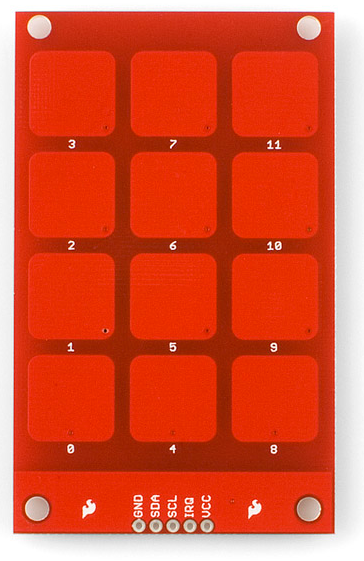

========================
MPR121 Capacitive Keypad
========================

**What is the MPR121 Keypad**
The  MPR Capacitive Keypad is a small keyboard with 12 keys, similar
to a telephone keypad, however the keys are numered from 0 to 11.

This is the picture of the MPR121 Capacitive Keypad:

**Purpose**. The MPR121 driver provides a generic keypad
implementation for this capacitive keypad. The MPR121 uses the I2C
bus to setup and read the touched/released key and uses an IRQ pin
(open drain) to indicate when a key is pressed/released or when some
unnexpected issue happens (currently not used).

The driver also enables debounce, and emits keyboard events through
the common keyboard upper-half. This makes the device available as a
character driver (e.g., ``/dev/keypad0``) using the standard keyboard
interfaces.

**Driver Overview**. The MPR121 lower-half scans the matrix and calls
``keyboard_event()`` when it detects a press or release. The keyboard
upper-half registers the character device at the requested ``devpath``
and stores events in a circular buffer. Applications read
``struct keyboard_event_s`` from the device or use the optional
kbd-codec layer.

**Board Support**. To support the MPR121, a board must provide:

#. **IRQ Definition**

   - Define the GPIO Input pin with pull-up enabled (since the
     IRQ pin is open-drain) to be used to detect the interrupts.

#. **Registration Hook**

   - Define a ``struct xxx_mpr121config_s`` that will wrap the
     ``struct mpr121_config_s config`` as first member and the irq
     argument and ISR handler (xcpt_t isr). The ``config`` needs to
     have its ``.irq_attach`` and ``keymap`` initialized with the
     board IRQ ISR function and the key mapping array.
   - Implement ``board_mpr121_initialize(int devno, int busno)`` to
     call ``mpr121_register(&config, devpath)``. It needs to initialize
     the I2C Master port/channel that will be used to communicate with
     the MPR121 and an instance of that ``xxx_mpr121config_s`` structure.
   - Invoke the board hook during bring-up (for example,
     ``board_mpr121_initialize(0, 1)`` for ``/dev/keymap0`` and ``i2c1``).

**Reference Implementation (STM32F4Discovery)**. The current reference
is in ``boards/arm/stm32/common/src/stm32_mpr121.c``:

- Keymap: 4x3 keypad layout
- Registration: ``board_mpr121_initialize()`` calls
  ``mpr121_register()``

**Data Path Summary**.

- Board calls ``board_mpr121_initialize(0, 1)``
- ``mpr121_register()`` initializes and configure the MPR121 chip
  and calls ``keyboard_register(&lower, devpath, buflen)``
- The upper-half registers the device node at ``devpath``
- Every time an interruption is generated on IRQ pin it will call the
  ``mpr121_worker()`` and it is calls ``keyboard_event()`` on
  press/release of keys.
- Applications read events from the device node (``/dev/keypad0``).

