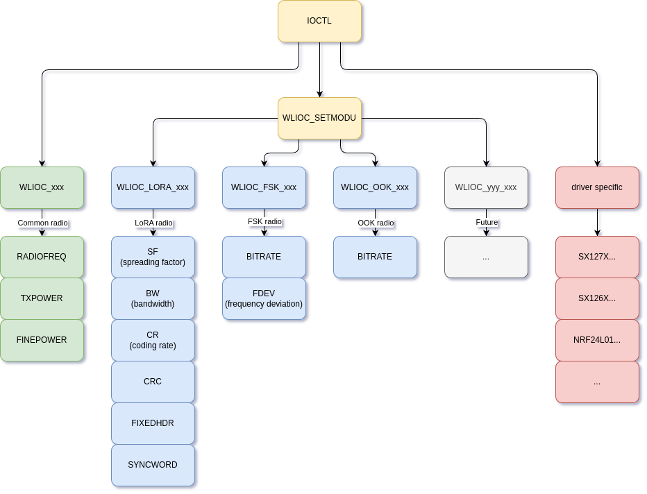

==========================
Wireless character drivers
==========================

.. toctree::
  :maxdepth: 1

  lpwan/index.rst

IOCTL Interface
===============

Before this interface, the IOCTL API for character-driven RF devices lacked
a common interface across different modulation technologies,
such as LoRa, FSK, and OOK. The result was, driver-specific IOCTL commands
were created even when they could be shared across multiple radios.
This fragmentation made application portability more difficult to maintain.

To solve this issue, groups of commands have been created that are "selected"
by using ``WLIOC_SETMODU``.
See image below for a representation.

.. note:: This image does not show all features. This is purely a
          representation of command relations under WLIOC_SETMODU.

read()
------

Reading a radio will take a ``wlioc_rx_hdr_s``, where information about the
payload will be read and written to.

- ``FAR uint8_t *payload_buffer`` Pointer to **user buffer**. This is where
  the payload will be written to.
- ``size_t payload_length`` **Initially**: User must set this to the size
  of ``payload_buffer``. **After reading**: This will become the amount of
  bytes written to the ``payload_buffer``.
- ``uint8_t error`` When greater than 0, there are errors detected in the
  payload. The payload can still be returned, which allows the user to repair
  it if desired.
- ``int32_t rssi_dbm`` The Received Signal Strength Indicator in
  1/100 decibel-milliwatts of the received signal.
  When unsupported, this returns ``INT32_MIN``.
- ``int32_t snr_db`` The signal to noise ratio in 1/100 decibels of the
  received signal. When unsupported, this returns ``INT32_MIN``.

write()
-------

Writing to a radio will attempt to send the given bytes. The radio must be
configured before doing so.
Unlike ``read()``, this will simply take uint8_t bytes as payload.