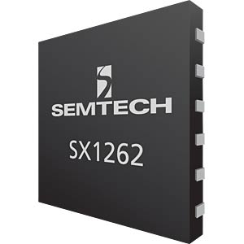
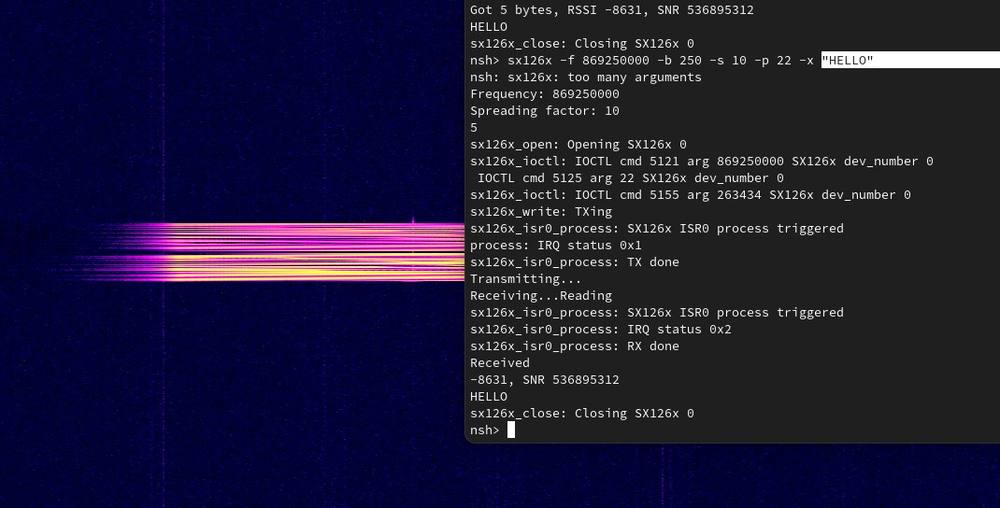

==================
SX126x LoRa driver
==================
**Currently experimental. Changes can happen in the near future**

Short introduction SX126x
=========================

The SX126x is a LoRa chip by Semtech. Sometimes also found in chips with a different name but the same or similar sillicon underneath.
The older variant is the SX127x, even with its higher number. The SX126x series promises to improve the link budget. They also added extra spreading factors.

Userspace API
=============
This driver is controlled as a character device and using IOCTL commands. At the time of writing this 24 February, 2025, there is no common API **yet** for LoRa devices and other RF devices under ``/lpwan``.
Currently this driver is controlled using older and driver specific IOCTL commands.

Basic RF IOCTL
--------------
See ``nuttx/wireless/ioctl.h`` : ``WLIOC_x`` for setting the basic radio parameters such as frequency and power.
Please note that frequency and power may be limited by the lower driver part at board logic.

Driver dedicated IOCTL
----------------------
See ``nuttx/wireless/lpwan/sx126x.h`` : ``SX126XIOC_x`` for the commands.

* The packet type is set using ``SX126XIOC_PACKETTYPESET`` which takes ``sx126x_packet_type_e`` enums. **Currently only LoRa packet type is supported.**

* LoRa modulation and LoRa packets are configured using ``SX126XIOC_LORACONFIGSET`` which takes a pointer to a ``sx126x_lora_config_s`` struct. This struct contains two separate structures for modulation and packet config. It is recommended to follow the SX126x datasheet at https://www.semtech.com/products/wireless-rf/lora-connect/sx1262 that gives more details about each parameter.

Reading / Writing
-----------------
Reading and writing is done with the ``read`` and ``write`` functions.

* ``write`` directly transmits the given bytes using the IOCTL configured parameters. **Does not support polling or timeout yet.**

* ``read`` takes a pointer to ``sx126x_read_header_s``, which contains information about the received packet. **RSSI and SNR aren't implemented yet**. *Note that packets are always received, even when the CRC (checked using ``.crc_error``) failed.*

Board implementation
====================
The driver can be registered in board logic using ``sx126x_register``, which takes an SPI bus, lower driver and the path.
More information about ``struct sx126x_lower_s`` parameters can be found in detail under ``nuttx/wireless/lpwan/sx126x.h`` : ``struct sx126x_lower_s``.

This driver supports multiple instances using ``dev_number`` found in ``sx126x_lower_s``. This is done so multiple channels of LoRa can work at the same time.

**Do not assign random numbers in get_pa_values. This can damage the device depending on model. Refer to the manual**

Testing
=======
A simple ping-pong test is made to test the device. This code can be used as an example. It is found here https://pastebin.com/71CdKZvm
It takes the following parameters:

* ``-f`` sets frequency in hz. The range is board depended.
* ``-b`` sets the bandwidth in kHz and automatically selects the closest sx126x supported bandwidth.
* ``-s`` sets the spreading factor between 5 and 12.
* ``-p`` sets the power in dBm. The range is board depended. Also PA setting depended.
* ``-t`` perform transmit. Transmit the following bytes.
* ``-r`` perform receive. Receives and print.
* ``-x`` perform transmit and receive. Transmits following bytes and attempts to receives immediately. To be used with ``-e`` echo
* ``-e`` perform echo. Listen and repeat.

