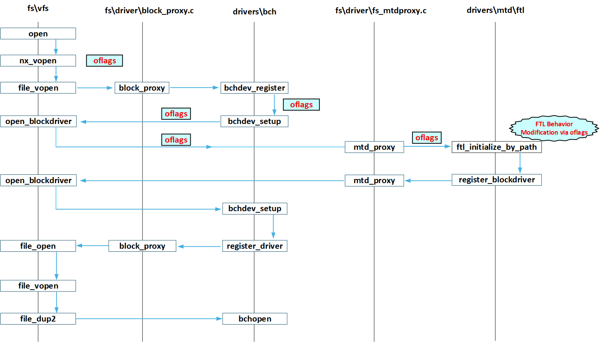

================================
Memory Technology Device Drivers
================================

MTD stands for "Memory Technology Devices".  This directory contains
drivers that operate on various memory technology devices and provide an
MTD interface.  That MTD interface may then be used by higher level logic
to control access to the memory device.

See include/nuttx/mtd/mtd.h for additional information.

-  ``include/nuttx/mtd/mtd.h``. All structures and APIs needed
   to work with MTD drivers are provided in this header file.

-  ``struct mtd_dev_s``. Each MTD device driver must implement
   an instance of ``struct mtd_dev_s``. That structure defines a
   call table with the following methods:

   Erase the specified erase blocks (units are erase blocks):

   Read/write from the specified read/write blocks:

   Some devices may support byte oriented reads (optional). Most
   MTD devices are inherently block oriented so byte-oriented
   accesses are not supported. It is recommended that low-level
   drivers not support read() if it requires buffering.

   Some devices may also support byte oriented writes (optional).
   Most MTD devices are inherently block oriented so byte-oriented
   accesses are not supported. It is recommended that low-level
   drivers not support read() if it requires buffering. This
   interface is only available if ``CONFIG_MTD_BYTE_WRITE`` is
   defined.

   Support other, less frequently used commands:

   -  ``MTDIOC_GEOMETRY``: Get MTD geometry
   -  ``MTDIOC_BULKERASE``: Erase the entire device
   -  ``MTDIOC_ISBAD``: Check if a block is bad

   is provided via a single ``ioctl`` method (see
   ``include/nuttx/fs/ioctl.h``):

-  **Binding MTD Drivers**. MTD drivers are not normally directly
   accessed by user code, but are usually bound to another, higher
   level device driver. In general, the binding sequence is:

   #. Get an instance of ``struct mtd_dev_s`` from the
      hardware-specific MTD device driver, and

   #. Use the ``register_mtddriver`` interface to register the MTD drivers.

-  **Examples**: ``drivers/mtd/m25px.c`` and ``boards/arm/sama5/sama5d4-ek/src/sam_at25.c``

Registration Method
===================

The ``register_mtddriver`` function provides a unified interface for
registering MTD devices. Upon registration, the MTD device will automatically
incorporate FTL (Flash Translation Layer) and BCH (Block-to-Character conversion)
wrappers during the ``open()`` process. This automatic wrapping obviates the
need for legacy registration methods ``ftl_initialize()`` and
``bchdev_register()`` in user code. Users can directly access the MTD device
via standard file operations (e.g., ``open()``, ``read()``, ``write()``)
after registration.

- **Character Device Mode** (via ``open()``):
  Enables byte-oriented access with both FTL and BCH layers applied
  (requires ``CONFIG_BCH``).

- **Block Device Mode** (via ``open_blockdriver()``):
  Presents a block interface with only the FTL layer enabled

  The functions register_partition_with_mtd() and register_mtdpartition()
  are actually wrappers built on top of register_mtddriver(),
  and they can be used to create sub-partition devices for MTD devices.

  In scenarios where the FTL layer is not suitable for converting MTD to a
  block device, alternatives like Dhara can be used instead.
  To register a Dhara-backed block device: Use the ``dhara_initialize()``
  function, passing the underlying  ``struct mtd_dev_s *dev``
  as a parameter to create a Dhara block device instance.  Once Dhara is
  initialized, register the block device using ``register_blockdriver()``
  with the Dhara device's block operations:  This approach bypasses the FTL
  layer and directly integrates Dhara's block management capabilities with the
  MTD device. Dhara provides features such as wear-leveling and bad block
  management tailored for specific use cases.

Control FTL Behavior via Open Flags
===================================

The FTL layer translates MTD operations into block-device semantics
while managing NAND-specific challenges (e.g., bad blocks, wear leveling).
By default, FTL employs a read-modify-write cycle for writes:

1. Read the entire erase block into a cache buffer.
2. Modify the target data in memory.
3. Erase the physical block.
4. Write the entire buffer back.

This approach ensures data consistency but introduces latency and requires
sufficient RAM.
To accommodate performance-sensitive applications,
FTL supports the following flags during ``open()``:

- **``O_DIRECT``**:
  Bypasses the read-modify-write cycle, enabling direct writes to flash.
  Use this flag when: Write speed is critical or Sufficient RAM for caching
  is unavailable.

- **``O_SYNC``**:
  Assumes blocks are pre-erased, skipping the erase step during writes.
  This flag only takes effect when used in conjunction with ``O_DIRECT``.

The diagram below illustrates the workflow when opening an MTD device node
via the ``open()`` function, highlighting how ``oflags``
(e.g., ``O_DIRECT``, ``O_SYNC``) are propagated through layers to control
FTL behavior:

  *Figure 1: Sequence of opening an MTD device node and oflag propagation*

EEPROM
======

SPI EEPROMs using the same commands as the Microchip 25xxxx family, and I2C
EEPROMs using the same commands as the Microchip 24xxxx family can be
interfaced using the `drivers/mtd/at25ee.c` and `drivers/mtd/at24xx.c` driver
respectively.

Refer to the :doc:`EEPROM character driver reference <../character/eeprom>`
for

-  the differences between EEPROM and FLASH memory;
-  the list of supported EEPROM variants;
-  interfacing EEPROM using a character driver.

The MTD interface should be preferred over the character driver interface in
most cases, unless finer control is desired over the EEPROM operations. The
character driver interface may also be preferred to reduce footprint or for
very trivial usage of the EEPROM (e.g. storing parameters without having to
rely on a filesystem).

The MTD driver for 25xxxx family EEPROMs is a wrapper around the character
driver, their performance is therefore almost identical.

CFI FLASH
=========

CFI, the full name of which is Common Flash Interface, is a standard proposed
by JEDEC (Joint Electron Device Engineering Council) in 2003. The role of CFI
(Common Flash Interface) is to read the information of NOR Flash through a
unified method.

This standard defines a query interface for Flash that complies with CFI,
allowing parameterization and platformization of read, write, erase, and other
interfaces for Flash. It allows programmers to read electrical characteristics
of Flash-related devices, including memory size, erase speed, special features,
and more. In other words, it is equivalent to loading the data manual of Flash
into the physical device of Flash, It can be read and used by relevant personnel
when needed.

CFI's instruction link:
https://netwinder.osuosl.org/pub/netwinder/docs/nw/flash/29220403.pdf
CFI supports intel and amd instruction sets, and currently device drivers are
already supported

NAND MEMORY
===========

Files
-----

This directory also includes drivers for NAND memory.  These include::

    mtd_nand.c: The "upper half" NAND MTD driver
    mtd_nandecc.c, mtd_nandscheme.c, and hamming.c: Implement NAND software
      ECC
    mtd_onfi.c, mtd_nandmodel.c, and mtd_modeltab.c: Implement NAND FLASH
      identification logic.

File Systems
------------

NAND support is only partial in that there is no file system that works
with it properly.  It should be considered a work in progress.  You will
not want to use NAND unless you are interested in investing a little
effort. See the STATUS section below.

NXFFS
~~~~~

The NuttX FLASH File System (NXFFS) works well with NOR-like FLASH
but does not work well with NAND.  Some simple usability issues
include:

- NXFFS can be very slow.  The first time that you start the system,
  be prepared for a wait; NXFFS will need to format the NAND volume.
  I have lots of debug on so I don't yet know what the optimized wait
  will be.  But with debug ON, software ECC, and no DMA the wait is
  in many tens of minutes (and substantially  longer if many debug
  options are enabled.

- On subsequent boots, after the NXFFS file system has been created
  the delay will be less.  When the new file system is empty, it will
  be very fast.  But the NAND-related boot time can become substantial
  whenthere has been a lot of usage of the NAND.  This is because
  NXFFS needs to scan the NAND device and build the in-memory dataset
  needed to access NAND and there is more that must be scanned after
  the device has been used.  You may want tocreate a separate thread at
  boot time to bring up NXFFS so that you don't delay the boot-to-prompt
  time excessively in these longer delay cases.

- There is another NXFFS related performance issue:  When the FLASH
  is fully used, NXFFS will restructure the entire FLASH, the delay
  to restructure the entire FLASH will probably be even larger.  This
  solution in this case is to implement an NXFSS clean-up daemon that
  does the job a little-at-a-time so that there is no massive clean-up
  when the FLASH becomes full.

But there is a more serious, showstopping problem with NXFFS and NAND:

- Bad NXFFS behavior with NAND:  If you restart NuttX, the files that
  you wrote to NAND will be gone.  Why?  Because the multiple writes
  have corrupted the NAND ECC bits.  See STATUS below.  NXFFS would
  require a major overhaul to be usable with NAND.

There are a few reasons whay NXFFS does not work with NAND. NXFFS was
designed to work with NOR-like FLASH and NAND differs from other that
FLASH model in several ways.  For one thing, NAND requires error
correction (ECC) bytes that must be set in order to work around bit
failures.  This affects NXFFS in two ways:

- First, write failures are not fatal. Rather, they should be tried by
  bad blocks and simply ignored.  This is because unrecoverable bit
  failures will cause read failures when reading from NAND.  Setting
  the CONFIG_EXPERIMENTAL+CONFIG_NXFFS_NAND option will enable this
  behavior.

[CONFIG_NXFFS_NAND is only available is CONFIG_EXPERIMENTAL is also
selected.]

- Secondly, NXFFS will write a block many times.  It tries to keep
  bits in the erased state and assumes that it can overwrite those bits
  to change them from the erased to the non-erased state.  This works
  will with NOR-like FLASH.  NAND behaves this way too.  But the
  problem with NAND is that the ECC bits cannot be re-written in this
  way.  So once a block has been written, it cannot be modified.  This
  behavior has NOT been fixed in NXFFS.  Currently, NXFFS will attempt
  to re-write the ECC bits causing the ECC to become corrupted because
  the ECC bits cannot be overwritten without erasing the entire block.

This may prohibit NXFFS from ever being used with NAND.

FAT
~~~

Another option is FAT.  FAT can be used if the Flast Translation Layer
(FTL) is enabled.  FTL converts the NAND MTD interface to a block driver
that can then be used with FAT.

FAT, however, will not handle bad blocks and does not perform any wear
leveling.  So you can bring up a NAND file system with FAT and a new,
clean NAND FLASH but you need to know that eventually, there will be
NAND bit failures and FAT will stop working: If you hit a bad block,
then FAT is finished.  There is no mechanism in place in FAT not to
mark and skip over bad blocks.

FTL writes are also particularly inefficient with NAND.  In order to
write a sector, FTL will read the entire erase block into memory, erase
the block on FLASH, modify the sector and re-write the erase block back
to FLASH.  For large NANDs this can be very inefficient.  For example,
I am currently using nand with a 128KB erase block size and 2K page size
so each write can cause a 256KB data transfer!

NOTE that there is some caching logic within FAT and FTL so that this
cached erase block can be reused if possible and writes will be
deferred as long as possible.

SMART FS
~~~~~~~~

I have not yet tried SmartFS.  It does support some wear-leveling
similar to NXFFS, but like FAT, cannot handle bad blocks and like NXFFS,
it will try to re-write erased bits.  So SmartFS is not really an
option either.

What is Needed
~~~~~~~~~~~~~~

What is needed to work with FAT properly would be another MTD layer
between the FTL layer and the NAND FLASH layer.  That layer would
perform bad block detection and sparing so that FAT works transparently
on top of the NAND.

Another, less general, option would be support bad blocks within FAT.
Such a solution might be possible for SLC NAND, but would not be
sufficiently general for all NAND types.
