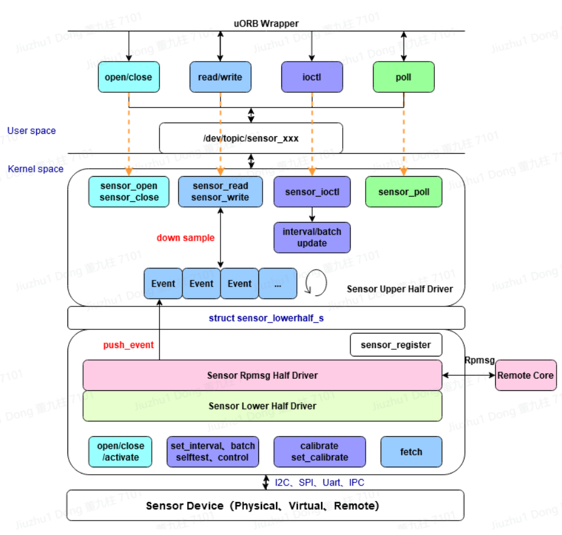

.. _new_sensor_framework:

=====================
Sensor "uORB" Drivers
=====================

NuttX, in order to uniformly manage all sensors, reuse common code, and
reduce space occupation, extracts the common parts of all sensor drivers
into an **upper half layer** that provides general functionalities.
The **lower half layer** is responsible for the actual interaction with sensor
registers.

NuttX sensor drivers focus more on physical sensors. For virtually fused
sensors generated through integration, they are automatically created through
application advertisements or subscriptions. For devices like IMUs, which integrate
multiple sensors into one unit, multiple lower halves need to be instantiated
within the driver, and device nodes are registered separately through the API
(sensor_register) provided by the upper half.

Naming
======

The name used for this component in NuttX may be misleading because this sensor
framework is not dependent on "uORB" in any way. Sensors implemented in this way
can be used as general character drivers with a standardized interface.

**Driver Model**
================

The NuttX Sensor Upperhalf Driver is primarily responsible for registering device
nodes, implementing the struct file_operations, multi-user access, ring buffer
management, low power consumption, and downsampling logic. The Lowerhalf Driver
is divided into rpmsg half and a general lower half. The rpmsg half is responsible
for cross-core subscription and publication with remote CPUs, while the general
lower half is responsible for interacting with sensor hardware. The main actions
performed by the general lower half include a set of sensor operations such as
``activate``, ``set_interval``, ``batch``, ``selftest``, ``set_calibvalue``,
``calibrate``, and ``control``. Under interrupt or polling mechanisms,
sensor events are sent to the ring buffer in the upper layer.

Problems to solve
=================

The current implementation uses the ``float`` type which may make it difficult
to use on platforms without FPU support.

**Code**
========

::

  nuttx/driver/sensor/sensor.c               sensor upperhalf implementation
  nuttx/driver/sensor/sensor_rpmsg.c         sensor rpmsg lowerhalf implementation
  nuttx/driver/sensor/usensor.c              userpace sensor register implementation
  nuttx/include/nuttx/sensors/sensor.h       sensor unify structure header file
  nuttx/include/nuttx/sensors/ioctl.h        sensor ioctl cmd header file

  CONFIG_SENSORS                             open sensor driver config
  CONFIG_USENSORS                            open user sensor driver config
  CONFIG_SENSORS_RPMSG                       open rpmsg sensor driver config

**Data Structures**
===================

**Sensor Types**
----------------

NuttX defines 50+ types of sensors, covering most physical sensors. All type
definitions are located in include/nuttx/uorb.h. If a new type needs to be added,
a comment must be provided for the new type, explaining the purpose and units of
the sensor.

**SENSOR_TYPE_CUSTOM**

This is a custom type used for irregular sensor devices where the event structure
changes or is dynamically altered. It is registered using ``sensor_custom_register``.

**SENSOR_TYPE_ACCELEROMETER**

Accelerometer, used to measure the acceleration vector of the device. Units: m/s=2.
Event data structure: (This indicates that there is a specific data structure for
accelerometer events, but the actual structure is not provided in the text you gave.)

(won't introduce them one by one since there are many)

**Sensor Topic Definition**
---------------------------

The data structure for sensors, which is also the topic structure for uORB, is
defined in ``include/nuttx/uorb.h``.

**Lower Half Structure**
------------------------

This structure serves as a bridge between the sensor driver's upper half and
lower half. Both the upper half and lower half populate this structure, with
the lower half responsible for synchronizing configuration information and
the upper half for exposing data reporting interfaces.

The lower part highlighted in red is filled by the lower half driver, while
the rest is filled by the upper half.

``type`` indicates the sensor type: ``SENSOR_TYPE_XXX``

``nbuffer`` specifies the length of the ring buffer in the upper half driver; 

``uncalibrated`` indicates whether the data reported by the lower half driver is
uncalibrated. If true, it means uncalibrated data is reported, and the registered
device node will have a suffix ``_uncal``.

``ops`` represents the set of sensor operations implemented by the lower half driver.

``push_event`` and ``notify_event`` are not used simultaneously and are filled
by the upper half.

``push_event`` works in conjunction with the ring buffer for the lower half to
report data to the ring buffer;

``notify_event`` is used in conjunction with fetch to notify the upper half that
data is ready when actively
pulling data in a blocking operation.

``sensor_lock`` and ``sensor_unlock`` are filled by the upper half and exported
to the lower half to avoid recursive deadlock issues. Currently, they are only
used for sensor_rpmsg.

``priv`` is filled by the upper half and represents the upper context.

``persist`` indicates whether the topic is a notification-type topic.

.. code:: C

  struct sensor_lowerhalf_s
  {
    int type;
    unsigned long nbuffer;
    bool uncalibrated;
    FAR const struct sensor_ops_s *ops;
  
    union
      {
        sensor_push_event_t push_event;
        sensor_notify_event_t notify_event;
      };
  
    CODE void (*sensor_lock)(FAR void * priv);
    CODE void (*sensor_unlock)(FAR void * priv);
  
    FAR void *priv;
    bool persist;
  };

**API**
-------

The NuttX Sensor UpperHalf Driver provides a set of APIs for the lower half,
including registration and timestamp acquisition.

**Registration and Deregistration**
~~~~~~~~~~~~~~~~~~~~~~~~~~~~~~~~~~~

For the 50+ types of sensors, the sensor_register function can be used to register
a character device. The parameter dev represents the handle of the lower half,
and devno is the index of the device name. If the registration is successful,
a node will be created under ``/dev/{topic}``, for example: ``/dev/topic/sensor_accel0``.
If it fails, an error code will be returned.

For custom special-type drivers, the ``sensor_custom_register`` function needs
to be used to register a character device. The parameter dev is the handle of
the lower half, path is the path of the character device, and esize is
the element size of the data reported by the sensor. If the registration is
successful, a character device node will be created at the specified path.
If it fails, an error code will be returned.

.. code:: C

  int sensor_register(FAR struct sensor_lowerhalf_s *dev, int devno);
  void sensor_unregister(FAR struct sensor_lowerhalf_s *dev, int devno);
  
  int sensor_custom_register(FAR struct sensor_lowerhalf_s *dev,
                             FAR const char *path, unsigned long esize);
  void sensor_custom_unregister(FAR struct sensor_lowerhalf_s *dev,
                                FAR const char *path);
 
**Acquiring Timestamps**
~~~~~~~~~~~~~~~~~~~~~~~~

The function returns a timestamp with microsecond precision.

.. code:: C

  static inline uint64_t sensor_get_timestamp(void);

**Sensor Driver Operation Set**
-------------------------------

Sensor driver frameworks for different systems and platforms always revolve
around sensor characteristics, and the NuttX Sensor is no exception. For sensors,
common operations include: opening/closing, initializing range/resolution/filtering,
setting the sampling rate (ODR)/hardware FIFO/operating mode, and interrupt control.
Based on practical applications and references from other systems, several key
points have been selected to form the sensor operation set. For those without
the need for dynamic changes, they can simply be passed as parameters to the
initialization function.

**Opening/Closing**
~~~~~~~~~~~~~~~~~~~

When the caller invokes open and close, the corresponding open and close
in the lower half will be called, with parameters being lower and filep
respectively. filep contains user information, so the driver can differentiate
between different users. Currently, this interface is only used by the sensor_rpmsg
lower half.

.. code:: C

  CODE int (*open)(FAR struct sensor_lowerhalf_s *lower,
                   FAR struct file *filep);
                   
  CODE int (*close)(FAR struct sensor_lowerhalf_s *lower,
                    FAR struct file *filep);

**Activating/Deactivating the Sensor**
~~~~~~~~~~~~~~~~~~~~~~~~~~~~~~~~~~~~~~

When the caller invokes open, if it is a subscriber, it will call activate in
the lower half to activate the sensor. When close is called, deactivate is
invoked to turn off the sensor.

.. code:: C

  CODE int (*activate)(FAR struct sensor_lowerhalf_s *lower,
                       FAR struct file *filep, bool enable);

**Setting the Sampling Rate**
~~~~~~~~~~~~~~~~~~~~~~~~~~~~~

Applications (including the Sensor service) set the sampling rate of the sensor
through the system call ioctl.

Call flow:

  #. ``ioctl(fd, SNIOC_SET_INTERVAL, &interval)``
  #. vfs
  #. ``sensor_ioctl``
  #. ``set_interval()``.

The sampling interval between consecutive samples of the sensor is set in
microseconds. If period_us exceeds the range of min_delay and max_delay, it
will be adjusted. When modifying the sampling rate, it should be ensured that
the data that has already been prepared is not lost.

.. code:: C

  CODE int (*batch)(FAR struct sensor_lowerhalf_s *lower,
                    FAR struct file *filep,
                    FAR unsigned long *latency_us);

**Proactively Pulling Data**
~~~~~~~~~~~~~~~~~~~~~~~~~~~~

To proactively obtain sensor data, set to NULL if using interrupt or polling methods.

.. code:: C

  CODE int (*fetch)(FAR struct sensor_lowerhalf_s *lower,
                    FAR struct file *filep,
                    FAR char *buffer, size_t buflen);

**Self-Test**
~~~~~~~~~~~~~

The sensor self-test is mainly used for factory testing and aging purposes.

.. code:: C

  CODE int (*selftest)(FAR struct sensor_lowerhalf_s *lower,
                       FAR struct file *filep,
                       unsigned long arg);

**Calibration**
~~~~~~~~~~~~~~~

Trigger calibration with calibrate and return calibration data to arg.
Use set_calibvalue to set calibration data to the underlying sensor.

.. code:: C

  CODE int (*calibrate)(FAR struct sensor_lowerhalf_s *lower,
                        FAR struct file *filep,
                        unsigned long arg);

  CODE int (*set_calibvalue)(FAR struct sensor_lowerhalf_s *lower,
                             FAR struct file *filep,
                             unsigned long arg);

**Sensor Information**
~~~~~~~~~~~~~~~~~~~~~~

Use get_info to proactively obtain sensor information data, with the return value
being ``sensor_device_info_s``.

.. code:: C

  struct sensor_device_info_s
  {
    uint32_t      version;
    float         power;
    float         max_range;
    float         resolution;
    int32_t       min_delay;
    int32_t       max_delay;
    uint32_t      fifo_reserved_event_count;
    uint32_t      fifo_max_event_count;
    char          name[SENSOR_INFO_NAME_SIZE];
    char          vendor[SENSOR_INFO_NAME_SIZE];
  };

  CODE int (*get_info)(FAR struct sensor_lowerhalf_s *lower,
                       FAR struct file *filep,
                       FAR struct sensor_device_info_s *info);

**Custom Control**
~~~~~~~~~~~~~~~~~~

In addition to the above controls, if certain sensor control requirements are
still not met, the control command with custom controls can be used.

Call flow:

  #. ``ioctl(fd, custom macro cmd, custom parameters)``
  #. vfs
  #. ``sensor_ioctl``
  #. ``control()``.

.. code:: C

  CODE int (*control)(FAR struct file *filep,
                      FAR struct sensor_lowerhalf_s *lower,
                      int cmd, unsigned long arg);

**Downsampling**
----------------

The downsampling capability of Vela Sensor is provided by the sensor upper half
at the driver layer, supporting both aligned and unaligned downsampling mechanisms.
When the publisher pushes the main line index each time, the subscriber retrieves
data from its own index. If the difference between the two indexes exceeds the
length of the internal queue, data will be lost. Otherwise, the next theoretical
data point is calculated based on the subscription frequency, the publication
frequency factor, and the current index.

**Multi-Core Mechanism**
------------------------

The cross-core capability of Vela Sensor is provided by the sensor rpmsg lower
half at the driver layer, which is primarily responsible for sending or receiving
subscription and broadcast messages from other cores.

**Publishing Topics**
---------------------

When a local application publishes a topic for the first time, it broadcasts
the message to all cores. If there are subscriptions on other cores, they bind
with each other. A stub is created locally to represent the subscription on a
remote core, and a proxy is created on the remote core to represent the local
publisher. All subsequent communication between them is determined by the
context of the stub and proxy.

**Subscribing to Topics**
-------------------------

When a local application subscribes to a topic for the first time, if the message
is broadcast to all cores and there are publishers on other cores, they bind with
each other and communicate through stubs and proxies.

**Remote Control**
------------------

When a local subscriber modifies the sampling rate and the publisher of that
topic is remote, the local proxy will publish this sampling rate to the remote
stub. Upon receiving this control information, the stub sets it for the actual
physical hardware. The same applies to other controls.

**Remote Message Publishing**
-----------------------------

When local data is published, the sensor rpmsg lower half collects all messages
within a sampling interval that does not exceed half of the fastest topic's
interval and sends them to other cores together, reducing IPC occurrences and
saving power consumption.

**Subscription and Publication Order**
--------------------------------------

There is no order restriction for advertising and subscribing to topics.
For notification-type topics, even if the advertisement is canceled immediately
after data publication, other cores can still successfully obtain the latest data.
For general-purpose topics, subscribing after publication will only allow reading
of data published after the subscription.

**Programming Modes**
=====================

NuttX Sensor drivers support three data retrieval methods: proactive,
interrupt-driven, and polling. The proactive method allows filling sensor events
using a buffer passed in by the app, reducing memory copy operations.
The interrupt-driven and polling methods open an internal circular buffer, where
each event is automatically pushed upon generation. The size of the buffer is set
by sensor_lowerhalf_s::buffer_size. For sensors with high sampling rates, it is
recommended to set the buffer size for 2-3 events, while for sensors with low
sampling rates, setting it for 1 event is sufficient.

**Proactive Retrieval**
-----------------------

This method is recommended for sensors with low sampling rates and small data
volumes. The ``sensor_ops_s::fetch`` function must be implemented.

The call flow is:

  #. ``read(fd, buf, len)``
  #. vfs
  #. ``sensor_read``
  #. ``fetch()``

It is not advisable to use the fetch method to retrieve sensor data. When the
caller invokes read, accessing the bus to obtain data has two disadvantages:
the bus speed is low, which may block the upper layer; and the retrieved data
may be old and not representative of the current state.

When using the fetch function, the upper layer will automatically disable
the circular buffer and can directly use the user-space buffer to store register
data, reducing memory copy operations. When the character device node is opened
in non-blocking mode, the fetch operation will directly read the registers via
the I2C/SPI bus, and the poll operation will always succeed. When opened in
blocking mode, if there is no ready data when read is called, the poll function
can be used to monitor it. If a POLLIN event occurs, the read function should
be called immediately to retrieve the data.

**Interrupt-Driven Retrieval**
------------------------------

For sensors with hardware interrupts, sensor data can be read via the bus in
the interrupt's bottom half, and the event can be pushed to the upper layer's
circular buffer using ``sensor_lowerhalf_s::push_event``. When using the internal
circular buffer, data generated in each interrupt's bottom half is pushed to
the upper layer's circular buffer. Upper-layer applications read data directly
from the buffer. When the buffer has no data, it will depend on the blocking
flag in f_oflags to determine whether to wait. Common sensors operate in
interrupt mode. When an interrupt occurs, a worker is scheduled to start
the bottom half, which then retrieves sensor data via buses such as
I2C or SPI and calls the push_event interface to push the data to the upper
half's buffer. It is recommended to configure an interrupt pin for sensors
with a sampling rate higher than 25Hz.

**Polling Retrieval**
---------------------

For sensors without hardware interrupts, data generated by the sensor can be
collected through periodic polling, with the polling period typically varying
based on the sampling rate.

Implemented Drivers
===================

- :doc:`adxl362`
- :doc:`adxl372`
- bh1749nuc
- bme680
- bmi088
- bmi160
- bmi270
- bmm150
- bmp180
- bmp280
- ds18b20
- fakesensor
- fs3000
- gnss
- goldfish_gnss
- goldfish_sensor
- hyt271
- l3gd20
- lsm9ds1
- ltr308
- mpu9250
- ms56xx
- wtgahrs2
