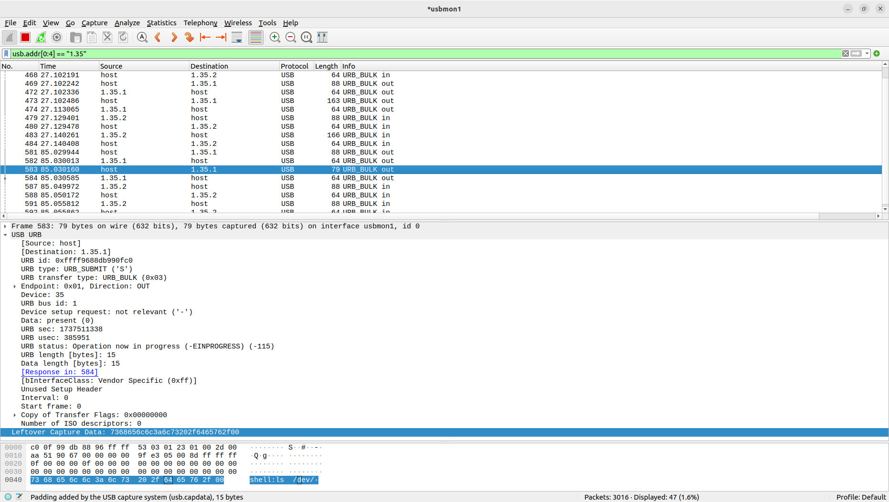

===================
USB Monitor support
===================

Wireshark
=========
The wireshark software USB capture can capture URBs (USB Request Blocks) rather than raw USB packets when device connect to host directly.
To capture raw USB packets, a sniffer is needed.

Linux
-----
1. Install Wireshark::

    sudo apt update
    sudo apt install wireshark

2. (Optional) Configurate Wireshark

  Wireshark offical documentation: https://wiki.wireshark.org/CaptureSetup/USB

3. Load the usbmon kernel module and run Wireshark::

    sudo modprobe usbmon
    sudo wireshark

4. Find bus the device connects::

    $ adb devices -l
    List of devices attached
    1234                   device usb:1-9.4 product:adb dev model:adb_board device:NuttX device transport_id:1000

    $ dmesg
    [3713722.861582] usb 1-9.4: New USB device found, idVendor=18d1, idProduct=4e11, bcdDevice= 1.01

    $ lsusb
    Bus 001 Device 035: ID 18d1:4e11 Google Inc. Nexus One

5. Filter address

  - Select usbmon (Bus 001): usbmon1
  - Wireshark filter (Bus 001 Device 035): usb.addr[0:4] == "1.35"

6. Example

  Capturing ADB packets with filter (usb.addr[0:4] == "1.35"), on board `ESP32S3-DevKit:ADB <https://nuttx.apache.org/docs/latest/platforms/xtensa/esp32s3/boards/esp32s3-devkit/index.html#adb>`_::

    adb -s 1234 shell ls /dev/

  The example PcapNg(Packet CAPture Next Generation) file can be downloaded from :download:`here <./usbmonitor_wireshark_linux_example_adb.pcapng>`.

   Wireshark Capturing

