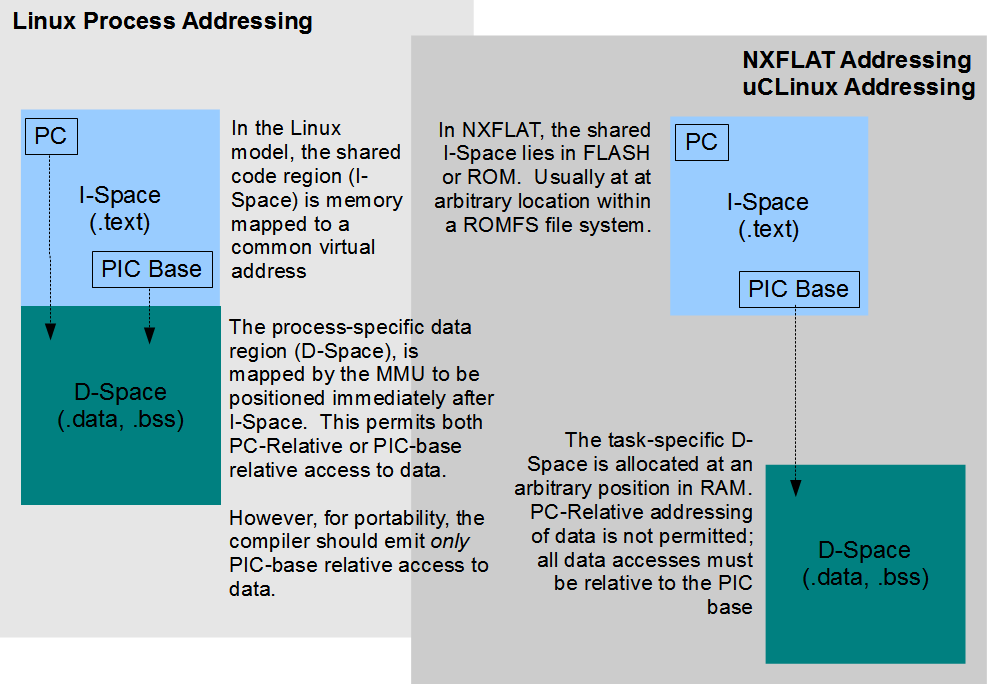

=================================
NuttX FLAT Binary Format (NXFLAT)
=================================

.. warning:: 
    Migrated from: 
    https://cwiki.apache.org/confluence/pages/viewpage.action?pageId=139630111

Overview
========

NuttX supports a configurable :doc:`binary loader <../binfmt>` .
This binary loader supports loading and executing binary objects from 
the file system.
The NuttX binary loader is capable of supporting multiple binary formats.
One of of those binary formats is NXFLAT, the top of this Wiki page.

NXFLAT is a customized and simplified version of binary format 
implemented a few years ago called XFLAT.
With the NXFLAT binary format you will be able to do the following:

* Place separately linked programs in a file system, and

* Execute those programs by dynamically linking them to the 
  base NuttX code.

This allows you to extend the NuttX base code after it has been 
written into FLASH.
One motivation for implementing NXFLAT is support clean CGI under 
an HTTPD server.

This feature is especially attractive when combined with the 
NuttX ROMFS support:
ROMFS allows you to execute programs in place (XIP) in flash 
without copying anything other than the .data section to RAM.
In fact, the initial NXFLAT release only worked on ROMFS.
Later extensions also support execution NXFLAT binaries from 
an SRAM copy as well.

This NuttX feature includes:

* A dynamic loader that is built into the NuttX core (See SVN).
* Minor changes to RTOS to support position independent code, and
* A linker to bind ELF binaries to produce the 
  NXFLAT binary format (See SVN).

Toolchain Compatibility Problem
===============================

Description
-----------

NXFLAT flat requires a specific kind of position independence. 
The ARM family of GCC toolchains has historically supported 
this method of position independence: All code addresses are 
accessed relative to the Program Counter (PC) and a special, 
`PIC register` (usually ``r10``) is used to access all data. To 
load or store a data value, the contents of ``r10``, the PIC 
base, is added to a constant, position-independent offset 
to produce the absolute address of the data.

The `Global Offset Table` (GOT) is a special data structure that 
resides in D-Space. So PIC-base relative addressing may also 
be specified as GOT-Relative addressing (or ``GOTOFF``). The older 
GCC 4.3.3 GCC compiler, for example, generates ``GOTOFF`` 
relocations to the constant strings, like:

.. code-block:: asm

    .L3:
            .word   .LC0(GOTOFF)
            .word   .LC1(GOTOFF)
            .word   .LC2(GOTOFF)
            .word   .LC3(GOTOFF)
            .word   .LC4(GOTOFF)

Where ``.LC0``, ``.LC1``, ``.LC2``, ``.LC3``, and ``.LC4`` are the labels 
corresponding to strings in the ``.rodata.str1.1`` section. One 
consequence of this is that ``.rodata`` must reside in D-Space 
since it will addressed relative to the GOT (see the section 
entitled "Read-Only Data in RAM" here).

The newer 4.6.3 GCC compiler, however, generated PC relative 
relocations to these same strings:

.. code-block::

    .L2:
        .word   .LC0-(.LPIC0+4)
        .word   .LC1-(.LPIC1+4)
        .word   .LC2-(.LPIC2+4)
        .word   .LC3-(.LPIC4+4)
        .word   .LC4-(.LPIC5+4)

These are `PC-Relative` relocations. This means that the string 
data is address not by an offset relative to the PIC register 
(``r10``) but to the program count (PC). This is good and bad. This 
is good because it means that ``.rodata.str1.1`` must now can now 
reside in FLASH with ``.text`` and can be accessed using PC-relative 
addressing. That can be accomplished by simply moving the ``.rodata`` 
from the ``.data`` section to the ``.text`` section in the linker script. 
The NXFLAT linker script is located at 
``nuttx/binfmt/libnxflat/gnu-nxflat-?.ld``. **NOTE**: There are two 
linker scripts located at ``nuttx/binfmt/libnxflat/``:

1. ``binfmt/libnxflat/gnu-nxflat-gotoff.ld.`` Older versions 
   of GCC (at least up to GCC 4.3.3), use GOT-relative 
   addressing to access RO data. In that case, read-only 
   data (``.rodata``) must reside in D-Space and this linker 
   script should be used.
2. ``binfmt/libnxflat/gnu-nxflat-pcrel.ld.`` Newer versions 
   of GCC (at least as of GCC 4.6.3), use PC-relative 
   addressing to access RO data. In that case, read-only 
   data (``.rodata``) must reside in I-Space and this linker 
   script should be used.

But this is very bad because a lot of NXFLAT is now broken. 
For it appears that not just constant strings, but that all 
data may now be referenced using PC-relative addressing to 
.bss and .data values. I do not yet know the extent of this 
problem or the direction that GCC is going but certainly 
version 4.6.3 cannot be used with NXFLAT.

The workaround for now is to use the older, 4.3.3 OABI 
compiler. In the long run, this might spell the end 
to NXFLAT.

Update: Restored GCC Support
----------------------------

This post was pointed out by Michael Jung:

.. code-block:: bash

    MCU: STM32F4 (ARM Cortex M4)
    Build environment: arm-none-eabi-gcc 4.8.4 20140725
    
    My goal is to build an image that can be run from any properly-aligned
    offset in internal flash (i.e., position-independent).  I found the
    following set of gcc flags that achieves this goal:
    
        # Generate position independent code.
        -fPIC
        
        # Access bss via the GOT.
        -mno-pic-data-is-text-relative
        
        # GOT is not PC-relative; store GOT location in a register.
        -msingle-pic-base
        
        # Store GOT location in r9.
        -mpic-register=r9

Reference: https://gcc.gnu.org/ml/gcc-help/2015-07/msg00027.html

Michael has verified that ``-mno-pic-data-is-text-relative`` is, 
indeed, a solution to the above NXFLAT problem in newer 
compilers. You simply need to modify the board Make.defs 
file like:

1. ARCHPICFLAGS = -fpic -msingle-pic-base -mpic-register=r10

.. code-block:: bash

    +ARCHPICFLAGS = -fpic -msingle-pic-base -mpic-register=r10 -mno-pic-data-is-text-relative

NOTE the minor difference from the post: NuttX uses ``r10`` as 
the PIC base register by default in all configurations.

See this `thread <https://groups.google.com/forum/>`_ for additional information.

References
----------

* :doc:`NXFLAT <../nxflat>`
* `XFLATFLAT <http://xflat.sourceforge.net/>`_
* `FLAT <http://retired.beyondlogic.org/uClinux/bflt.htm>`_
* `ROMFS <http://romfs.sourceforge.net/>`_