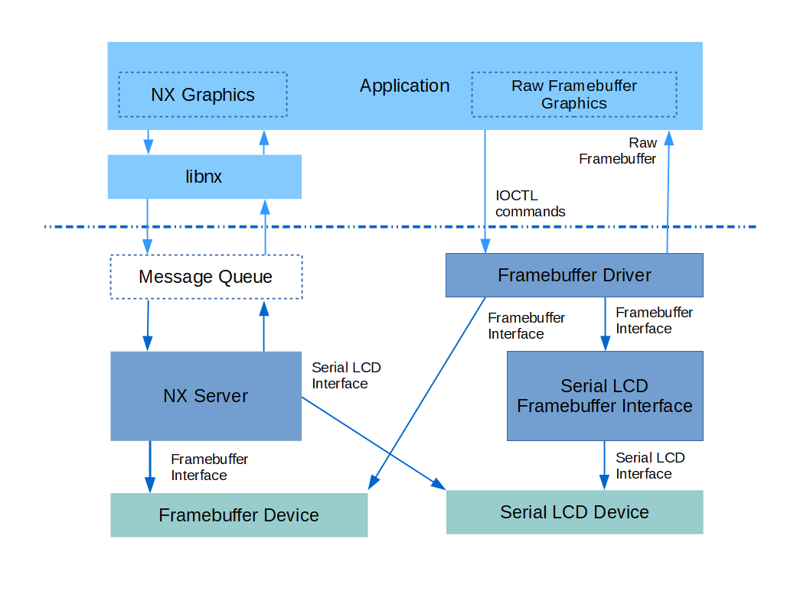

============================
Framebuffer Character Driver
============================

.. warning:: 
    Migrated from: 
    https://cwiki.apache.org/confluence/display/NUTTX/Framebuffer+Character+Driver 
    

NX Graphics
===========

NuttX has supported higher level graphics for some time with 
the OS's :doc:`/components/nxgraphics/index` and application 
oriented :doc:`NxWidgets </applications/graphics/nxwidgets/index>` and the tiny 
window manager :doc:`NxWM </applications/graphics/nxwm/index>`. 
These are higher level in the sense that the primary 
graphical function is to support windowing and control 
of tools and toolbars within windows. These graphics 
tools often do not meet the needs 
of developers with very low end graphics and minimal display 
requirements.

Figure 1
========

The framebuffer character driver, along with the option LCD 
framebuffer interface, is an optional lighter-weight graphics interface.

Framebuffer Character Driver details
====================================

A `framebuffer character driver` has been recently been added 
to bypass the complexity of `NX` and to provide a direct 
application interface to the framebuffer graphic device. 
The framebuffer buffer character devices, as with all 
character devices, provides the interface to the graphics 
device via stand POSIX VFS commands (``open()``, ``close()``, 
``read()``, ``write()``, ``seek()``, ...), through IOCTL commands, 
and for this driver via the ``mmap()`` function. These 
interfaces are described below,

The framebuffer character driver is located in the NuttX 
source tree at ``drivers/video/fb.c``. It is enabled in the 
build with ``CONFIG_VIDEO_FB=y``. In order to register the 
framebuffer driver, you will need to include logic in the 
your board-specific start-up function that calls 
``fb_register()`` That code sequence might look something 
like:

.. code-block:: c 

    #include <nuttx/video/fb.h>
 
    #ifdef CONFIG_VIDEO_FB
    /* Initialize and register the simulated framebuffer driver */
    
    ret = fb_register(0, 0);
    if (ret < 0)
        {
        syslog(LOG_ERR, "ERROR: fb_register() failed: %d\n", ret);
        }
    #endif

The ``fb_register()`` function takes two parameters:

* `display`. The display number for the case of boards 
  supporting multiple displays or for hardware that supports 
  multiple layers (each layer is consider a display). Typically zero.
* `plane`. Identifies the color plane on hardware that supports 
  separate framebuffer "planes" for each color component. 
  Should be zero because no planar hardware is currently 
  supported by NuttX.

``fb_register()`` will register the framebuffer character device 
at ``/dev/fb`` `N` where `N` is the display number if the devices 
supports only a single plane. If the hardware supports 
multiple color planes, then the device will be registered 
at ``/dev/fb`` `N-M` where `N` is the again display number but `M` 
is the display plane.

There is a simple example at ``apps/examples/fb`` that provides 
an illustration of most of the following interfacing methods.

POSIX Interfaces
================

The interaction with the framebuffer character driver via POSIX 
VFS interface calls is the same as for other character drivers. 
The only aspect that might require some additional discussion 
is the use of ``read()``, ``write()``, and ``seek()``.

* ``read()`` returns data from the framebuffer memory and 
  updates the file position based on the number of bytes read.
* ``write()`` puts data into the framebuffer memory and 
  also updates the file position.

That file position is initially set to the position 
zero meaning the beginning of the framebuffer. It is 
advanced each time you ``read()`` from or ``write()`` to the 
framebuffer. Is also updated by ``seek()``:

* ``seek()`` sets the file position to any desired 
  location within the framebuffer.

The file position is in units of `bytes`. This can be 
confusing because other positional data may be in units 
`pixels`. Pixels have different `depth` in different displays, 
that is, different graphic hardware may support pixels with 
differing bits-per-pixel. The pixel depth can be obtained 
using one of the IOCTL commands listed below. Since the file 
position is in bytes, the bits-per-pixel must be taken account 
when using ``read()``, ``write()``, and ``seek()``. The usual conversion 
from pixels to bytes is:

.. code-block:: C

    start_byte = (start_pixel * bits_per_pixel) >> 3;
    end_byte   = (end_pixel * bits_per_pixel + 7) >> 3;

While the framebuffer may be accessed with these POSIX interfaces, 
a more typical way of interacting with the framebuffer from an 
application would involve use of ``mmap()`` as described below.

IOCTL Commands
==============

* ``FBIOGET_VIDEOINFO``. Get color plane info. Its argument is 
  pointer a writable instance of ``struct fb_videoinfo_s``:

  .. code-block:: c 

    struct fb_videoinfo_s
    {
        uint8_t    fmt;         /* see FB_FMT_*  */
        fb_coord_t xres;        /* Horizontal resolution in pixel columns */
        fb_coord_t yres;        /* Vertical resolution in pixel rows */
        uint8_t    nplanes;     /* Number of color planes supported */
    };

* ``FBIOGET_PLANEINFO``. Get video plane info. It received 
  a pointer to a writable instance of ``struct fb_planeinfo_s`` as its argument:

  .. code-block:: C

    struct fb_planeinfo_s
    {
        FAR void  *fbmem;       /* Start of frame buffer memory */
        uint32_t   fblen;       /* Length of frame buffer memory in bytes */
        fb_coord_t stride;      /* Length of a line in bytes */
        uint8_t    display;     /* Display number */
        uint8_t    bpp;         /* Bits per pixel */
    };

* ``FBIOGET_CMAP`` and ``FBIOPUT_CMAP``. Get/Put RGB color mapping. 
  These commands are available only if the hardware and 
  framebuffer driver support color mapping (``CONFIG_FB_CMAP=y``). 
  They each take a pointer to an instance of ``struct fb_cmap_s`` 
  as an argument (writeable for ``FBIOGET_CMAP`` and read-only 
  for ``FBIOPUT_CMAP``).

  .. code-block:: c 

    #ifdef CONFIG_FB_CMAP
    struct fb_cmap_s
    {
        uint16_t  first;        /* Offset offset first color entry in tables */
        uint16_t  len;          /* Number of color entries  in tables */
        
        /* Tables of  color component.  Any may be NULL if not used */
        
        uint8_t *red;           /* Table of 8-bit red values */
        uint8_t *green;         /* Table of 8-bit green values */
        uint8_t *blue;          /* Table of 8-bit blue values */
    #ifdef CONFIG_FB_TRANSPARENCY
        uint8_t *transp;        /* Table of 8-bit transparency */
    #endif
    };
    #endif

* ``FBIOGET_CURSOR``. Get cursor attributes. This command is 
  available only if the hardware and framebuffer driver 
  support cursors (``CONFIG_FB_HWCURSOR=y``). It take a pointer 
  to a writable instance of ``struct fb_cursorattrib_s``:

  .. code-block:: c 

    #ifdef CONFIG_FB_HWCURSOR
    #ifdef CONFIG_FB_HWCURSORIMAGE
    struct fb_cursorimage_s
    {
        fb_coord_t     width;    /* Width of the cursor image in pixels */
        fb_coord_t     height    /* Height of the cursor image in pixels */
        const uint8_t *image;    /* Pointer to image data */
    };
    #endif
    
    struct fb_cursorpos_s
    {
        fb_coord_t x;            /* X position in pixels */
        fb_coord_t y;            /* Y position in rows */
    };
    
    #ifdef CONFIG_FB_HWCURSORSIZE
    struct fb_cursorsize_s
    {
        fb_coord_t h;             /* Height in rows */
        fb_coord_t w;             /* Width in pixels */
    };
    #endif
    
    struct fb_cursorattrib_s
    {
    #ifdef CONFIG_FB_HWCURSORIMAGE
        uint8_t fmt;                   /* Video format of cursor */
    #endif
        struct fb_cursorpos_s  pos;    /* Current cursor position */
    #ifdef CONFIG_FB_HWCURSORSIZE
        struct fb_cursorsize_s mxsize; /* Maximum cursor size */
        struct fb_cursorsize_s size;   /* Current size */
    #endif
    };
    #endif

* ``FBIOPUT_CURSOR``. Set cursor attributes. This command is 
  available only if the hardware and framebuffer driver 
  support cursors (``CONFIG_FB_HWCURSOR=y``). It take a 
  pointer to a writable instance of ``struct fb_setcursor_s``:

  .. code-block:: c 

    #ifdef CONFIG_FB_HWCURSOR
    struct fb_setcursor_s
    {
        uint8_t flags;                /* See FB_CUR_* definitions */
        struct fb_cursorpos_s pos;    /* Cursor position */
    #ifdef CONFIG_FB_HWCURSORSIZE
        struct fb_cursorsize_s  size; /* Cursor size */
    #endif
    #ifdef CONFIG_FB_HWCURSORIMAGE
        struct fb_cursorimage_s img;  /* Cursor image */
    #endif
    };
    #endif

* ``FBIO_UPDATE``. This IOCTL command updates a rectangular region 
  in the framebuffer. Some hardware requires that there be 
  such a notification when a change is made to the 
  framebuffer (see, for example, the discussion of LCD drivers 
  below). This IOTCL command is if ``CONFIG_NX_UPDATE=y`` is 
  defined. It takes a pointer to a read-only instance of 
  ``struct nxgl_rect_s`` that describes the region to be updated:

  .. code-block:: c 

    struct nxgl_rect_s
    {
        struct nxgl_point_s pt1; /* Upper, left-hand corner */
        struct nxgl_point_s pt2; /* Lower, right-hand corner */
    };

``mmap()``
==========

Above we talked about using ``read()``, ``write()``, and ``seek()`` to 
access the framebuffer. The simplest way to access the 
framebuffer, however, is by using the ``mmap()`` to map 
the framebuffer memory into the application memory 
space. The following ``mmap()`` command, for example, can 
be used to obtain a pointer to a read-able, write-able 
copy of the framebuffer:

.. code-block:: c 

    FAR void *fbmem;
 
    fbmem = mmap(NULL, fblen, PROT_READ|PROT_WRITE, MAP_SHARED|MAP_FILE, fd, 0);
    if (state.fbmem == MAP_FAILED)
    {
        /* Handle failure */
        ...
    }
    
    printf("Mapped FB: %p\n", fbmem);

Where fd is the file descriptor of the opened framebuffer 
character driver and ``fblen`` was obtained via an IOCTL 
command as described above. NOTE that the framebuffer 
buffer pointer is also available within the values 
returned by the IOCTL commands. The address is a 
kernel memory address and may not be valid in all 
build configurations. Hence, ``mmap()`` is the preferred, 
portable way to get the framebuffer address.

Framebuffer vs. LCD Graphics Drivers
====================================

Framebuffer graphics drivers are very common in high-end CPUs 
but most low-end, embedded hardware will not support a 
framebuffer.

A framebuffer graphics driver supports a region of memory 
that is shared both by the software and by the graphics 
hardware. Any modification to the framebuffer memory 
results in a corresponding modification on the display 
with no intervening software interaction. Some video 
memory is dual ported to support concurrent video processor 
and application processor accesses; or perhaps the LCD 
peripheral just constantly DMAs the framebuffer memory 
to the graphics hardware.

Most low-end embedded MCUs have a much simpler hardware 
interface: The interface to the LCD may be through a simple 
parallel interface or, more commonly, through a slower serial 
interface such as SPI. In order to support such low-end 
hardware with the framebuffer character driver, a special 
software layer called the `Framebuffer LCD Front End` has 
been developed. This is the topic of the next paragraph.

LCD Framebuffer Front-End
=========================

The `LCD Framebuffer Front-End` provides a standard NuttX 
framebuffer interface, but works on top of a standard 
parallel or serial LCD driver. It provides the framebuffer, 
the framebuffer interface, and the hooks to adapt the LCD 
driver. The LCD framebuffer front-end can be found in the 
NuttX source tree at ``drivers/lcd/lcd_framebuffer.c``.

In order to provide updates to the LCD hardware after 
updates to the framebuffer, the LCD framebuffer front-end 
must be notified when significant changes to the framebuffer 
have been made. This notification is supported when 
``CONFIG_NX_UPDATE=y`` is defined in the configuration. In 
this case, the LCD framebuffer front-end will support 
the special. OS-internal interface function ``nx_notify_rectangle()`` 
which defines the rectangular region in the framebuffer that 
has been changed. In response to a call to ``nx_notify_rectangle()`` 
will use the lower-level LCD interface to update only that 
rectangular region on the display.

This kind of update for standard LCD drivers is very efficient: 
It is usually more efficient to update a region on the 
display than it is for form a complex image with text and 
line drawing; the updated region seems to update very 
quickly because of that. In fact, many of the low-end 
LCD drivers already include an internal framebuffer to 
support this style of LCD update.

When used with LCD character driver, the ``nx_notify_rectangle()`` 
function will be called by the character river in response 
to the ``FBIO_UPDATE IOCTL`` command.

Another advantage of the framebuffer, both the LCD internal 
framebuffer and the framebuffer character driver, is 
that super-efficient reading of the LCD display memory: 
The LCD display memory is not read at all! The read is 
from the copy in the framebuffer.

Of course, using both an LCD internal framebuffer with the 
framebuffer character drivers is wasteful; one framebuffer 
is enough!

As a caution, it is important to remember that a framebuffer 
can be quite large. For example, a 480x320 display with 
16-bit RGB pixels would require an allocated framebuffer 
of size 300 KiB. This is inappropriate with most small 
MCUs (unless they support external memory). For tiny displays, 
such as 128x64 1-bit monochromatic displays, the framebuffer 
memory usage is not bad: 1 KiB in that example.

Framebuffer Graphics Library
============================

Now the missing part is some kind of application-space 
framebuffer graphics library. The NuttX framebuffer 
driver is superficially similar to the Linux framebuffer 
driver so there is a lot of support for Linux 
framebuffer graphics support that should be easily ported to 
NuttX – Perhaps DirectFB would be an GPL option? SDL with its 
MIT license might be a more compatible source for such a port.