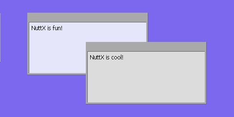
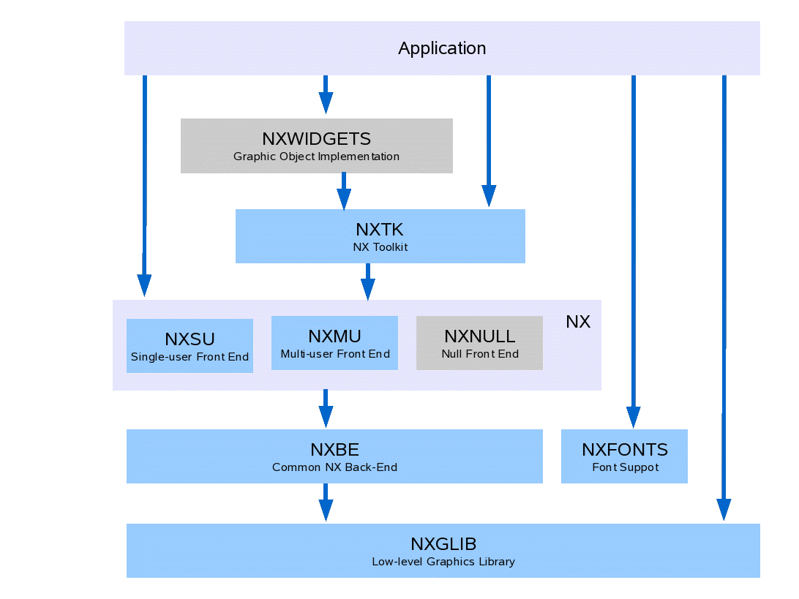

.. _nxgraphics:

=====================
NX Graphics Subsystem
=====================

This document describes the tiny graphics support included in NuttX. It
includes an overview description of that graphics support, detailed
descriptions of the NuttX graphics APIs, and discussion of code
organization, and OS configuration options.



  **Figure 1**. This screnshot shows the final frame for the NuttX example
  at ``apps/examples/nx`` running on the simulated, Linux x86 platform with
  simulated framebuffer output to an X window. This picture shows to framed window
  with (blank) toolbars. Each window has displayed text as received from the
  NX keyboard interface The second window has just been raised to the top of the display.

Objectives
==========

The objective of this development was to provide a tiny windowing system
in the spirit of X, but greatly scaled down and appropriate for most
resource-limited embedded environments. The current NX implementation
supports the general following, high-level features:

-  **Virtual Vertical Graphics Space**. Windows that reside in a
   virtual, *vertical* space so that it makes sense to talk about one
   window being on top of another and obscuring the window below it.
-  **Client/Server Model**. A standard client server/model was adopted.
   NX may be considered a server and other logic that presents the
   windows are NX clients.
-  **Multi-User Support**. NX includes *front-end* logic to support a
   separate NX server thread that can serve multiple NX client threads.
   The NX is a server thread/daemon the serializes graphics operations
   from multiple clients.
-  **Minimal Graphics Toolset**. The actual implementation of the
   graphics operations is performed by common, *back-end* logic. This
   back-end supports only a primitive set of graphic and rendering
   operations.
-  **Device Interface**. NX supports any graphics device either of two
   device interfaces:

   -  Any device with random access video memory using the NuttX
      framebuffer driver interface (see ``include/nuttx/video/fb.h``).
   -  Any LCD-like device than can accept raster line *runs* through a
      parallel or serial interface (see ``include/nuttx/lcd/lcd.h``). By
      default, NX is configured to use the frame buffer driver unless
      ``CONFIG_NX_LCDDRIVER`` is defined =y in your NuttX configuration
      file.

-  **Transparent to NX Client**. The window client on "sees" the
   sub-window that is operates in and does not need to be concerned with
   the virtual, vertical space (other that to respond to *redraw*
   requests from NX when needed).
-  **Framed Windows and Toolbars**. NX also adds the capability to
   support windows with frames and toolbars on top of the basic
   windowing support. These are windows such as those shown in the
   `screenshot <#screenshot>`__ above. These framed windows sub-divide
   one one window into three relatively independent subwindows: A frame,
   the contained window and an (optional) toolbar window.
-  **Mouse Support**. NX provides support for a mouse or other X/Y
   pointing devices. APIs are provided to allow external devices to give
   X/Y position information and mouse button presses to NX. NX will then
   provide the mouse input to the relevant window clients via callbacks.
   Client windows only receive the mouse input callback if the mouse is
   positioned over a visible portion of the client window; X/Y position
   is provided to the client in the relative coordinate system of the
   client window.
-  **Keyboard input**. NX also supports keyboard/keypad devices. APIs
   are provided to allow external devices to give keypad information to
   NX. NX will then provide the mouse input to the top window on the
   display (the window that has the *focus*) via a callback function.

Organization
============

NX is organized into 6 (and perhaps someday 7 or 8) logical modules.
These logical modules also correspond to the directory organization.
That NuttX directory organization is discussed in `Appendix
B <#grapicsdirs>`__ of this document. The logic modules are discussed in
the following sub-paragraphs.



NX Graphics Library (``NXGL``)
------------------------------

NXGLIB is a standalone library that contains low-level graphics
utilities and direct framebuffer or LCD rendering logic. NX is built on
top NXGLIB.

NX (``NXSU`` and ``NXMU``)
--------------------------

NX is the tiny NuttX windowing system for raw windows (i.e., simple
regions of graphics memory). NX includes a small-footprint, multi-user
implementation (NXMU as described below). NX can be used without
NxWidgets and without NXTOOLKIT for raw window displays.

:sup:`1`\ NXMU and NXSU are interchangeable other than (1) certain
start-up and initialization APIs (as described below), and (2) timing.
With NXSU, NX APIs execute immediately; with NXMU, NX APIs defer and
serialize the operations and, hence, introduce different timing and
potential race conditions that you would not experience with NXSU.

**NXNULL?** At one time, I also envisioned a *NULL* front-end that did
not support windowing at all but, rather, simply provided the entire
framebuffer or LCD memory as one dumb window. This has the advantage
that the same NX APIs can be used on the one dumb window as for the
other NX windows. This would be in the NuttX spirit of scalability.

However, the same end result can be obtained by using the
```nx_requestbkgd()`` <#nxrequestbkgd>`__ API. It still may be possible
to reduce the footprint in this usage case by developing and even
thinner NXNULL front-end. That is a possible future development.

NX Tool Kit (``NXTK``)
----------------------

NXTK is a s set of C graphics tools that provide higher-level window
drawing operations. This is the module where the framed windows and
toolbar logic is implemented. NXTK is built on top of NX and does not
depend on NxWidgets.

NX Fonts Support (``NXFONTS``)
------------------------------

A set of C graphics tools for present (bitmap) font images. The font
implementation is at a very low level or graphics operation, comparable
to the logic in NXGLIB. NXFONTS does not depend on any NX module other
than some utilities and types from NXGLIB.

NX Widgets (``NxWidgets``)
--------------------------

:ref:`NxWidgets <nxwidgets>` is a higher level, C++, object-oriented
library for object-oriented access to graphical "widgets." NxWidgets is
provided as a separate library in the ``apps/`` repository NxWidgets is
built on top of the core NuttX graphics subsystem, but is part of the
application space rather than part of the core OS graphics subsystems.

Terminal Driver (``NxTerm``)
----------------------------

NxTerm is a write-only character device (not shown) that is built on top
of an NX window. This character device can be used to provide ``stdout``
and ``stderr`` and, hence, can provide the output side of NuttX console.
).

NX Header Files
===============

``include/nuttx/nx/nxglib.h``
   Describes the NXGLIB C interfaces
``include/nuttx/nx/nx.h``
   Describes the NX C interfaces
``include/nutt/nxtk.h``
   Describe the NXTOOLKIT C interfaces
``include/nutt/nxfont.h``
   Describe sthe NXFONT C interfaces

.. toctree::
  :Caption: User APIs

  nxgl.rst
  nx.rst
  nxtk.rst
  nxfonts.rst
  nxcursor.rst
  sample.rst
  appendix.rst

