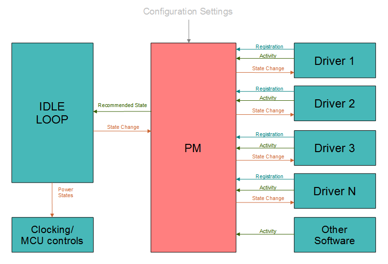

================
Power Management
================

NuttX supports a simple power management (PM) sub-system which:

  - Monitors activity from drivers (and from other parts of the
    system), and

  - Provides hooks to place drivers (and the whole system) into
    reduce power modes of operation.

|figure|

The PM sub-system integrates the MCU idle loop with a collection
of device drivers to support:

  -  Reports of relevant driver or other system activity.

  -  Registration and callback mechanism to interface with
     individual device drivers.

  -  IDLE time polling of overall driver activity.

  -  Coordinated, global, system-wide transitions to lower power
     usage states.

**Low Power Consumption States**. Various "sleep" and low power
consumption states have various names and are sometimes used in
conflicting ways. In the NuttX PM logic, we will use the following
terminology:

  ``NORMAL``
     The normal, full power operating mode.
  ``IDLE``
     This is still basically normal operational mode, the system is,
     however, ``IDLE`` and some simple simple steps to reduce power
     consumption provided that they do not interfere with normal
     Operation. Simply dimming the a backlight might be an example
     some that that would be done when the system is idle.
  ``STANDBY``
     Standby is a lower power consumption mode that may involve more
     extensive power management steps such has disabling clocking or
     setting the processor into reduced power consumption modes. In
     this state, the system should still be able to resume normal
     activity almost immediately.
  ``SLEEP``
     The lowest power consumption mode. The most drastic power
     reduction measures possible should be taken in this state. It
     may require some time to get back to normal operation from
     ``SLEEP`` (some MCUs may even require going through reset).

.. c:enum:: pm_state_e

  These various states are represented with type :c:enum:`pm_state_e`
  in ``include/nuttx/power/pm.h``.

**Power Management Domains**. Each PM interfaces includes a
integer *domain* number. By default, only a single power domain is
supported (``CONFIG_PM_NDOMAINS=1``). But that is configurable;
any number of PM domains can be supported. Multiple PM domains
might be useful, for example, if you would want to control power
states associated with a network separately from power states
associated with a user interface.

Interfaces
==========

All PM interfaces are declared in the file ``include/nuttx/power/pm.h``.

.. c:function:: void pm_initialize(void)

  Called by MCU-specific one-time logic
  at power-on-reset in order to initialize the power management
  capabilities. This function must be called *very* early in the
  initialization sequence *before* any other device drivers are
  initialized (since they may attempt to register with the power
  management subsystem).

.. c:function:: int pm_register(FAR struct pm_callback_s *callbacks)

  Called by a device driver in
  order to register to receive power management event callbacks.
  Refer to the :ref:`components/power:Callbacks` section for more
  details.

  :param callbacks:
    An instance of :c:struct:`pm_callback_s`
    providing the driver callback functions.

  :return:
    Zero (``OK``) on success; otherwise a negated
    ``errno`` value is returned.

.. c:function:: int pm_unregister(FAR struct pm_callback_s *callbacks)

  Called by a device driver in
  order to unregister previously registered power management event
  callbacks. Refer to the :ref:`components/power:Callbacks` section for
  more details.

  **Input Parameters:**

  :param callbacks:
    An instance of :c:struct:`pm_callback_s`
    providing the driver callback functions.

  :return:
    Zero (``OK``) on success; otherwise a negated
    ``errno`` value is returned.

.. c:function:: void pm_activity(int domain, int priority)

  Called by a device driver to
  indicate that it is performing meaningful activities (non-idle).
  This increment an activity count and/or will restart a idle timer
  and prevent entering reduced power states.

    :param domain: Identifies the domain of the new PM activity
    :param priority:
       Activity priority, range 0-9. Larger values correspond to
       higher priorities. Higher priority activity can prevent the
       system from entering reduced power states for a longer period
       of time. As an example, a button press might be higher priority
       activity because it means that the user is actively interacting
       with the device.

  **Assumptions:** This function may be called from an interrupt
  handler (this is the ONLY PM function that may be called from an
  interrupt handler!).

.. c:function:: enum pm_state_e pm_checkstate(int domain)

  Called from the MCU-specific
  IDLE loop to monitor the power management conditions. This
  function returns the "recommended" power management state based on
  the PM configuration and activity reported in the last sampling
  periods. The power management state is not automatically changed,
  however. The IDLE loop must call :c:func:`pm_changestate` in order to
  make the state change.

  These two steps are separated because the platform-specific IDLE
  loop may have additional situational information that is not
  available to the PM sub-system. For example, the IDLE loop may
  know that the battery charge level is very low and may force lower
  power states even if there is activity.

  NOTE: That these two steps are separated in time and, hence, the
  IDLE loop could be suspended for a long period of time between
  calling :c:func:`pm_checkstate` and :c:func:`pm_changestate`. The IDLE
  loop may need to make these calls atomic by either disabling
  interrupts until the state change is completed.

    :param domain: Identifies the PM domain to check
    :return: The recommended power management state.

.. c:function::  int pm_changestate(int domain, enum pm_state_e newstate)

  This function is used by platform-specific power
  management logic. It will announce the power management power
  management state change to all drivers that have registered for
  power management event callbacks.

  :param domain: Identifies the domain of the new PM state
  :param newstate: Identifies the new PM state

  :return:
    0 (``OK``) means that the callback function
    for all registered drivers returned ``OK`` (meaning that they
    accept the state change). Non-zero means that one of the drivers
    refused the state change. In this case, the system will revert to
    the preceding state.

  **Assumptions:** It is assumed that interrupts are disabled when
  this function is called. This function is probably called from the
  IDLE loop... the lowest priority task in the system. Changing
  driver power management states may result in renewed system
  activity and, as a result, can suspend the IDLE thread before it
  completes the entire state change unless interrupts are disabled
  throughout the state change.

Callbacks
=========

.. c:struct:: pm_callback_s

  This struct includes the pointers to the driver
  callback functions. This structure is defined
  ``include/nuttx/power/pm.h``. These callback functions can be used
  to provide power management information to the driver.

.. c:var:: int (*prepare)(FAR struct pm_callback_s *cb, int domain, enum pm_state_e pmstate)

  Request the driver to prepare for a new power
  state. This is a warning that the system is about to enter into a
  new power state. The driver should begin whatever operations that
  may be required to enter power state. The driver may abort the
  state change mode by returning a non-zero value from the callback
  function.

    :param cb:
       Returned to the driver. The driver version of the callback
       structure may include additional, driver-specific state data at
       the end of the structure.
    :param domain:
       Identifies the activity domain of the state change
    :param pmstate:
       Identifies the new PM state

    :return:
      Zero (``OK``) means the event was successfully
      processed and that the driver is prepared for the PM state change.
      Non-zero means that the driver is not prepared to perform the
      tasks needed achieve this power setting and will cause the state
      change to be aborted. NOTE: The ``prepare()`` method will also be
      called when reverting from lower back to higher power consumption
      modes (say because another driver refused a lower power state
      change). Drivers are not permitted to return non-zero values when
      reverting back to higher power consumption modes!

.. c:var:: void (*notify)(FAR struct pm_callback_s *cb, int domain, enum pm_state_e pmstate)

  Notify the driver of new power state. This
  callback is called after all drivers have had the opportunity to
  prepare for the new power state.

    :param cb:
       Returned to the driver. The driver version of the callback
       structure may include additional, driver-specific state data at
       the end of the structure.
    :param domain:
       Identifies the activity domain of the state change
    :param pmstate:
       Identifies the new PM state

  The driver already agreed to transition
  to the low power consumption state when when it returned ``OK`` to
  the :c:var:`prepare` call.

