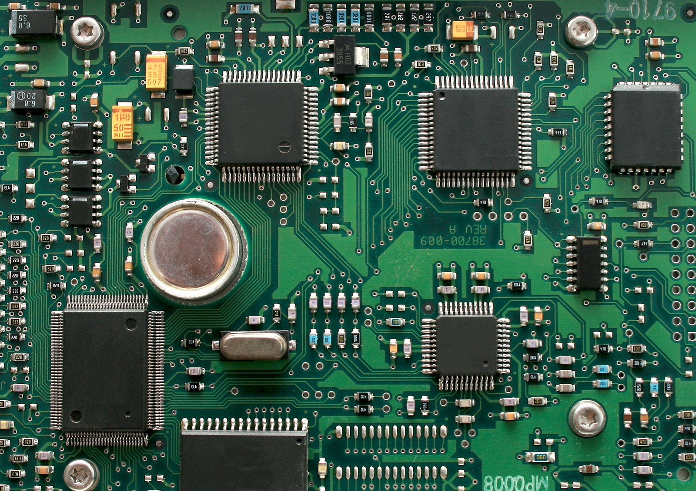

===========================
Board Documentation Example
===========================

.. tags:: chip:example, arch:example, vendor:example

.. At the very top of the page, place your tags section! You should include any
   tags which maybe applicable to your board, such as the chip it uses, its
   architecture, any peripherals (i.e. ``ethernet``), etc.

   This is the image caption. Replace with your board's image and its name!

After your tags, write a short description about the board. This should include
the vendor, what it's generally used for, or some major feature about it (i.e. a
board made specifically for greenhouse monitoring). You can also link to an
external webpage here, like the vendor documentation page for the board.

Features
========

.. Here you should list some of the key features of the board. Some examples are
   included below to get you started, or look at other existing board docs. Much
   of this information could be copied from the vendor website.

* Chip name here
* Key chip feature 1 (FPU)
* Key chip feature 2 (4 core)
* Number of accessible GPIO pins
* On-board sensor
* Number of accessible UART interfaces
* WiFi support
* etc.

If there are any unsupported features in your NuttX implementation of this
board, mention them here.

.. warning::

   If something is partially implemented but experimental, add a warning about
   it. Don't frustrate users by saying that "SPI is supported" if you only
   support 2/3 SPI interfaces, or can't configure frequency, etc.

.. todo::

   If you want help with implementing something important (i.e. a WiFi driver
   for a WiFi chip), then you can also add a TODO asking contributors for help.

.. note::

   Do not list a ton of features specific to the chip that the board uses. That
   is for the chip documentation to cover (as well as list unimplemented chip
   features). I.e don't list "this board has I2C" if it's not user accessible
   and is instead just used for communicating with peripherals.

Buttons and LEDs
================

If the board has any user buttons, describe them here.

If the board has any LEDs, describe them here. If there's a particular LED that
your NuttX implementation uses to show status, you can explain that further
here. Example: "The red LED labelled 'LED1' will flash at 1Hz to indicate a
kernel panic".

Some Important Feature
======================

You can add sections just like this one to describe important features that your
board has support for. An example might be networking support (does it use WiFi,
what frequency, what chip, which protocols, any limitations, etc.).

Pin Mapping
===========

Tell the user what the default pin mapping of the board is. This is especially
critical if your board uses some chip that typically has ``n`` number of GPIO
pins, but some of them are now reserved for a board peripheral (i.e. the RP2040
has two SPI interfaces, but now one of them is reserved because it's connected
to an on-board Ethernet chip).

You'll want to make a table similar to this one. At least include the pin
number, the GPIO number (if it's different from the pin number) and some comment
about the pin's functionality.

===== ========== ==========
Pin   Signal     Notes
===== ========== ==========
1     GPIO0      Default TX for UART0 serial console
2     GPIO1      Default RX for UART0 serial console
3     Ground
4     GPIO2
5     GPIO3
6     GPIO4      Default SDA for I2C0
7     GPIO5      Default SCL for I2C0
8     Ground
9     GPIO6      Default SDA for I2C1
10    GPIO7      Default SCL for I2C1
11    VCC        3V3
===== ========== ==========

Power Supply
============

Any important information about power supply. If you want you can link to the
vendor documentation. It should be sufficient to explain the valid input voltage
range and mention any special quirks about the power system here.

If the board logic has some power management implementation, you can explain it
here, too.

Installation
============

Here, tell the user how to install any tools they'll need for building NuttX on
this board. You don't need to re-explain installing NuttX, but you will need to
list information about how to get any extra tool-chains.

Wherever possible, link to existing documentation. Your board is based on some
chip, and the tool-chains that need be installed are the same for all boards
using this chip? Link to the documentation page of that chip where the install
instructions are. Your board needs OpenOCD to flash it? Link to the OpenOCD
installation guide.

.. Note: you can link to existing docs using the :doc:`text <path/to/docpage>`
   directive. Don't include the `.rst` at the end of the file path.

If there are any easy commands you can give the user, create a console code
block like this one:

.. code:: console

   $ mkdir somedir
   $ cd some-dir
   $ git clone --recursive <somerepo>
   $ make build
   $ make install

The user can copy paste these commands to make the setup process easier. Please
keep in mind that NuttX supports building on more than just Linux systems, so
include any extra installation information for other OSes if
applicable/possible.

Building NuttX
==============

Tell the user how to build NuttX for the board. This should include any special
process that isn't just using ``./tools/configure.sh`` and running ``make``.

.. If the build process is the same for all boards with this chip, link to the
   chip documentation page.

If your board has any specific configuration options in Kconfig that the user
should know about, describe them!

* ``CONFIG_ENABLE_COOL_FEATURE``: Enables this board's coolest feature
* ``CONFIG_SOMETHING_ELSE``: Enable something else on the board

Flashing
========

Explain to the user how to flash the NuttX image to the board. If there are
multiple methods, list them all.

.. If the flashing information is the same for all boards with this chip, link
   to the chip documentation page. You might only need to tell the user what
   connector on the board they need to use.

If your flashing procedure has steps, number them!

1. Prepare an SD card
2. Copy files to SD card
3. Insert SD card
4. Power on

Configurations
==============

Boards come with one or more configuration pre-sets to get the user going.
Typically they include some kind of shell interface to NSH and when the board
has a major feature (like WiFi or a specific sensor) there is a configuration to
leverage that as well.

You should mention the board "identifier" (name) for the ``tools/configure.sh``
command so the user knows how to access the configurations.

.. code:: console

   $ ./tools/configure.sh <your-board-name>:<config-name>

nsh
---

Under sub-headings, list out the configurations that are available. A common one
is ``nsh``, which provides some basic access to the NSH shell over UART.

The configuration description should tell the user everything they need to use
it. What baud rate is the shell? What interface? Do they need a special debug
probe to interact with it? Should an LED come on?

Tell the user about any applications you included that are specific to the
configuration. In this case, they have NSH to play with. Maybe they can run
:doc:`getprime </applications/testing/getprime/index>` to benchmark the
processing speed? Link to the docs for these applications as much as possible.

usbnsh
------

Same thing, but USB-based shell.

wifi
----

Some headline feature, in this case WiFi. Tell the user how to play with it
using the examples or applications you included in the configuration.

License Exceptions
==================

If the board depends on any code that wasn't written by NuttX contributors, and
it's subject to a different license, you should identify that here. List
the file names and state the applicable license.

* ``some/file/driver.c``: BSD licensed driver code
* ``some/file/blob.bin``: GPLv3 licensed driver binary for some proprietary chip

.. If any of these license exceptions are specific to chip support code, not
   just this one board, then link back to the chip documentation page instead of
   duplicating.
