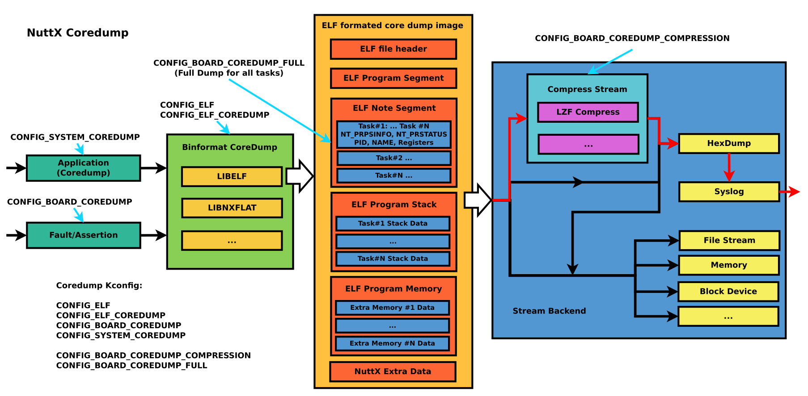

=========
Core Dump
=========

Overview
========

How to use
-----------

1. Enable NuttX Core dump

Enable Kconfig

    .. code-block:: console

      CONFIG_COREDUMP=y                   /* Enable Coredump */

      CONFIG_BOARD_COREDUMP_SYSLOG=y      /* Enable Board Coredump, if exceptions and assertions occur, */

      CONFIG_SYSTEM_COREDUMP=y            /* Enable coredump in user command, which can capture the current
                                             state of one or all threads when the system is running, the
                                             output can be redirect to console or file */

      CONFIG_BOARD_COREDUMP_COMPRESSION=y /* Default y, enable Coredump compression to
                                             reduce the size of the original core image */

      CONFIG_BOARD_COREDUMP_FULL=y        /* Set the initial runtime scope to all tasks */

2. Configure crash dumps at runtime

When ``CONFIG_FS_PROCFS=y`` and ``CONFIG_COREDUMP=y`` are enabled,
``/proc/coredump`` shows the current crash dump configuration and accepts
runtime updates.  The node can be removed by enabling
``CONFIG_FS_PROCFS_EXCLUDE_COREDUMP``.

The available dump modes are:

- ``off``: Skip crash dumps.
- ``current``: Dump only the task that triggered the crash.
- ``all``: Dump all tasks.

``CONFIG_BOARD_COREDUMP_FULL`` selects the initial mode: ``all`` when enabled
and ``current`` otherwise.  The mode can then be changed without rebooting:

    .. code-block:: console

      nsh> cat /proc/coredump
      mode: all
      range:
        none
      commands:
        ...
      nsh> echo current > /proc/coredump
      nsh> echo off > /proc/coredump

Extra memory regions can also be changed at runtime:

    .. code-block:: console

      nsh> echo range clear > /proc/coredump
      nsh> echo range add {0x20000000,0x20001000,0x6} > /proc/coredump
      nsh> echo range set {0x20000000,0x20001000,0x6} > /proc/coredump

``range clear`` removes all runtime regions, including defaults initialized
from ``CONFIG_BOARD_MEMORY_RANGE``.  ``range add`` appends or merges one
region, while ``range set`` replaces the complete list.  The maximum number
of regions is controlled by ``CONFIG_COREDUMP_MEMORY_REGION_MAX``.
Overlapping regions must have identical flags.

The flags become the ELF ``PT_LOAD`` segment flags: ``0x1`` is executable,
``0x2`` is writable, and ``0x4`` is readable.  The NuttX-specific
``PF_REGISTER`` flag (``0x00100000``) requests aligned register-width reads
and should only be used for suitable register regions.

A single write may contain multiple newline-separated commands.  The runtime
configuration controls crash dumps initiated by ``coredump_dump()``, such as
assertion handling.  It does not alter the userspace ``coredump`` command,
which calls ``coredump()`` directly.

3. Run Coredump on nsh (CONFIG_SYSTEM_COREDUMP=y)

Parameters of coredump tool

    .. code-block:: console

      $ coredump <pid>        /* If pid is specified, coredump will only capture the thread with the
                                 specified pid, otherwise all threads will be captured */

      $ coredump <filename>   /* If filename is specified, then coredump will be output to the specified
                                 file by default, otherwise it will be redirect in stdout stream */

4. Capture coredump from stdout

Save the print of the red frame part in the figure as file

    .. image:: image/coredump-hexdump.png

    .. code-block:: console

      $ cat elf.dump
      [CPU0] [ 6] 5A5601013D03FF077F454C4601010100C0000304002800C00D003420036000070400053400200008200A4000000420030034C024200001D8092004E00200601A
      ...
      [CPU0] [ 6] 401B018D37814720005A5601000800090100006000010000

5. Convert the dump file

If the core file is post-processed by lzf compress and hexdump stream, execute the coredump script (`tools/coredump.py
<https://github.com/apache/nuttx/blob/master/tools/coredump.py>`_) to convert hex to binary and lzf decompression, If the -o parameter is not added in commandline, the output of <original file name>.core will be automatically generated:

    .. code-block:: console

      $ ./nuttx/tools/coredump.py elf.dump
      Core file conversion completed: elf.core

6. Analysis by gdb

After generating elf.core, combined with compiled nuttx.elf, you can view the call stack and related register information of all threads directly through gdb:

(NOTE: Toolchain version must be newer than 11.3)

    .. code-block:: console

      $ prebuilts/gcc/linux/arm/bin/arm-none-eabi-gdb -c elf.core nuttx

    .. image:: image/coredump-gdb.png
