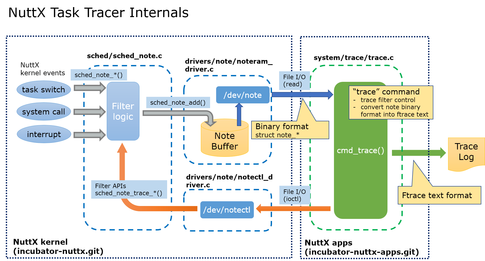
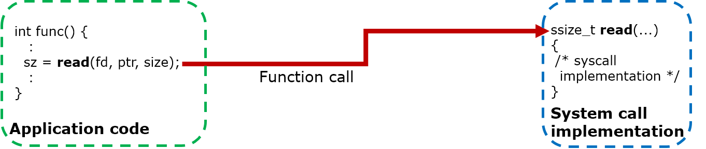
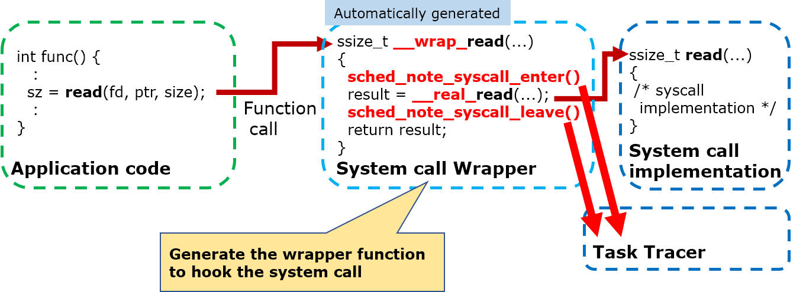
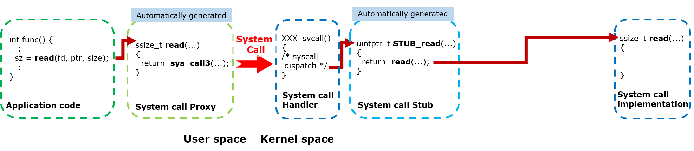
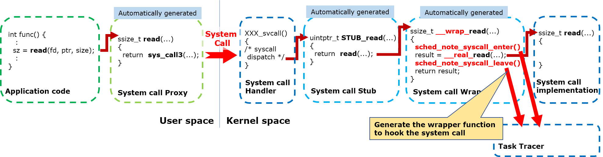

====================
Task Trace Internals
====================

Overview
========

The Task Trace is constructed by the following functions.

NuttX kernel events collection
------------------------------

The kernel events are collected by ``sched_note_*()`` API calls embedded in NuttX kernel.

  - For task switch events

    - ``sched_note_start()``
    - ``sched_note_stop()``
    - ``sched_note_suspend()``
    - ``sched_note_resume()``

  - For system call events

    - ``sched_note_syscall_enter()``
    - ``sched_note_syscall_leave()``

  - For interrupt event

    - ``sched_note_irqhandler()``

Filter logic (``nuttx/sched/sched_note.c``)
-------------------------------------------

- The ``sched_note_*()`` APIs are implemented here.
- Filter the notes and pass them to noteram driver by ``sched_note_add()`` API.

Noteram device driver (``nuttx/drivers/note/noteram_driver.c``)
---------------------------------------------------------------

- Accumurate incoming note records into the buffer.
- Read the note records from the buffer by user requests.
- The notes are recorded in the binary format of ``struct note_*_s``.
- The detail function is described in :doc:`../components/drivers/character/note`.

Notectl device driver (``nuttx/drivers/note/notectl_driver.c``)
---------------------------------------------------------------

- ``/dev/notectl`` device driver.
- Control the filter logic in ``sched_note.c`` by calling note filter APIs.
- The detail function is described in :doc:`../components/drivers/character/note`.

"``trace``" Built-In Application (``apps/system/trace/trace.c``)
----------------------------------------------------------------

- ``trace`` Built-In Application to control the trace function interactively.
- Read binary note records from ``/dev/note`` and convert into the ftrace text format which is acceptable by  `"Trace Compass" <https://www.eclipse.org/tracecompass/>`_.
- The command syntax is described in :doc:`tasktraceuser`.

Getting the system call events
==============================

To get the system call events, two different methods are used for FLAT build and PROTECTED/KERNEL build.

FLAT build
----------

In FLAT build, a system call is just a function call into the NuttX kernel.

To get the system call events, `wrapper function option <https://sourceware.org/binutils/docs/ld/Options.html#index-_002d_002dwrap_003dsymbol>`_  of the GNU Linker is used.

The mksyscall tool is fixed to generate the system call wrapper which call system call enter/leave hook.
The wrapper supersedes the system call function call of the NuttX binary by passing ``--wrap`` linker option to the build system.
The wrapper calls the system call hooks before and after calling the real system call function.

PROTECTED/KERNEL build
----------------------

Different to FLAT build, in PROTECTED and KERNEL build, a system call is issued by an user space is handled as the following steps.

#. System call issued by an application code is handled by the system call proxy (automatically generated by mksyscall).
#. System call proxy issues the supervisor call instruction to enter into the kernel space.
#. System call handler in the kernel space calls the system call stub (automatically generated by mksyscall).
#. System call stub calls the API implementation in the NuttX kernel.

To get the system call events, the mksyscall tool is fixed to generate the system call wrapper which supersedes the system call function call in the system call stub.

