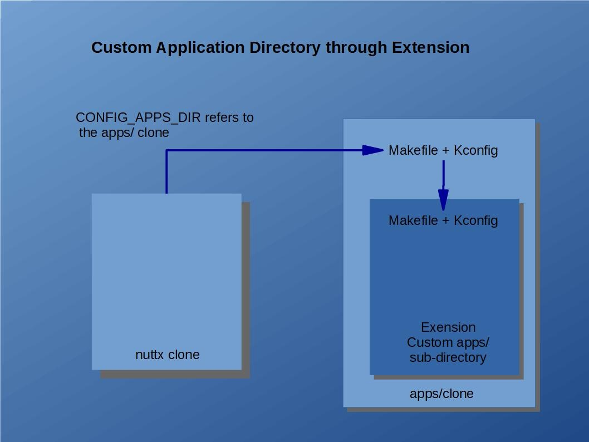

========================================================
Building NuttX with Applications Outside the Source Tree
========================================================

.. warning:: 
    Migrated from: 
    https://cwiki.apache.org/confluence/display/NUTTX/Building+NuttX+with+Applications+Outside+of+the+Source+Tree

Q: Has anyone come up with a tidy way to build NuttX with board-specific pieces outside the source tree?
========================================================================================================

A: Here are four approaches:
============================

1. Make export
--------------

There is a make target called ``make export``. It will build NuttX, then bundle
all of the header files, libraries, startup objects, and other build components
into a ``.zip`` file. You can move that ``.zip`` file into any build environment
you want. You can even build NuttX under a DOS CMD window.

This ``make target`` is documented in the top-level 
:doc:`Legacy README </introduction/resources>`. Search for ``Build Targets``

1. Replace the apps/ Directory
------------------------------

You can replace the entire ``apps/`` directory. It is not a critical part of the
OS. The ``apps/`` is simply provided for you to help with your application
development. It should not dictate anything that you do.

To use a different ``apps`` directory, simply execute ``make menuconfig`` in the
top-level ``nuttx/`` directory and redefine ``CONFIG_APPS_DIR`` in your
``.config`` file so that it points to a different, custom application directory.
Note that ``CONFIG_APPS_DIR`` is a `relative` path from the top-level
``nuttx/`` directory.

You can copy any pieces that you like from the old ``apps/`` directory to your
custom ``apps`` directory as necessary. This is documented in 
the `NuttX Porting Guide <https://cwiki.apache.org/confluence/display/NUTTX/Porting+Guide>`_ 
and in the `apps/README.md <https://github.com/apache/nuttx-apps/blob/master/README.md>`_ file.

1. Extend the apps/ Directory
-----------------------------

If you like the random collection of stuff in the ``apps/`` directory but just
want to expand the existing components with your own, external sub-directory,
then there is an easy way to do that too: Create a symbolic link in the
``apps/`` directory that redirects to your application sub-directory (or copy
your code into a sub-directory of ``apps/``).

Makefile and Make.defs
^^^^^^^^^^^^^^^^^^^^^^

In order to be incorporated into the build, the directory that you link under
the ``apps/`` directory should contain:

1. A ``Makefile`` that supports the ``clean`` and ``distclean`` targets (see
   other Makefiles for examples).
2. A tiny ``Make.defs`` make file fragment that simply adds the build
   directories to the variable ``CONFIGURED_APPS`` like:

.. code-block:: shell

   CONFIGURED_APPS += my_directory1 my_directory2

Automatic Sub-directory Inclusion
^^^^^^^^^^^^^^^^^^^^^^^^^^^^^^^^^

The ``apps/Makefile`` will always automatically check for the existence of
sub-directories containing a ``Makefile`` and a ``Make.defs`` file. The
``Makefile`` will be used only to support cleaning operations. The
``Make.defs`` file provides the set of relative paths to directories to be
built; these directories must also contain a ``Makefile``. That ``Makefile`` can
build the sources and add the object files to the ``apps/libapps.a`` archive
(see other Makefiles for examples). It should support the ``all``, ``install``,
``context``, and ``depend`` targets.

``apps/Makefile`` does not depend on any hard-coded lists of directories.
Instead, it does a wildcard search to find all appropriate directories. This
means that to install a new application, you simply have to copy the directory
(or link it) into the ``apps/`` directory. If the new directory includes a
``Makefile`` and a ``Make.defs`` file, then it will be automatically discovered
and included in the build at ``make`` time.

Kconfig
^^^^^^^

If the directory that you add also includes a ``Kconfig`` file, then it will be
automatically included in the NuttX configuration system as well.
``apps/Makefile`` uses a tool at ``apps/tools/mkkconfig.sh`` that dynamically
builds the ``apps/Kconfig`` file at pre-configuration time.

.. note::

   The native Windows build will use a corresponding tool called
   ``apps/tools/mkconfig.bat``.

Install script
^^^^^^^^^^^^^^

You could, for example, create a script called ``install.sh`` that installs a
custom application, configuration, and board-specific directory:

1. Copy ``MyBoard`` directory to ``boards/MyBoard``.
2. Add a symbolic link to ``MyApplication`` at ``apps/external``
3. Configure NuttX:

.. code-block:: shell

   tools/configure.sh MyBoard:MyConfiguration

Special ``apps/external`` Directory
^^^^^^^^^^^^^^^^^^^^^^^^^^^^^^^^^^^^

Use of the name ``apps/external`` is suggested because that name is included in
the ``.gitignore`` file and will save you some nuisance when working with GIT.

4. Contain the apps/ Directory
------------------------------

A simple, minimally invasive approach would be to contain the ``apps/`` GIT
clone within your custom application directory. In this case, ``apps/`` would
appear as a directory under your custom application directory instead of your
application directories being inserted as sub-directories of ``apps/``. It may
even be implemented as a sub-module of your custom application directory.

.. image:: image/custom_app_dir_through_containment.png

Kconfig and Makefile
^^^^^^^^^^^^^^^^^^^^

There are only a few minimal requirements of your custom application directory.
It needs to have only its own ``Makefile`` and ``Kconfig`` file. That
``Kconfig`` would need to include the ``apps/Kconfig``. The ``Makefile`` would
similarly need to invoke the ``apps/Makefile`` for all of the relevant build
targets. For example, the ``clean`` target:

.. code-block:: shell

  $(MAKE) -c apps clean TOPDIR=$(TOPDIR)

Library Issues
^^^^^^^^^^^^^^

The contained directory will create and install a static library called
``libapps($LIBEXT)`` in the ``nuttx/staging`` directory. Your custom logic must
also appear in the ``nuttx/staging`` directory. Here are two ways that you might
do that:

1. **Merge with ``libapps($LIBEXT)``.**  
   The custom application directory's ``Makefile`` could create and install the
   final ``libapps($LIBEXT)`` in the ``nuttx/staging`` directory.
   ``<custom-dir>/apps/libapps($LIBEXT)`` could merge its custom object files
   with ``<custom-dir>/libapps($LIBEXT)`` and then re-install the library at
   ``nuttx/staging``.
2. **Use the EXTRA_LIBS Feature.**  
   The build system supports two special make-related variables called
   ``EXTRA_LIBS`` and ``EXTRA_LIBPATHS``. These may be defined in your
   board-specific ``Make.defs`` file. ``EXTRA_LIBS`` provides the name of your
   custom library. If you create ``<custom-dir>/libcustom.a``, then the value
   of ``EXTRA_LIBS`` would be ``-lcustom`` and the value of ``EXTRA_LIBPATHS``
   would be ``-L <custom-dir>`` (assuming the GNU ld linker).

Relative Effort and Benefits
^^^^^^^^^^^^^^^^^^^^^^^^^^^^

The contained ``apps/`` directory approach requires some more effort than the
extended ``apps/`` approach, but has the advantage that there will be no strange
behavior due to issues with ``.gitignore`` and, hence, a cleaner user
experience.

Out-of-tree Builds
^^^^^^^^^^^^^^^^^^

This configuration also has the possibility of supporting out-of-tree builds
using ``fusefs``. Suppose, for example, that you have a project directory with
the contained ``apps/`` directory and, say, three platform build directories.
Using ``fusefs``, you can overlay one of the platform build directories on top
of the project directory. Then all files generated by the build will be written
into the overlaid platform build directory. When the ``fusefs`` is torn down,
the project directory will still be clean, and the build result will still be in
the platform build directory. This can then be repeated for the other two
platform build directories.

In this case, you would probably also want to contain the ``nuttx/`` directory
in the project directory as well so that the entire system is built out-of-tree.

Hooking External Applications into the Configuration System
-----------------------------------------------------------

Suppose you have opted to extend the ``apps/`` directory with your custom
external application directories and would also like to support configuration
variables in your external application. No problem! Thanks to Sebastien Lorquet,
any external application that you install into the ``apps/`` (whether via a
symbolic link or via a directory copy) `will` be included in the NuttX
configuration system.

The top-level ``Kconfig`` file in the ``apps/`` directory is automatically
generated based on the contents of each ``apps/`` sub-directory. If your
installed sub-directory contains ``Kconfig``, ``Makefile``, and ``Make.defs``
files, then it will be incorporated into the NuttX configuration system when the
top-level ``Kconfig`` file is generated.
