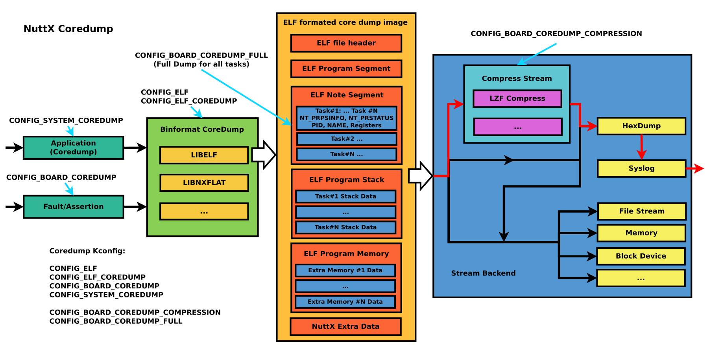

=========
Core Dump
=========

Overview
========

How to use
-----------

1. Enable NuttX Core dump

Enable Kconfig

    .. code-block:: console

      CONFIG_ELF=y                        /* Enable ELF */

      CONFIG_ELF_COREDUMP=y               /* Enable ELF Coredump */

      CONFIG_BOARD_COREDUMP=y             /* Enable Board Coredump, if exceptions and assertions occur, */

      CONFIG_SYSTEM_COREDUMP=y            /* Enable coredump in user command, which can capture the current
                                             state of one or all threads when the system is running, the
                                             output can be redirect to console or file */

      CONFIG_BOARD_COREDUMP_COMPRESSION=y /* Default y, enable Coredump compression to
                                             reduce the size of the original core image */

      CONFIG_BOARD_COREDUMP_FULL=y        /* Default y, save all task information */

2. Run Coredump on nsh (CONFIG_SYSTEM_COREDUMP=y)

Parameters of coredump tool

    .. code-block:: console

      $ coredump <pid>        /* If pid is specified, coredump will only capture the thread with the
                                 specified pid, otherwise all threads will be captured */

      $ coredump <filename>   /* If filename is specified, then coredump will be output to the specified
                                 file by default, otherwise it will be redirect in stdout stream */

3. Capture coredump from stdout

Save the print of the red frame part in the figure as file

    .. image:: image/coredump-hexdump.png

    .. code-block:: console

      $ cat elf.dump
      [CPU0] [ 6] 5A5601013D03FF077F454C4601010100C0000304002800C00D003420036000070400053400200008200A4000000420030034C024200001D8092004E00200601A
      ...
      [CPU0] [ 6] 401B018D37814720005A5601000800090100006000010000

4. Convert the dump file

If the core file is post-processed by lzf compress and hexdump stream, execute the coredump script (`tools/coredump.py
<https://github.com/apache/nuttx/blob/master/tools/coredump.py>`_) to convert hex to binary and lzf decompression, If the -o parameter is not added in commandline, the output of <original file name>.core will be automatically generated:

    .. code-block:: console

      $ ./nuttx/tools/coredump.py elf.dump
      Core file conversion completed: elf.core

5. Analysis by gdb

After generating elf.core, combined with compiled nuttx.elf, you can view the call stack and related register information of all threads directly through gdb:

(NOTE: Toolchain version must be newer than 11.3)

    .. code-block:: console

      $ prebuilts/gcc/linux/arm/bin/arm-none-eabi-gdb -c elf.core nuttx

    .. image:: image/coredump-gdb.png
