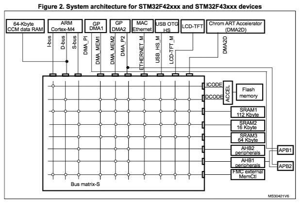
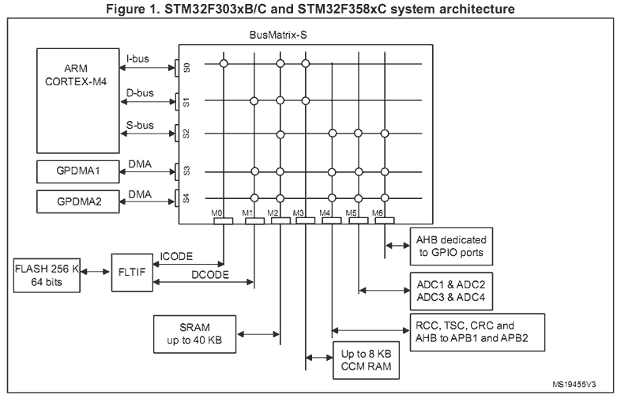

===============================
ELF Programs – No Symbol Tables
===============================

.. warning:: 
    Migrated from: 
    https://cwiki.apache.org/confluence/pages/viewpage.action?pageId=139629542

You can easily extend the firmware in your released, embedded system using ELF  
programs provided via a file system (for example, an SD card or downloaded into  
on-board SPI FLASH). In order to support such post-release updates, your  
released firmware would have to support execution of fully linked, relocatable  
ELF programs loaded into RAM (see, for example, ``apps/examples/elf``).

The files shown in this Wiki page can be downloaded `here <https://cwiki.apache.org/confluence/download/attachments/139629402/elfprog-nosymtab.tar.gz?version=1&modificationDate=1576735520000&api=v2>`_.

Alan Carvalho de Assis has also made a video based on this example in the  
YouTube `NuttX Channel <https://www.youtube.com/watch?v=oL6KAgkTb8M>`_.

Creating the Export Package
===========================

At the time that you release the firmware, you should create and save an  
export package. The export package is all that you need to create  
post-release, add-on modules for your embedded system. Let's illustrate this  
using the ``STM32F4-Discovery`` networking ``NSH`` configuration with the  
``STM32F4DIS-BB`` baseboard. (This demonstration assumes that you also have  
support for some externally modifiable media in the board configuration, such  
as removable media like an SD card, or a USB FLASH stick, an internal file  
system remotely accessible via USB MSC, FTP, or any remote file system (NFS).  
The networking ``NSH`` configuration uses the SD card on the STM32 baseboard  
for this demonstration. Other ``NSH`` configurations could be used, provided  
that you supply the necessary file system support in some fashion.)

(No baseboard? You can add file system support to the basic ``STM32F4-Discovery``  
board by following these instructions: 
`USB FLASH drive <https://www.youtube.com/watch?v=5hB5ZXpRoS4>`_ 
or `SD card <https://www.youtube.com/watch?v=H28t4RbOXqI>`_.)

.. code-block:: shell

   $ make distclean
   $ tools/configure.sh -c stm32f4discovery:netnsh
   $ make menuconfig

Your released firmware would have to have been built with a few important  
configuration settings:

1. Disable networking (Only because it is not needed in this example):

.. code-block:: shell

   # CONFIG_NET is not set

2. Enable basic ELF binary support with no built-in symbol table support:

.. code-block:: shell

   CONFIG_ELF=y
   CONFIG_LIBC_EXECFUNCS=y
   # CONFIG_EXECFUNCS_HAVE_SYMTAB is not set

3. Enable PATH variable support:

.. code-block:: shell

   CONFIG_BINFMT_EXEPATH=y
   CONFIG_PATH_INITIAL="/bin"
   # CONFIG_DISABLE_ENVIRON not set

4. Enable execution of ELF files from the ``NSH`` command line:

.. code-block:: shell

   CONFIG_NSH_FILE_APPS=y

.. note::

   You must enable some application that uses ``printf()``. This is necessary  
   to assure that the symbol ``printf()`` is included in the base system.  
   Here we assume that you include the "Hello, World!" example from  
   ``apps/examples/hello``:

.. code-block:: shell

       CONFIG_EXAMPLES_HELLO=y

Then we can build the NuttX firmware image and the export package:

.. code-block:: shell

   $ make
   $ make export

When ``make export`` completes, you will find a ZIP'ed package in the top-level  
NuttX directory called ``nuttx-export-x.y.zip`` (for version ``x.y``). The  
version is determined by the ``.version`` file in the same directory. The  
content of this ZIP file is the following directory structure:

.. code-block:: shell

   nuttx-export-x.x
    |- arch/
    |- build/
    |- include/
    |- libs/
    |- startup/
    |- System.map
    `- .config

The Add-On Build Directory
==========================

In order to create the add-on ELF program, you will need (1) the export  
package, (2) the program build ``Makefile``, (3) a linker script used by the  
``Makefile``, and (4) a Bash script to create a linker script. That  
``Makefile`` and Bash Script are discussed in the following paragraphs.

.. note::

   These example files implicitly assume a GNU tool chain is used and, in at  
   least one place, that the target is an ARMv7-M platform. A non-GNU tool  
   chain would probably require a significantly different ``Makefile`` and  
   linker script. There is at least one ARMv7-M specific change that would  
   have to be made for other platforms in the script that creates the linker  
   script (``mkdefines.sh``).

Hello Example
=============

To keep things manageable, let's use a concrete example. Suppose the ELF  
program that we wish to add to the release code is the single source file  
``hello.c``:

.. code-block:: c

   #include <stdio.h>
   
   int main(int argc, char **argv)
   {
     printf("Hello from Add-On Program!\n");
     return 0;
   }

Let's say that we have a directory called ``addon`` and it contains the  
``hello.c`` source file, a ``Makefile`` that will create the ELF program, and a  
Bash script called ``mkdefines.sh`` that will create a linker script.

Building the ELF Program
========================

The first step in creating the ELF program is to unzip the Export Package. We  
start with our ``addon`` directory containing the following:

.. code-block:: shell

   $ cd addon
   $ ls
   gnu-elf.ld hello.c Makefile mkdefines.sh nuttx-export-7.25.zip

Where:

- ``gnu-elf.ld`` is the linker script.  
- ``hello.c`` is our example source file.  
- ``Makefile`` will build our ELF program and symbol table.  
- ``mksymtab.h`` is the Bash script that will create the symbol table for the  
  ELF program.  
- ``nuttx-export-7.25.zip`` is the Export Package for NuttX-7.25.

We unzip the Export Package like:

.. code-block:: shell

   $ unzip nuttx-export-7.25.zip

Then we have a new directory called ``nuttx-export-7.25`` that contains all of  
the content from the released NuttX code that we need to build the ELF  
program.

The Makefile
============

The ELF program is created simply as:

.. code-block:: shell

   $ make

This uses the following ``Makefile`` to generate several files:

- ``hello.o``: The compiled ``hello.c`` object.  
- ``hello.r``: A "partially linked" ELF object that still has undefined  
  symbols.  
- ``hello``: The fully linked, relocatable ELF program.  
- ``linker.ld``: A linker script created by ``mkdefines.sh``.

Only the resulting ``hello`` is needed.

Below is the ``Makefile`` used to create the ELF program:

.. code-block:: shell

   include nuttx-export-7.25/build/Make.defs
   
   # Long calls are need to call from RAM into FLASH
   
   ARCHCFLAGS += -mlong-calls
   ARCHWARNINGS = -Wall -Wstrict-prototypes -Wshadow -Wundef
   ARCHOPTIMIZATION = -Os -fno-strict-aliasing -fno-strength-reduce -fomit-frame-pointer
   ARCHINCLUDES = -I. -isystem  nuttx-export-7.25/include
   
   CFLAGS = $(ARCHCFLAGS) $(ARCHWARNINGS) $(ARCHOPTIMIZATION) $(ARCHINCLUDES) -pipe
   
   CROSSDEV = arm-none-eabi-
   CC = $(CROSSDEV)gcc
   LD = $(CROSSDEV)ld
   STRIP = $(CROSSDEV)strip --strip-unneeded
   
   # Setup up linker command line options
   
   LDRELFLAGS = -r
   
   LDELFFLAGS = -r -e main
   LDELFFLAGS += -T defines.ld -T gnu-elf.ld
   
   # This might change in a different environment
   
   OBJEXT ?= .o
   
   # This is the generated ELF program
   
   BIN = hello
   REL = hello.r
   
   # These are the sources files that we use
   
   SRCS = hello.c
   OBJS = $(SRCS:.c=$(OBJEXT))
   
   # Build targets
   
   all: $(BIN)
   .PHONY: clean
   
   $(OBJS): %$(OBJEXT): %.c
   $(CC) -c $(CFLAGS) -o $@ $<
   
   System.map: nuttx-export-7.25/System.map
   cat nuttx-export-7.25/System.map | sed -e "s/\r//g" >System.map
   
   $(REL): $(OBJS)
   $(LD) $(LDRELFLAGS) -o $@ $<
   
   defines.ld: System.map $(REL)
   ./mkdefines.sh System.map "$(REL)" >defines.ld
   
   $(BIN): defines.ld $(REL)
   $(LD) $(LDELFFLAGS) -o $@ $(REL)
   $(STRIP) $(REL)
   
   clean:
   rm -f $(BIN)
   rm -f $(REL)
   rm -f defines.ld
   rm -f System.map
   rm -f *.o

The Linker Script
=================

Two linker scripts are used. One is a normal file (we'll call it the main  
linker script), and the other, ``defines.ld``, is created on-the-fly as  
described in the next section.

The main linker script, ``gnu-elf.ld``, contains the following:

.. code-block:: shell

   SECTIONS
   {
   .text 0x00000000 :
      {
         _stext = . ;
         *(.text)
         *(.text.*)
         *(.gnu.warning)
         *(.stub)
         *(.glue_7)
         *(.glue_7t)
         *(.jcr)
         _etext = . ;
      }
   
   .rodata :
      {
         _srodata = . ;
         *(.rodata)
         *(.rodata1)
         *(.rodata.*)
         *(.gnu.linkonce.r*)
         _erodata = . ;
      }
   
   .data :
      {
         _sdata = . ;
         *(.data)
         *(.data1)
         *(.data.*)
         *(.gnu.linkonce.d*)
         _edata = . ;
      }
   
   .bss :
      {
         _sbss = . ;
         *(.bss)
         *(.bss.*)
         *(.sbss)
         *(.sbss.*)
         *(.gnu.linkonce.b*)
         *(COMMON)
         _ebss = . ;
      }
   
      /* Stabs debugging sections.    */
   
      .stab 0 : { *(.stab) }
      .stabstr 0 : { *(.stabstr) }
      .stab.excl 0 : { *(.stab.excl) }
      .stab.exclstr 0 : { *(.stab.exclstr) }
      .stab.index 0 : { *(.stab.index) }
      .stab.indexstr 0 : { *(.stab.indexstr) }
      .comment 0 : { *(.comment) }
      .debug_abbrev 0 : { *(.debug_abbrev) }
      .debug_info 0 : { *(.debug_info) }
      .debug_line 0 : { *(.debug_line) }
      .debug_pubnames 0 : { *(.debug_pubnames) }
      .debug_aranges 0 : { *(.debug_aranges) }
   }

Creating the ``defines.ld`` Linker Script
=========================================

The additional linker script ``defines.ld`` is created through a three-step  
process:

1. The ``Makefile`` generates a partially linked ELF object, ``hello.r``.  
2. The ``Makefile`` then invokes the ``mkdefines.sh`` script, which generates  
   the ``defines.ld`` linker script that provides values for all of the  
   undefined symbols.  
3. Finally, the ``Makefile`` produces the fully linked, relocatable ``hello``  
   ELF object using the ``defines.ld`` linker script.

Below is the version of ``mkdefines.sh`` used in this demo:

.. code-block:: bash

   #!/bin/bash
   
   usage="Usage: $0 <system-map> <relprog>"
   
   # Check for the required path to the System.map file
   
   sysmap=$1
   if [ -z "$sysmap" ]; then
   echo "ERROR: Missing <system-map>"
   echo ""
   echo $usage
   exit 1
   fi
   
   # Check for the required partially linked file
   
   relprog=$2
   if [ -z "$relprog" ]; then
   echo "ERROR: Missing <program-list>"
   echo ""
   echo $usage
   exit 1
   fi
   
   # Verify the System.map and the partially linked file
   
   if [ ! -r "$sysmap" ]; then
   echo "ERROR:  $sysmap does not exist"
   echo ""
   echo $usage
   exit 1
   fi
   
   if [ ! -r "$relprog" ]; then
   echo "ERROR:  $relprog does not exist"
   echo ""
   echo $usage
   exit 1
   fi
   
   # Extract all of the undefined symbols from the partially linked file and create a
   # list of sorted, unique undefined variable names.
   
   varlist=`nm $relprog | fgrep ' U ' | sed -e "s/^[ ]*//g" | cut -d' ' -f2 | sort - | uniq`
   
   # Now output the linker script that provides a value for all of the undefined symbols
   
   for var in $varlist; do
   map=`grep " ${var}$" ${sysmap}`
   if [ -z "$map" ]; then
      echo "ERROR:  Variable $var not found in $sysmap"
      echo ""
      echo $usage
      exit 1
   fi
   
   varaddr=`echo ${map} | cut -d' ' -f1`
   echo "${var} = 0x${varaddr} | 0x00000001;"
   done

This script uses the ``nm`` utility to find all of the undefined symbols in the  
ELF object, then searches for the address of each undefined symbol in the  
``System.map`` that was created when the released firmware was built. Finally,  
it uses the symbol name and the symbol address to create each symbol table  
entry.

.. note::

   - For the ARMv7-M architecture, bit 0 of the address must be set to indicate  
     thumb mode. If you are using a different architecture that requires  
     normal aligned addresses, you will need to change the following line by  
     eliminating the ORed value:

   .. code-block:: shell

         echo "${var} = 0x${varaddr} | 0x00000001;"

   - If the new ELF module uses a symbol that is not provided in the base  
     firmware and, hence, not included in the ``System.map`` file, this script  
     will fail. In that case, you will need to provide the missing logic  
     within the ELF program itself, if possible.  

   - The technique as described here is only valid in the FLAT build mode. It  
     could probably also be extended to work in the PROTECTED mode by  
     substituting ``User.map`` for ``System.map``.

Here is an example ``defines.ld`` created by ``mkdefines.sh``:

.. code-block:: shell

   printf = 0x0800aefc | 0x00000001 ;

Replacing an NSH Built-In Function
==================================

Files can be executed by ``NSH`` from the command line by simply typing the  
name of the ELF program. This requires:

1. That the feature be enabled with``CONFIG_NSH_FILE_APP=y``  
2. That support for the PATH variable is enabled (``CONFIG_BINFMT_EXEPATH=y`` and  
   ``CONFIG_PATH_INITIAL`` set to the mount point of the file system that  
   may contain ELF programs).

Suppose, for example, I have a built-in application called ``hello``. Before  
installing the new replacement ``hello`` ELF program in the file system, this  
is the version of ``hello`` that ``NSH`` will execute:

.. code-block:: shell

   nsh> hello
   Hello, World!
   nsh>

In the above configuration, ``NSH`` will first attempt to run the program called  
``hello`` from the file system. This will fail because we have not yet placed  
our custom ``hello`` ELF program in the file system. So instead, ``NSH`` will  
fall back and execute the built-in application called ``hello``.  

In this way, any command known to ``NSH`` can be replaced by an ELF program  
installed in a mounted file system directory that is found via the PATH  
variable.

Now suppose that we do add our custom ``hello`` to the file system. When  
``NSH`` attempts to run the program called ``hello`` from the file system, it  
will run successfully. The built-in version will be ignored. It has been  
replaced with the version in the file system:

.. code-block:: shell

   nsh> mount -t vfat /dev/mmcsd0 /bin
   nsh> hello
   Hello from Add-On Program!
   nsh>

Version Dependency
==================

.. note::

   This technique generates ELF programs using fixed addresses from the  
   ``System.map`` file of a versioned release. The generated ELF programs can  
   only be used with that specific firmware version. A crash will most likely  
   result if used with a different firmware version, because the addresses  
   from the ``System.map`` will not match the addresses in a different version  
   of the firmware.

The alternative approach using :doc:`Symbol Tables <fully_linked_elf>` is more 
or less version independent.

Tightly Coupled Memories
========================

Most MCUs based on ARMv7-M family processors support some kind of Tightly  
Coupled Memory (TCM). These TCMs have somewhat different properties for  
specialized operations. Depending on the bus matrix of the processor, you may  
not be able to execute programs from TCM. For instance, the ``STM32 F4``  
supports Core Coupled Memory (CCM), but since it is tied directly to the D-bus,  
it cannot be used to execute programs! On the other hand, the ``STM32F3`` has a  
CCM that is accessible to both the D-Bus and the I-Bus, in which case it  
should be possible to execute programs from this TCM.

When ELF programs are loaded into memory, the memory is allocated from the  
heap via a standard memory allocator. By default with the ``STM32 F4``, the  
CCM is included in ``HEAP`` and will typically be allocated first. If CCM  
memory is allocated to hold the ELF program, a hard-fault will occur  
immediately when you try to execute the ELF program in memory.

Therefore, it is necessary on ``STM32 F4`` platforms to include the following  
configuration setting:

.. code-block:: shell

   CONFIG_STM32_CCMEXCLUDE=y

With that setting, the CCM memory will be excluded from the heap, and so will  
never be allocated for ELF program memory.
