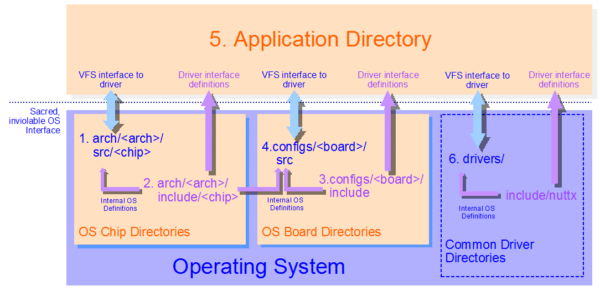

====================
Platform Directories
====================

.. warning:: 
    Migrated from: 
    https://cwiki.apache.org/confluence/display/NUTTX/Platform+Directories

Let's assume that you are not change the OS itself but want to implement or 
extend platform-specific code.In this case, there are six, maybe seven, 
places where you can provide the platform code.

REVISIT: This is a out of date. There has been a recent reorganization 
of the board-related directories: The ``configs/`` directory has been 
renamed ``boards/`` and structure under the new ``boards/`` directory is 
significantly different. A ``<board>`` directory would now be found 
at ``boards/<arch>/<chip>/<board>``. Conceptually the figure is correct, 
just not consistent with current naming.

Each directory has slightly different properties and are discussed 
in more detail below where:

* `<arch>` represents the chip architecture that you are using. 
  As examples, `<arch>` might represent ``arm`` or ``mips``.
* `<chip>` represents the specific chip family that you are using. 
  As examples, `<chip>` might mean ``stm32`` or ``efm32``
* `<board>` represents the specific board that you are using. 
  As examples, `<board>` might be ``stm32f4discovery`` or ``dk-tm4c129x``

1. arch/<arch>/src/<chip>
=========================

The ``arch/<arch>/src/<chip>`` directory should hold all chip related 
logic. Almost all chip-specific header files should reside here 
too. That includes device-related header files. GPIO header 
files, for example, go here and no where else.

2. arch/<arch>/include/<chip>
=============================

The intent of the ``arch/<arch>/include/<chip>`` directory is to 
hold driver-related definitions needed by application in order 
to access drivers registered by the chip-specific logic in the 
``arch/<arch>/src/<chip>`` directory. This would include things like:

* The IOCTL cmds that would be used with the driver 
  ``ioctl()`` interfaces calls,
* Structure definitions of parameters passed with 
  IOCTL cmds, and
* Structure definitions of binary data that might 
  be transferred via the driver ``read()`` or ``write()`` methods.

The ``arch/<arch>/include/<chip>`` directory is not currently used 
properly for most of the definitions you will find there. Most 
of the definitions in these header files really belong in the 
``arch/<arch>/src/<chip>`` directory but are here for historical 
reasons only at this point.

The difference between header files in ``arch/<arch>/include/<chip>`` 
directory and the header files in ``arch/<arch>/src/<chip>`` directory 
is that the former can be included by applications using the 
include path:

.. code-block:: c

    #include <arch/chip/someheader.h>

The header files in ``arch/<arch>/src/<chip>`` cannot be used by 
applications. Those header flies can and only be used in the 
``arch/<arch>/src/<chip>`` and in the ``configs/<board>`` directories.

The header files in this directory `MUST NOT` introduce `ad hoc` 
non-standard function call interfaces between the application 
and the OS. The OS interfaces are highly controlled and not 
subject to `ad hoc` extension.

The NuttX build system enforces this and I do everything that 
I can to restrict usage of all chip specific facilities to those 
directories. In reality you are free, of course, to subvert that 
intent in any way you please for your personal project; but any 
subversion of that intent will not not be committed into the 
upstream NuttX repository.

3. configs/<board>/include
==========================

The ``configs/<board>/include`` directory is the moral equivalent of the 
``arch/<arch>/include/<chip>`` directory for boards: The 
``arch/<arch>/include/<chip>`` directory holds chip-specific 
definitions that are accessible all logic (event even application code). 
Similarly the ``configs/<board>/include`` directory holds board-specific 
definitions that are accessible even to applications code. And the 
same kinds of driver interfacing data should appear in these 
files (see the list above).

Similarly, the intent of the ``configs/<board>/include`` directory 
is to hold driver-related definitions needed by application in 
order to access drivers registered by the board-specific logic 
in the ``configs/<board>/src`` directory. The header files in the 
``configs/<board>/include`` directory can be included using this 
include path:

.. code-block:: c

    #include <arch/board/someheader.h>

The header files in this directory `MUST NOT` introduce `ad hoc` 
non-standard function call interfaces between the application 
and the OS. The OS interfaces are highly controlled and not 
subject to `ad hoc` extension.

4. configs/<board>/src
======================

All of your board-specific initialization logic and `all` of the 
custom board device driver logic should go either in a `built-in` 
``configs/<board>/src`` directory or in an external, custom board 
directory. These board directories are where all of your 
board-specific, hardware interfacing work should be done. 
As a minimum, a built-in board directory must contain 
these files/directories at a minimum:

* ``Kconfig`` to include the custom board configuration options into 
  the NuttX configuration system.
* ``src/Makefile`` contains the custom board build logic
* ``include/board.h`` provides board-specific information needed by the system

Most people will eventually want to create their own custom board 
directory. If you do ``make menuconfig`` you will find under the board 
menu that you can enable and configure a custom board directory. 
One of these configuration options is the path to your custom 
board directory. That is where you will want to implement all 
of your product-specific device driver logic. As a minimum, 
your custom board directory must contain these files/directories at a minimum:

* ``src/Makefile`` contains the custom board build logic
* ``include/board.h`` provides board-specific information needed by the system

NOTE: That the configuration definition file, ``Kconfig``, is not 
currently supported in the custom board configuration directory.

Within either type of ``board/src`` directory you will have 
free access to all of the header files in the whole system, 
including even those in the ``arch/<arch>/src/<chip>`` directory. 
There are no limitations whatsoever; All include paths are supported.

5. Application Directory
========================

There are many ways to implement your application build. How you do that is 
not really a part of NuttX and the topic is beyond the scope of this Wiki 
page. The NuttX apps package does provide one example of an application 
directory you may choose to use – or not. That apps/ directory is 
intended to provide you with some guidance. But if you search the 
messages in the forum, you can get lots of other ideas how to 
structure the application build.

The application logic can include header files from 
``arch/<arch>/include/<chip>`` directory or from the 
``configs/<board>/include`` directory for sole purpose 
of support standard driver interfacing. The header 
files in this directories must not introduce 
uncontrolled, `ad hoc` interfaces into the operating system.

In the application directory, you cannot include header files 
from either the ``arch/<arch>/src/<chip>`` directory or the 
``configs/<board>/src`` directory. That is an intentional 
restriction that I try to enforce in order to support the 
NuttX model for the segregation of functionality. But again, 
you can always subvert that in your own repository as you 
like. There should be no device level code in your application. 
There should be no need to access GPIOs or registers or 
anything like that. That all should be done in the chip 
directory or in your board directory.

The model I advocate is to create and register standard device 
drivers in your ``configs/<board>/src`` or custom board directory, 
then you can access the device in your application directory 
using the standard ``open()`` / ``close()`` / ``read()`` / ``write()`` 
functions.

But I am all about freedom. Please do things exactly how you 
want to do them. Make sure the project meets all of your needs 
first; do things as you like. But, of course, I cannot commit 
anything upstream that does not conform to these architectural rules.

6. drivers/
===========

Above I said that all of the devices drivers for the board-specific 
resources should go in your ``configs/<board>/src`` directory. However 
if your board is loaded with standard external parts that require 
device drivers – such as an lcd, a touchscreen, serial FLASH, 
accelerometers, etc. – then you will want to re-use or implement 
standard drivers for these parts that can be shared by different 
boards. In that case the ``drivers/`` directory is the correct place 
for those implementations. Header files associated with these 
common drivers would go in the appropriate place under ``include/nuttx/``.

7. apps/platform/<board> (maybe)
================================

A final place where you can put application specific data is the 
``apps/platform/<board>`` directory. This is really part of `5. 
Application Directory` if you are using the NuttX ``apps/`` package. 
But since it has a slightly different purpose, it is worth 
discussing separately.

The ``apps/platform/`` directory structure is very similar to the 
``nuttx/configs/`` directory with one directory per board. At 
context create time, a symbolic link at ``apps/platform/board`` 
is set up to link to the board-specific directory in 
``apps/platform/<board>``.

The ``apps/platform/<board>`` directory is where board-specific 
application logic could be placed. This directory is not often 
used. In the normal `flat` Nuttx build, there is really not much 
difference between the ``nuttx/configs/<board>`` board directory 
and the ``apps/platform/<board>`` board directory. Hence the 
former is normally sufficient.

The fundamental difference between the two board directories 
is that the ``nuttx/configs/<board>`` board directory is inside 
the operating system while the ``apps/platform/<board>`` directory 
is outside of the operating system. This distinction does not 
mean very much in the `flat` build (``CONFIG_BUILD_FLAT``) because 
nothing enforces `inside`-ness or `outside`-ness in that case. 
But the distinction is very important in protected builds 
(``CONFIG_BUILD_PROTECTED``) and `kernel` builds 
(``CONFIG_BUILD_KERNEL``) because the code operating 
`inside` the OS is privileged, kernel-mode logic; 
the code `outside` of the OS, on the other hand, 
is unprivileged, user-mode code. The two cannot be intermixed.