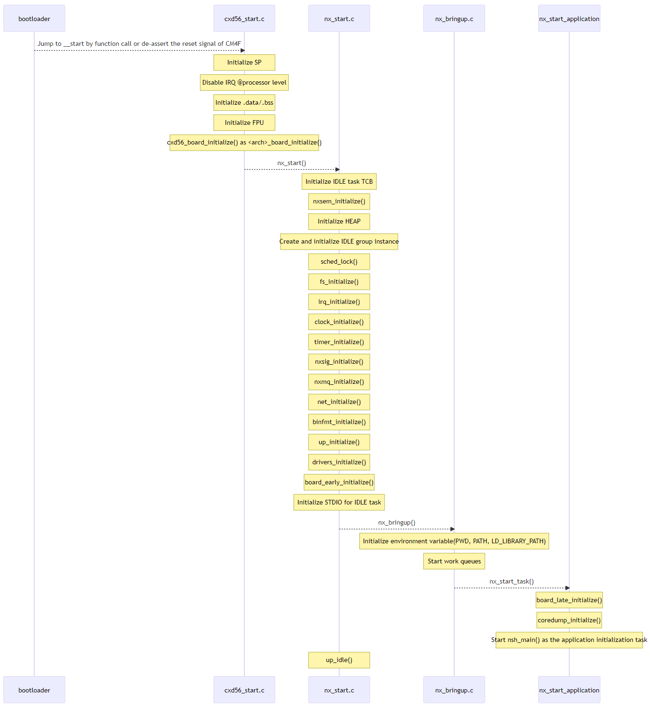

The diagram of boot sequence 
============================

The premise of this sequence diagram is NuttX12.4.0, cxd56xx, non-SMP and Flat build.

The beginning of boot sequence is __start().
__start() will call nx_start(). nx_start() will initialize the kernel and call nsh_main().
nsh_main() will execute NuttShell(NSH).
nx_start() is NuttX standard function, but the behavior depends on some kernel configurations.
For example, the calling nsh_main() is also configurable.
About related kernel configurations, see :doc:`/guides/port_relatedkernelconfigrations`.

