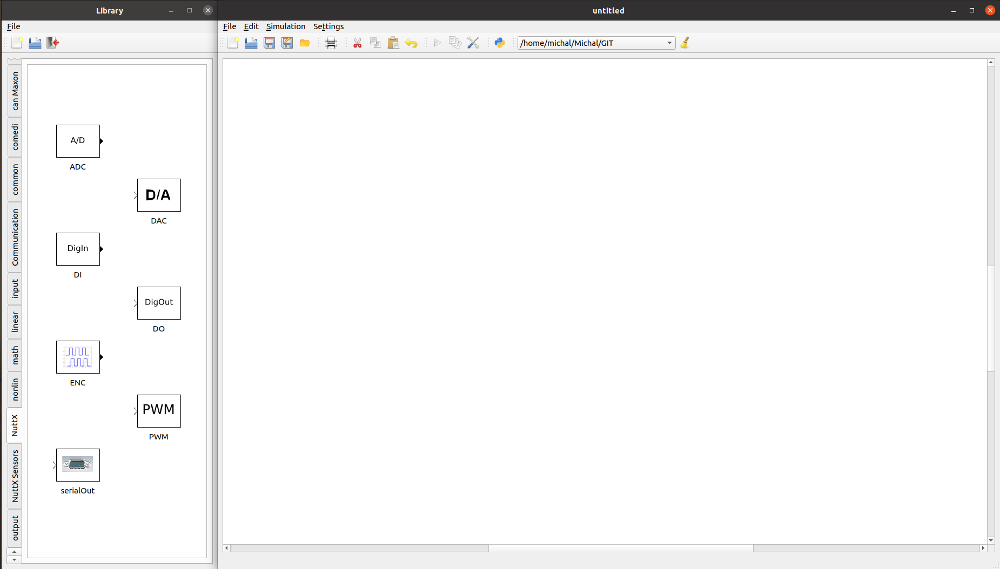
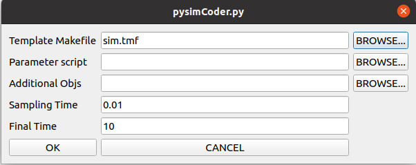

.. include:: /substitutions.rst
.. _pysimcoder:

pysimCoder integration with NuttX
=================================

`PysimCoder <https://github.com/robertobucher/pysimCoder>`__ is as an open source
Rapid Control Application Development Tool which is able to transfer block diagrams into C code.
Combined with NuttX, it can be used in real time control application and as an alternative to
expensive licensed programs and prototyping platforms. Example of `DC motor control application
<https://www.youtube.com/watch?v=6HlGk3ecPNQ>`_ with PID controller and blocks for encoder,
PWM, GPIO and sending data over TCP to real time plotter can be seen on `NuttX Channel 
<https://www.youtube.com/channel/UC0QciIlcUnjJkL5yJJBmluw>`_.

This documentation describes the steps that are needed to run application generated by pysimCoder
on NuttX and also keeps the track of peripherals that are supported by pysimCoder for NuttX RTOS.

Peripheral Support
------------------

The following list shows the peripherals and fuctionalities supported in pysimCoder for NuttX RTOS.

==========  =======================
Peripheral  Notes
==========  =======================
ADC
CAN         Including SocketCAN
DAC
ENC
GPIO
PWM         Multichannel support
UART        Serial output
Sensors     Basic support for DHTXX
TCP
UDP
==========  =======================

Please note that the actual support for NuttX peripherals can be wider that what is mentioned here
in case this documentation was not updated when new fuctionalities were added to pysimCoder.

NuttX Configuration
-------------------

Several configuration options are necessary to be set in order to successfully compile pysimCoder
with NuttX. The list is the following:

==================================== =====================================
``CONFIG_ARCH_RAMVECTORS=y``         ``CONFIG_NSH_FILE_APPS=y``
``CONFIG_BOARDCTL_APP_SYMTAB=y``     ``CONFIG_NSH_LINELEN=64``
``CONFIG_BOARDCTL_OS_SYMTAB=y``      ``CONFIG_NSH_READLINE=y``
``CONFIG_BUILTIN=y``                 ``CONFIG_NSH_ROMFSETC=y``
``CONFIG_ELF=y``                     ``CONFIG_PSEUDOTERM=y``
``CONFIG_FS_BINFS=y``                ``CONFIG_PTHREAD_CLEANUP=y``
``CONFIG_FS_PROCFS=y``               ``CONFIG_PTHREAD_MUTEX_TYPES=y``
``CONFIG_FS_PROCFS_REGISTER=y``      ``CONFIG_PTHREAD_STACK_MIN=1024``
``CONFIG_FS_ROMFS=y``                ``CONFIG_LIBM=y``
``CONFIG_FS_TMPFS=y``                ``CONFIG_RR_INTERVAL=10``
``CONFIG_IDLETHREAD_STACKSIZE=2048`` ``CONFIG_SCHED_WAITPID=y``
``CONFIG_LIBC_EXECFUNCS=y``          ``CONFIG_SERIAL_TERMIOS=y``
``CONFIG_LIBC_STRERROR=y``           ``CONFIG_SYMTAB_ORDEREDBYNAME=y``
``CONFIG_MAX_TASKS=16``              ``CONFIG_SYSTEM_NSH=y``
``CONFIG_NSH_BUILTIN_APPS=y``        ``CONFIG_SYSTEM_NSH_STACKSIZE=4096``
``CONFIG_NSH_FILEIOSIZE=512``        ``CONFIG_INIT_ENTRYPOINT="nsh_main"``
==================================== =====================================

Note that ``CONFIG_LIBM=y`` might not be required for toolchains that already include
standard math library. However it is recommended to add ``CONFIG_LIBM=y`` to ensure
math library is included. Subsequently ``CONFIG_LIBC_FLOATINGPOINT=y`` is needed if double values
are to be printed on terminal.

In case you want to use Network and blocks like TCP or UDP, following configuration
options are required:

============================== ==================================
``CONFIG_NET=y``               ``CONFIG_NET_ROUTE=y``
``CONFIG_NETDB_DNSCLIENT=y``   ``CONFIG_NET_SOLINGER=y``
``CONFIG_NETDEV_LATEINIT=y``   ``CONFIG_NET_STATISTICS=y``
``CONFIG_NETDEV_STATISTICS=y`` ``CONFIG_NET_TCP=y``
``CONFIG_NETINIT_DHCPC=y``     ``CONFIG_NET_TCPBACKLOG=y``
``CONFIG_NETINIT_NOMAC=y``     ``CONFIG_NET_TCP_KEEPALIVE=y``
``CONFIG_NETUTILS_FTPC=y``     ``CONFIG_NET_TCP_WRITE_BUFFERS=y``
``CONFIG_NETUTILS_TELNETD=y``  ``CONFIG_NET_UDP=y``
``CONFIG_NETUTILS_TFTPC=y``    ``CONFIG_SYSTEM_DHCPC_RENEW=y``
``CONFIG_NET_ARP_SEND=y``      ``CONFIG_SYSTEM_NTPC=y``
``CONFIG_NET_BROADCAST=y``     ``CONFIG_SYSTEM_PING6=y``
``CONFIG_NET_IPv6=y``          ``CONFIG_SYSTEM_PING=y``
``CONFIG_NET_LOOPBACK=y``      ``CONFIG_SYSTEM_TEE=y``
``CONFIG_NET_PKT=y``
============================== ==================================

Board and application specific configuration like setting up peripherals or boot options might also be required,
please refer to board and platform documentation for those information. Once NuttX is configured it can be build
by simply running:

  .. code-block:: console

     $ make

Then we need to export build NuttX which can be done by executing command

  .. code-block:: console

     $ make export

This creates a zip file nuttx-export-xx.x.x.zip where xx.x.x is the version of NuttX. This file then have to be
moved to pysimCoder directory pysimCoder/CodeGen/nuttx, unzip there and then renamed just to nuttx-export. Then
enter the pysimCoder/CodeGen/nuttx/device directory and execute

  .. code-block:: console

     $ make

This compiles pysimCoder files that controls functions of separate blocks. PysimCoder can be either installed
on the system (please refer to the `pysimCoder manual <https://github.com/robertobucher/pysimCoder/blob/master/README.md>`_)
or script pysim-run.sh can be used to run pysimCoder without the installation. This script can be found in pysimCoder
root directory and is run by executing command

  .. code-block:: console

     $ ./pysim-run.sh

Please note that PYSUPSICTRL variable has to be set/exported in order to successfully compile NuttX application
designed with pysimCoder.

Using pysimCoder to design NuttX application
--------------------------------------------

After running pysimCoder, separate blocks can be selected from the library menu on the left hand side. The menu contains
several libraries, NuttX specific blocks can be found in library "NuttX". It is also possible to use blocks from other
libraries like "input", "output", "math" and so on. Several blocks can have specific parameter options and various number
of inputs/outputs. Double left click on the block openes parameter settings while single right click on the block leads
to number of inputs/outputs setup. The pysimCoder interface can be seen in the picture below.

   pysimCoder interface: library menu can be seen on the left hand side

The NuttX template Makefile nuttx.tmf has to be selected in order to generate code for NuttX target.
This can be done in the top menu by clicking on Block settings icon which is highlighted in the red circle.

   pysimCoder menu: red block settings, green generate C-code

Block settings option open the following window (showed in the picture below) where you can set template Makefile and
also Python skript with parameters for the controllers.

   pysimCoder Block settings menu

C code can be generated by selecting Generate C-code icon (highlighted in the green circle). Executable files are then
generated and can be flashed into the target. The flashing procedure can be target specific, please refer to platform´s
documentation. The generated application can be then run from NuttX command line by executing::

    nsh> main
