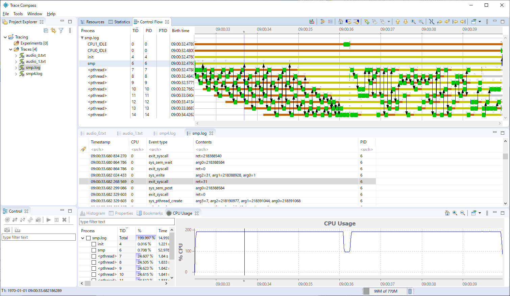

=====================
Task Trace User Guide
=====================

Installation
============

Install Trace Compass
---------------------

Task Trace uses the external tool `"Trace Compass" <https://www.eclipse.org/tracecompass/>`_ to display the trace result.

Download it from https://www.eclipse.org/tracecompass/ and install into the host environment.
After the installation, execute it and choose ``Tools`` -> ``add-ons`` menu, then select ``Install Extensions`` to install the extension named "Trace Compass ftrace (Incubation)".

NuttX kernel configuration
--------------------------

To enable the task trace function, the NuttX kernel configuration needs to be modified.

The following configurations must be enabled.

- ``CONFIG_SCHED_INSTRUMENTATION`` : Enables the feature of scheduler notes.
- ``CONFIG_SCHED_INSTRUMENTATION_FILTER`` : Enables the filter logic of the notes.
- ``CONFIG_SCHED_INSTRUMENTATION_SYSCALL`` : Enable system call instrumentation.
- ``CONFIG_SCHED_INSTRUMENTATION_IRQHANDLER`` : Enables IRQ instrumentation.
- ``CONFIG_DRIVER_NOTE`` : Enables note driver support.
- ``CONFIG_DRIVER_NOTERAM`` : Enables ``/dev/note`` in-memory buffering driver.
- ``CONFIG_DRIVER_NOTECTL`` : Enables ``/dev/notectl`` filter control driver.
- ``CONFIG_SYSTEM_TRACE`` : Enables "``trace``" command
- ``CONFIG_SYSTEM_SYSTEM`` : Enables "``system``" command (required by :ref:`trace_cmd`)

The following configurations are configurable parameters for trace.

- ``CONFIG_SCHED_INSTRUMENTATION_FILTER_DEFAULT_MODE``

  - Specify the default filter mode.
    If the following bits are set, the corresponding instrumentations are enabled on boot.

    - Bit 0 = Enable instrumentation
    - Bit 1 = Enable syscall instrumentation
    - Bit 2 = Enable IRQ instrumentation
    - Bit 3 = Enable collecting syscall arguments

- ``CONFIG_SCHED_INSTRUMENTATION_NOTERAM_BUFSIZE``

  - Specify the note buffer size in bytes.
    Higher value can hold more note records, but consumes more kernel memory.

- ``CONFIG_SCHED_INSTRUMENTATION_NOTERAM_DEFAULT_NOOVERWRITE``

  - If enabled, stop overwriting old notes in the circular buffer when the buffer is full by default.
    This is useful to keep instrumentation data of the beginning of a system boot.

- ``CONFIG_SCHED_INSTRUMENTATION_HIRES``

  - If enabled, use higher resolution system timer for instrumentation.

After the configuration, rebuild the NuttX kernel and application.

If the trace function is enabled, "``trace``" :doc:`../applications/nsh/builtin` will be available.

How to get trace data
=====================

The trace function can be controlled by "``trace``" command.

Quick Guide
-----------

Getting the trace
^^^^^^^^^^^^^^^^^

Trace is started by the following command.

.. code-block::

  nsh> trace start

Trace is stopped by the following command.

.. code-block::

  nsh> trace stop

If you want to get the trace while executing some command, the following command can be used.

.. code-block::

  nsh> trace cmd <command> [<args>...]

Displaying the trace result
^^^^^^^^^^^^^^^^^^^^^^^^^^^

The trace result is accumulated in the memory.
After getting the trace, the following command displays the accumulated trace data to the console.

.. code-block::

  nsh> trace dump

This will be get the trace results like the followings:

.. code-block::

  <noname>-1   [0]   7.640000000: sys_close()
  <noname>-1   [0]   7.640000000: sys_close -> 0
  <noname>-1   [0]   7.640000000: sys_sched_lock()
  <noname>-1   [0]   7.640000000: sys_sched_lock -> 0
  <noname>-1   [0]   7.640000000: sys_nxsched_get_stackinfo()
  <noname>-1   [0]   7.640000000: sys_nxsched_get_stackinfo -> 0
  <noname>-1   [0]   7.640000000: sys_sched_unlock()
  <noname>-1   [0]   7.640000000: sys_sched_unlock -> 0
  <noname>-1   [0]   7.640000000: sys_clock_nanosleep()
  <noname>-1   [0]   7.640000000: sched_switch: prev_comm=<noname> prev_pid=1 prev_state=S ==> next_comm=<noname> next_pid=0
  <noname>-0   [0]   7.640000000: irq_handler_entry: irq=11
  <noname>-0   [0]   7.640000000: irq_handler_exit: irq=11
  <noname>-0   [0]   7.640000000: irq_handler_entry: irq=15
  <noname>-0   [0]   7.650000000: irq_handler_exit: irq=15
  <noname>-0   [0]   7.650000000: irq_handler_entry: irq=15
      :

By using the logging function of your terminal software, the trace result can be saved into the host environment and it can be used as the input for `"Trace Compass" <https://www.eclipse.org/tracecompass/>`_.

If the target has a storage, the trace result can be stored into the file by using the following command.
It also can be used as the input for "Trace Compass" by transferring the file in the target device to the host.

.. code-block::

  nsh> trace dump <file name>

To display the trace result by `"Trace Compass" <https://www.eclipse.org/tracecompass/>`_, choose ``File`` -> ``Open Trace`` menu to specify the trace data file name.

Trace command description
=========================

.. _trace_start:

trace start
-----------

Start task tracing

**Command Syntax:**

.. code-block::

  trace start [-c][<duration>]

- ``-c`` : Continue the previous trace.
  The trace data is not cleared before starting new trace.

- ``<duration>`` : Specify the duration of the trace by seconds.
  Task tracing is stopped after the specified period.
  If not specified, the tracing continues until stopped by the command.

.. _trace_stop:

trace stop
----------

Stop task tracing

**Command Syntax:**

.. code-block::

  trace stop

.. _trace_cmd:

trace cmd
---------

Get the trace while running the specified command.
After the termination of the command, task tracing is stopped.
To use this command, ``CONFIG_SYSTEM_SYSTEM`` needs to be enabled.

**Command Syntax:**

.. code-block::

  trace cmd [-c] <command> [<args>...]

- ``-c`` : Continue the previous trace.
  The trace data is not cleared before starting new trace.

- ``<command>`` : Specify the command to get the task trace.

- ``<args>`` : Arguments for the command.

**Example:**

.. code-block::

  nsh> trace cmd sleep 1

.. _trace_dump:

trace dump
----------

Output the trace result.
If the task trace is running, it is stopped before the output.

**Command Syntax:**

.. code-block::

  trace dump [-c][<filename>]

- ``-c`` : Not stop tracing before the output.
  Because dumping trace itself is a task activity and new trace data is added while output, the dump will never stop.

- ``<filename>`` : Specify the filename to save the trace result.
  If not specified, the trace result is displayed to console.

.. _trace_mode:

trace mode
----------

Set the task trace mode options.
The default value is given by the kernel configuration ``CONFIG_SCHED_INSTRUMENTATION_FILTER_DEFAULT_MODE``.

**Command Syntax:**

.. code-block::

  trace mode [{+|-}{o|s|a|i}...]

- ``+o`` : Enable overwrite mode.
  The trace buffer is a ring buffer and it can overwrite old data if no free space is available in the buffer.
  Enables this behavior.

- ``-o`` : Disable overwrite mode.
  The new trace data will be disposed when the buffer is full.
  This is useful to keep the data of the beginning of the trace.

- ``+s`` : Enable system call trace.
  It records the event of enter/leave system call which is issued by the application.
  All system calls are recorded by default. ``trace syscall`` command can filter the system calls to be recorded.

- ``-s`` : Disable system call trace.

- ``+a`` : Enable recording the system call arguments.
  It records the arguments passed to the issued system call to the trace data.

- ``-a`` : Disable recording the system call arguments.

- ``+i`` : Enable interrupt trace.
  It records the event of enter/leave interrupt handler which is occured while the tracing.
  All IRQs are recorded by default. ``trace irq`` command can filter the IRQs to be recorded.

- ``-i`` : Disable interrupt trace.

If no command parameters are specified, display the current mode as the follows.

**Example:**

.. code-block::

  nsh> trace mode
  Task trace mode:
   Trace                   : enabled
   Overwrite               : on  (+o)
   Syscall trace           : on  (+s)
    Filtered Syscalls      : 16
   Syscall trace with args : on  (+a)
   IRQ trace               : on  (+i)
    Filtered IRQs          : 2

.. _trace_syscall:

trace syscall
-------------

Configure the filter of the system call trace.

**Command Syntax:**

.. code-block::

  trace syscall [{+|-}<syscallname>...]

- ``+<syscallname>`` : Add the specified system call name to the filter.
  The execution of the filtered system call is not recorded into the trace data.

- ``-<syscallname>`` : Remove the specified system call name from the filter.

Wildcard "``*``" can be used to specify the system call name.
For example, "``trace syscall +sem_*``" filters the system calls begin with "``sem_``", such as ``sem_post()``, ``sem_wait()``,...

If no command parameters are specified, display the current filter settings as the follows.

**Example:**

.. code-block:: console

  nsh> trace syscall
  Filtered Syscalls: 16
    getpid
    sem_destroy
    sem_post
    sem_timedwait
    sem_trywait
    sem_wait
    mq_close
    mq_getattr
    mq_notify
    mq_open
    mq_receive
    mq_send
    mq_setattr
    mq_timedreceive
    mq_timedsend
    mq_unlink

.. _trace_irq:

trace irq
---------

Configure the filter of the interrupt trace.

**Command Syntax:**

.. code-block::

  trace irq [{+|-}<irqnum>...]

- ``+<irqnum>`` : Add the specified IRQ number to the filter.
  The execution of the filtered IRQ handler is not recorded into the trace data.

- ``-<irqnum>`` : Remove the specified IRQ number from the filter.

Wildcard "``*``" can be used to specify all IRQs.

If no command parameters are specified, display the current filter settings as the follows.

**Example:**

.. code-block:: console

  nsh> trace irq
  Filtered IRQs: 2
    11
    15

