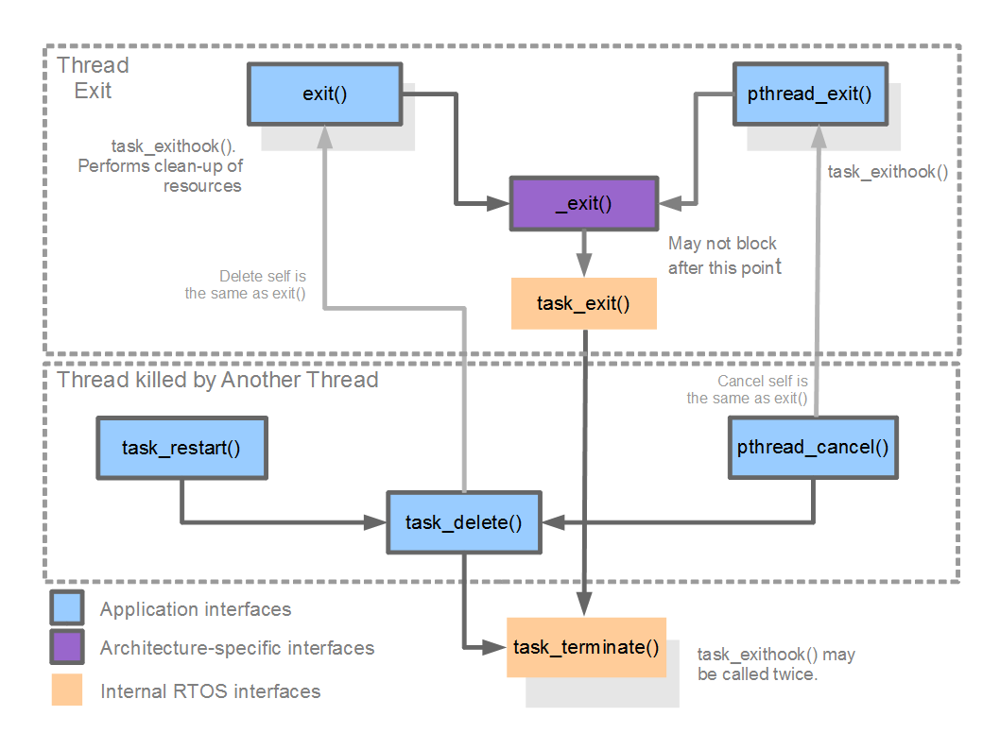

.. _nuttx-tasking:

=============
NuttX Tasking
=============

An RTOS as a library
====================

What is an RTOS? NuttX, as with all RTOSs, is a collection of various features
bundled as a library. It does not execute except when either:

1. The application calls into the NuttX library code, OR
2. An interrupt occurs.

There is no meaningful way to represent an architecture that is implemented
as a library of user managed functions with a diagram.
You can however, pick any subsystem of an RTOS and represent
that in some fashion.

Kernel Threads
==============

There are some RTOS functions that are implemented by internal threads,
for instance :ref:`kernel-threads-vs-pthreads`, :ref:`tasks-vs-threads`,
:ref:`kernel-modules`.

.. todo:: Provide more content here :-)

The Scheduler
=============

Schedulers and Operating Systems
--------------------------------

An operating system is a complete environment for developing applications.
One important component of an operating system is the scheduler.
That logic that controls when tasks or threads execute.

Actually, more than that; the scheduler really determines what a task
or a thread is! Most tiny operating systems are really not operating
“systems” in the sense of providing a complete operating environment.
Rather these tiny operating systems consist really only of a scheduler.
That is how important the scheduler is.

Task Control Block (TCB)
------------------------

In NuttX a thread is any controllable sequence of instruction execution
that has its own stack.
Each task is represented by a data structure called a task control block
or TCB. That data structure is defined in the header file
``include/nuttx/sched.h``.

Task Lists
----------

These TCBs are retained in lists. The state of a task is indicated both
by the ``task_state`` field of the TCB and by a series of task lists.
Although it is not always necessary, most of these lists are prioritized
so that common list handling logic can be used (only the ``g_readytorun``,
the ``g_pendingtasks``, and the ``g_waitingforsemaphore`` lists
need to be prioritized).

All new tasks start in an initial, non-running state:

.. code-block:: c

  volatile dq_queue_t g_inactivetasks;

* This is the list of all tasks that have been initialized, but not yet
  activated. NOTE: This is the only list that is not prioritized.

* When the task is initialized, it is moved to a ready-to-run list.
  There are two lists representing ready-to-run threads and several
  lists representing blocked threads. Here are the ready-to-run threads:

.. code-block:: c

  volatile dq_queue_t g_readytorun;

* This is the list of all tasks that are ready to run.
  The head of this list is the currently active task;
  the tail of this list is always the idle task.

.. code-block:: c

  volatile dq_queue_t g_pendingtasks;

* This is the list of all tasks that are ready-to-run, but cannot be placed
  in the ``g_readytorun`` list because:

  1. They are higher priority than the currently active task at the head
     of the ``g_readytorun`` list, AND
  2. the currently active task has disabled pre-emption.
  
  These tasks will stay in this holding list until pre-emption is again
  enabled (or until the currently active task voluntarily relinquishes
  the CPU).

* Tasks in the ``g_readytorun`` list may become blocked.
  In this cased, their TCB will be moved to one of the blocked lists.
  When the block task is ready-to-run, its TCB will be moved back to either
  the ``g_readytorun`` to ``the g_pendingtasks`` lists, depending up
  if pre-emption is disabled and upon the priority of the tasks.

Here are the blocked task lists:

.. code-block:: c

  volatile dq_queue_t g_waitingforsemaphore;

* This is the list of all tasks that are blocked waiting for a semaphore.

.. code-block:: c

  volatile dq_queue_t g_waitingforsignal;

* This is the list of all tasks that are blocked waiting for a signal
  (only if signal support has not been disabled).

.. code-block:: c

  volatile dq_queue_t g_waitingformqnotempty;

* This is the list of all tasks that are blocked waiting for a message queue
  to become non-empty (only if message queue support has not been disabled).

.. code-block:: c

  volatile dq_queue_t g_waitingformqnotfull;

* This is the list of all tasks that are blocked waiting for a message queue
  to become non-full (only if message queue support has not been disabled).

.. code-block:: c

  volatile dq_queue_t g_waitingforfill;

* This is the list of all tasks that are blocking waiting for a page fill
  (only if on-demand paging is selected).

Reference: ``nuttx/sched/sched/sched.h``.

State Transition Diagram
========================

The state of a thread can then be easily represented with this simple state
transition diagram.

.. todo:: Provide State Transition Diagram.

Scheduling Policies
===================

In order to be a real-time OS, an RTOS must support ``SCHED_FIFO``.
That is, strict priority scheduling. The thread with the highest priority
runs.. Period. The thread with the highest priority is always associated
with the TCB at the head of the ``g_readytorun`` list.

NuttX supports one additional real-time scheduling policy: ``SCHED_RR``.
The RR stands for **round-robin** and this is sometimes called
**round-robin scheduling**. In this case, NuttX supports timeslicing.
If a task with ``SCHED_RR`` scheduling policy is running, then when each
timeslice elapses, it will give up the CPU to the next task that is
at the same priority.

.. note::

  1. If there is only one task at this priority, ``SCHED_RR`` and
     ``SCHED_FIFO`` are the same, AND
  2. ``SCHED_FIFO`` tasks are never pre-empted in this way.

Task IDs
========

Each task is represented not only by a TCB but also by a numeric task ID.
Given a task ID, the RTOS can find the TCB.
Given a TCB, the RTOS can find the task ID.
So they are functionally equivalent.
Only the task ID, however, is exposed at the RTOS/application interfaces.

NuttX Tasks
===========

Processes vs. Threads
---------------------

In larger system OS such as BSD, Linux, or Windows you will often hear
the name process used to refer to threads managed by the OS.

A process is more than a thread as we have been discussing so far.
A process is a protected environment that hosts one or more threads.
By environment we mean the set of resources set aside by the OS but
in the case of the protected environment of the process we are specifically
referring its address space.

.. note::

  In order to implement the process' address space, the CPU must support
  a memory management unit (MMU).
  **The MMU is used to enforce the protected process environment.**

However, NuttX was designed to support the more resource constrained,
lower-end, deeply embedded MCUs. Those MCUs seldom have an MMU and,
as a consequence, can never support processes as are supported by BSD, Linux,
or Windows.

.. important:: NuttX does not support processes.

NuttX will support an MMU but it will not use the MMU to support processes.
NuttX operates only in a flat address space.
NuttX will use the MMU to control the instruction and data caches and
to support protected memory regions.
This may change in future, but this is how things are right now.

NuttX Tasks and Task Resources
------------------------------

All RTOSs support the notion of a task. A task is the RTOS's moral equivalent
of a process. Like a process, a task is a thread with an environment
associated with it.

This environment is like environment of the process but does not include
a private address space.
This environment is private and unique to a task.
Each task has its own environment.

This task environment consists of a number of resources
(as represented in the TCB). Of interest in this discussion are the following.
Note that any of these task resources may be disabled in the NuttX
configuration to reduce the NuttX memory footprint:

1. **Environment Variables**. This is the collection of variable assignments
   of the form: ``VARIABLE=VALUE``.

2. **File Descriptors**. A file descriptor is a task specific number
   that represents an open resource (a file or a device driver, for example).

3. **Sockets**. A socket descriptor is like a file descriptor, but
   the open resource in this case is a network socket.

4. **Streams**. Streams represent standard C buffered I/O.
   Streams wrap file descriptors or sockets to provide a new set of interface
   functions for dealing with the standard C I/O (like ``fprintf()``,
   ``fwrite()``, etc.).

In NuttX, a task is created using the interface ``task_create()``.

NuttX Task Exit Sequence
------------------------

   Task Exit Sequence diagram.

The Pseudo File System and Device Drivers
=========================================

A full discussion of the NuttX file system belongs elsewhere,
see :ref:`nuttx-filesystem` for more details.
But in order to talk about task resources, we also need to have
a little knowledge of the NuttX file system.

NuttX implements a Virtual Files System (VFS) that may be used to communicate
with a number of different entities via the standard ``open()``, ``close()``,
``read()``, ``write()``, etc, interfaces.
Like other VFSs, the NuttX VFS will support file system mount points,
files, directories, device drivers, etc.

Also, as with other VFSs, the NuttX file system will support
pseudo-file systems, that is, file systems that appear as normal media
but are really presented under programmatic control.
In Linux, for example, you have the ``/proc`` and the ``/sys``
psuedo-file systems.
There is no physical media underlying the pseudo-file system.

The NuttX root file system is always a psuedo-file system.
This is just the opposite from Linux. With Linux the root file system
must always be some physical block device (if only an initrd ram disk).
Then once you have mounted the physical root file system, you can mount
other file systems – including Linux pseudo-filesystems like ``/proc``
or ``/sys``.

With NuttX, the root file system is always
a pseudo-file system that does not require any underlying block driver
or physical device.
Then you can mount real filesystem in the pseudo-filesystem.

This arrangement makes life much easier for the tiny embedded world (but also
has a few limitations — like where you can mount file systems).

**NuttX interacts with devices via device drivers** – that is via software
that controls hardware and conforms to certain NuttX conventions
(see ``include/nuttx/fs/fs.h``). Device drivers are represented
by device nodes in the pseudo-file system.
By convention, these device nodes are created in the ``/dev`` directory.

Now that we have digressed a little to introduce the NuttX file system
and device nodes, we can return to our discussion of task resources.

``/dev/console`` and Standard Streams
-------------------------------------

There are three special cases of I/O: ``stdin``, ``stdout``, and ``stderr``.
These are type ``FILE*`` and correspond to file descriptors ``0``, ``1``,
and ``2`` respectively.
When the very first thread is created (called the IDLE thread),
the special device node ``/dev/console`` is opened. ``/dev/console`` provides
the ``stdin``, ``stdout``, and ``stderr`` for the initial task.

Inheritance of the Task Environment and I/O Redirection
=======================================================

When one task creates a new task, that new task inherits the task resources
of its parent. This includes all of the environment variables,
file descriptors, and sockets.

.. note::

  Task resources inheritance can be limited by special options
  in the NuttX configuration.

So, if nothing special is done, then every task will use ``/dev/console``
for the standard I/O. However, a task may close file descriptor
``0`` through ``2`` and open a new device for standard I/O.
Then any children tasks that are created will inherit that new re-directed
standard I/O as well.

This mechanism is used throughout NuttX.
For example in the THTTPD server to redirect socket I/O to standard I/O
for CGI tasks. In the Telnet server so that new tasks inherit the
Telnet session.

Tasks vs. Pthreads
==================

Systems like Linux also support POSIX pthreads.
In the Linux environment, the process is created with one thread running
in it. But by using interfaces like ``pthread_create()``, you can create
multiple threads that run and share the same process resources.

NuttX also supports POSIX pthreads and the NuttX pthreads also support
this behavior. That is, the NuttX POSIX pthreads also share the resources
of the parent task.

However, since NuttX does not support process address environments,
the difference is not so striking.
When a task creates a pthread, the newly create pthread will share
the environment variables, file descriptors, sockets, and streams
of the parent task.

.. note::

  Task resources are reference counted and will persist
  as long as a thread in the task group is still active.

See :ref:`tasks-vs-threads` for more details.

Process IDs / Task IDs / Pthread IDs
====================================

The term process ID is standard (usually abbreviated as pid) and used to
identify a task in NuttX. So, more technically, this number is a task ID
as was described above.
Pthreads are also described by a ``pthread_t`` ID.
In NuttX, the ``pthread_t`` ID is also the same task ID.
