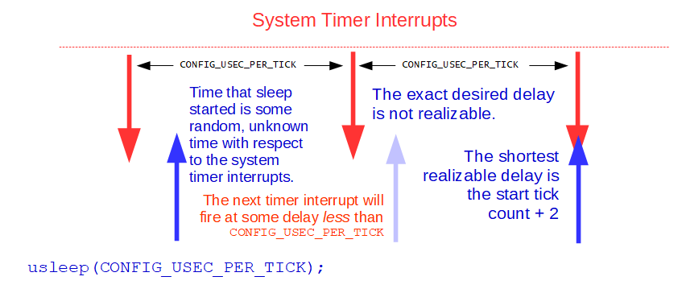

.. _short-time-delays:

=================
Short Time Delays
=================

System Timer Interrupt
======================

This section addresses some counter-intuitive properties of using very short
time delays.

This section assumes that timing is generated by a system timer
"tick" interrupt. In Tickless Mode there is no system timer interrupt.
Much of the discussion here would also apply in the Tickless mode, however,
the terminology used here assumes system timer interrupts.

Timer Resolution
================

When we talk about short delays, we are talking about delays that are
on the same order of magnitude as the system timer interrupt interval.

That interval is controlled the configuration setting
``CONFIG_USEC_PER_TICK``. The default value of ``CONFIG_USEC_PER_TICK``
is 10,000 microseconds.
That equivalent to a timer interrupt frequency of 100Hz:

.. code-block:: c

  Ftimer ticks/sec = 1,000,000 usec/sec / CONFIG_USEC_PER_TICK;

There are many different OS interfaces that implement timed delays
(or function that have timeout values such as ``sem_timedwait()``).
These all behave in basically the same way.

.. _usleep:

``usleep()``
============

For simplicity of discussion let's focus on on ``usleep()``.
``usleep()`` is a standard but deprecated interface that simply delays
for a specified number of microseconds.

.. note:: ``usleep()`` is deprecated in favor of ``clock_nanosleep()``.

Requirements/Assumptions of ``usleep()``
----------------------------------------

The prototype for ``usleep()`` is:

.. code-block:: c

  int usleep(useconds_t usec);

Where ``usec`` is the number microseconds to delay.
``usleep()`` will return zero unless an error occurs in which case
it will set the errno variable and return ``-1``.

Now the interesting questions:
Suppose that ``CONFIG_USEC_PER_TICK`` is set to 10,000 microseconds,
What will happen when you try any of the following?

.. code-block:: c

  usleep(0);
  usleep(1);
  usleep(10000);

In order to predict such behavior, we will have to enumerate some of the
assumption and requirements of ``usleep()``:

1. The contract that ``usleep()`` makes is that it will suspend the calling
   thread for at least usec microseconds. It will never, under any condition,
   return with a delay smaller than the requestion usec delay.
2. ``usleep()`` may wait longer than the requested delay due to small system
   processing overhead, task priorities, and quantization errors.

Task Priorities
---------------

When the requested delay expires, the calling task is ready to run but still
may not actually be able to run for some time due to higher priority tasks
that block execution of the ready to run task.

Quantization Errors
-------------------

``usleep()`` is only capable of waiting for multiples of the system timer
interrupt interval (``CONFIG_USEC_PER_TICK``) If the requested ``usec`` delay
is not an even multiple of the system timer interrupt interval,
then it will be rounded up as necessary to satisfy the first requirement above.

This means that the following are really equivalent delays:

.. code-block:: c

  usleep(1);
  usleep(10000);

And finally, the behavior that confuses most people..

.. note::

  ``usleep()`` has no knowledge of the the phase of the system timer
  when it is started: The next timer interrupt may occur immediately
  or may be delayed for almost a full cycle.
  In order to meet the contract of the first requirement, the requested
  time is also always incremented by one.

This means, for example, that the the delay:

.. code-block:: c

  usleep(10000);

will not delay for one clock tick! That would be impossible!

There is no event exactly one clock tick after ``usleep()`` is called.
The next timer tick will always occur at some time strictly less than
the system timer interval.
Rather, ``usleep()`` will delay for two clock ticks resulting some
actual delay between 10 and 20 microseconds, exclusive.

See the following figure:

   Short Time Delays in NuttX.

For the most part, when delays are large – hundreds or thousands
of microseconds – this error is not significant.
It becomes noticeable only if you are using ``usleep()``
for delays very close to the the timer resolution when the error
can be relatively significant.

Finally, the easy one:

.. code-block:: c

  usleep(0);

This will return immediately with no delay.
That satisfies all requirements and assumptions of the interface.

Using ``usleep()`` to implement periodic delays
-----------------------------------------------

The third assumption is necessary because ``usleep()`` has
no knowledge of the current system timer phase.
But it also makes ``usleep()`` a very bad choice for implementing
periodic behavior if the ``usleep()`` delay is close to the system
timer resolution.

For example, consider a loop such as the following
(again assuming that ``CONFIG_USEC_PER_TICK`` is set
to 10,000 microseconds):

.. code-block:: c

  for (; ; )
    {
      usleep(10000);
      /* Do some periodic stuff */
    }

From the preceding discussion, we know that this will not work:
It will not (and cannot) create periodic processing at the rate
of the system timer interrupt rate but, rather, at half the system
time interrupt rate in this case.

In this case, that the third assumption of ``usleep()`` is not valid.
``usleep()`` does not start timing some random, unknown phase with respect
to the system timer interrupt.
In this case, ``usleep()`` will be started at a nearly constant phase
with respect to the system timer (at some some short delay after the
system timer interrupt) and will consistently show
near-worst case timing errors.

Of course, ``usleep()`` cannot know that and, hence, is a bad choice
for implementing such periodic behavior.
The user in this case is assuming that ``usleep()`` simply waits for the
next timer tick to occur. That is not the behavior or ``usleep()`` that
describes some non-existent interface that waits for the next timer interrupt
event, not for a fixed time delay.

.. note::

  ``usleep()`` behavior is to wait to assure that at least usec
  microseconds has elapsed. And it does that job quite well.

A final note: The above periodic delay loop can be made to work well,
on the other hand, if the delay provided to ``usleep()`` is significantly
larger that the system timer resolution.

What can you do?
----------------

What can you do to improve the resolution for such high frequency processing
loop?

First, you might consider increasing the system timer interrupt rate.
You would do this by reducing the value of ``CONFIG_USEC_PER_TICK``.
For example a value of ``1000`` for ``CONFIG_USEC_PER_TICK`` would create
a timer interrupt rate of 1KHz and a minimum loop delay of
perhaps 2 milliseconds.

The trade-off here is that when you increase the timer interrupt rate,
the timer interrupt processing will then take a proportionately larger amount
of your CPU bandwidth.

The recommended way to get very high timer resolution without increasing
the timer interrupt rate (in most use cases) is to use a Tickless Mode OS.
For example, in the Tickless configuration, you could have
``CONFIG_USEC_PER_TICK`` set to ``1`` for a 1MHz timer resolution
(with no interrupts).

If your target periodic processing time is still 1Khz,
then this periodic processing could be met with good precision.

Another option is to abandon the system timer altogether and use
a dedicated timer peripheral to perform your timed operations with
high precision.
But if you really want to use the system timer than another thing
you should consider would be to implement a Timer Hook.

.. timer_hook:

Timer Hook
==========

A Timer Hook is a user provided function that is called from the OS
on each timer interrupt.
If you enable ``CONFIG_SYSTEMTICK_HOOK=y`` in your configuration,
then the OS timer interrupt handler will call out to a user-provided function,
``board_timerhook()``, on each timer interrupt.
The full prototype of this function is provided in ``included/nuttx/board.h``
as:

.. code-block:: c

    void board_timerhook(void);

.. note::

  The timer hook is only available when system timer interrupts
  are used; it is not available in Tickless mode.

This timer hook could be used in a scenario where you would like to have
your task run at the each timer interrupt without the strange rounding
performed by the standard delay functions.

You might do something like the following as an example:
In your servicing task, implement a loop. At the top of the loop,
you would wait on a semaphore.
In the body of the loop you perform the periodic operation
then return to the wait at the top of the loop. Like:

.. code-block:: c

  int ret;
  
  while ((ret = sem_wait(&g_waitsem) >= 0)
    {
      /* Do periodic operations */
    }

.. note::

  If the return value from ``sem_wait()`` is negative then
  some unusual event occurred. In normal cases the errno might either:
  ``EINTR`` meaning simply that the wait was awakened with a signal.
  You can continue to wait in this case. Or ``ECANCELED`` meaning
  that the thread has been cancelled and you should abort the periodic
  operations.

In your ``boards/<arch>/<chip>/<board>/src/`` directory you would implement
``void board_timerhook(void)``.
The implementation of this function could consist of only a single line
of code: It could just post the semaphore on each timer interrupt,
waking of the loop in the servicing task. Like:

.. code-block:: c

  void board_timerhook(void)
  {
    (void)sem_post(&g_waitsem);
  }

This is very efficient. There is no context switch overhead at all
getting from the the timing interrupt to to the servicing task.
None at all other that the normal interrupt return logic.
The servicing task should be the highest priority task in the system
to assure that it is the one that runs immediately
when the timer interrupt returns.
