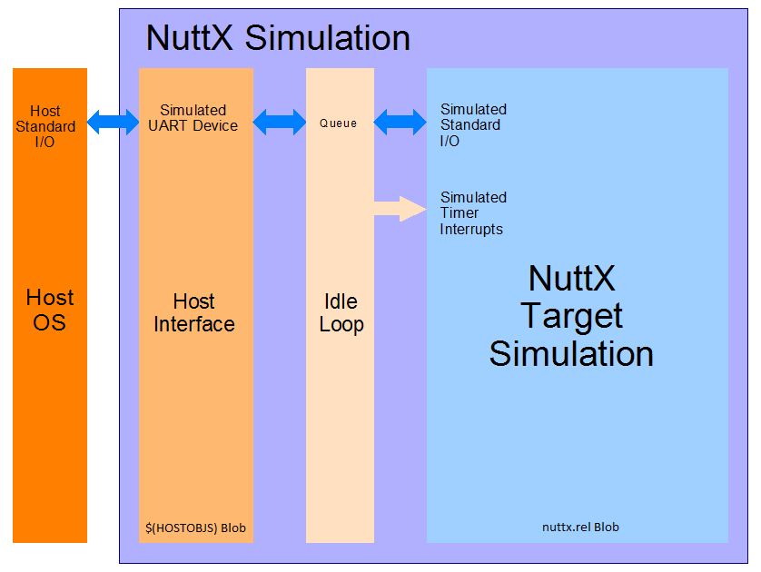

====================
The NuttX Simulation
====================

The NuttX simulation is a port of NuttX to run as a process under Linux or Cygwin and probably other POSIX contexts as well.

Reference: The ``sim`` configuration file :doc:`/platforms/sim/sim/index`.

How the Simulator is Built
==========================

The simulator isn't a virtual machine or anything like that.  It is just a single thread that implements a non-preemptive version of NuttX using ``setjmp``/``longjmp`` to do the context switches.

The nuttx.rel Blob
==================

The first thing that you have to understand is how the simulation is built.
Look at ``arch/sim/src/Makefile``. This target builds the NuttX executable (simplified for clarity):

    .. code-block:: console

      nuttx$(EXEEXT): nuttx.rel $(HOSTOBJS)
          $(CC) $(CCLINKFLAGS) $(LIBPATHS) -o $(TOPDIR)/$@ nuttx.rel $(HOSTOBJS) $(DRVLIB) $(STDLIBS)

The secret is ``nuttx.rel``. That is a blob that contains the entire Nuttx simulation.
It is built like this:

    .. code-block:: console

        nuttx.rel : libarch$(LIBEXT) board/libboard$(LIBEXT) $(HOSTOS)-names.dat $(LINKOBJS)
            $(LD) -r $(LDLINKFLAGS) $(RELPATHS) $(EXTRA_LIBPATHS) -o $@ $(REQUIREDOBJS) --start-group $(RELLIBS) $(EXTRA_LIBS) --end-group
            $(OBJCOPY) --redefine-syms=$(HOSTOS)-names.dat $@

The first ``$(LD)`` builds a partially linked, relocatable object (hence, the extension ``.rel``).  This contains all of the NuttX objects.  So ``nuttx.rel`` is the entire "fish bowl" that the NuttX simulation lives.

The second ``$(OBJCOPY)`` line is the thing the irrevocable severs the NuttX "fish bowl" from the host environment.  It renames most of the symbols in ``nuttx.rel`` so that they do not collide with the symbols use by the host system.  Look in ``arch/sim/src/nuttx-names.dat``.  So ``open()`` becomes ``NXopen()``, ``close()`` becomes ``NXclose()``, read becomes ``NXread()``, etc.

The $(HOSTOBJ) Blob
===================

The ``$(HOSTOBJS)`` contains the final host interface.  This is the host PC blob and in this one, there is no re-naming:  ``open()`` goes to the real system ``open()``, ``close()`` goes to the real system ``close()``, etc.  When these two blobs are linked together in the final ``$(CC``, you have the simulation.

Accessing Host Devices Using FIFOs?
===================================

General Concepts
----------------

When you write the code in the simulation, it runs in the NuttX blob and can only interface with NuttX interfaces.  It cannot interact directly with the host system.  It cannot ``open()``, ``close()``, ``read()``, or access a host device driver in any way (because it cannot get to the host system namespace).

To further complicate things, nothing in the simulation can call into a host interface that blocks.  Why?  Because this is not a NuttX blocking call, this is a host system blocking call.  It just not block that one NuttX thread; it blocks the entire simulation!

But you can add special, low level interface between the NuttX and the Host blobs so that they can communicate.  The Host blob could access the host device in some and provide some authentic NuttX driver interface to the simulation in some fashion.

If you want to access a host device driver, then the code that does that has to reside in the Host blob (i.e., it is in ``$(HOSTOS``)).  Only there can it interact with the host OS.  And there, you can do things like create a host pthread to service a device interface. That pthread can wait for I/O without blocking the whole simulation on the main thread (that is how the simulated console I/O works, for example).

Toward a General Design
=======================

There is no design in place for accessing Host devices from the simulation.  Here are some directions that I would investigate, however.

Perhaps you could create a NuttX FIFO in the NuttX blob.  It would reside at, say, ``/dev/mydevice`` in the NuttX VFS.  Perhaps this FIFO could be used in the NuttX world as your character device?  Perhaps it could read and write from FIFOs to intermediate the interaction with the host PC device?

On the NuttX side the target logic would call ``open()``, ``close()``, ``read()``, ... to access the FIFO. These are, of course, really ``NXopen()``, ``NXclose()``, ``NXread()``, ...

On the Host PC side it would call ``open()``, ``close()``, ``read()``, .. to access the host device driver.  These are real host device accesses.  But some code in the host blob should also be able to call ``NXopen()``, ``NXclose()``, ``NXwrite()``, etc. to access the NuttX FIFO.  So there might be a pthread in the host blob that does something like this:

1. Open a real PC device O_RDONLY using open()
2. Open a FIFO in using NXopen()
3. Read from the device using read().  This blocks, but only the host pthread that is intermediating the I/O.
4. When read data is obtained, call NXwrite() to write the data to the NuttX FIFO
5. etc.

In this way, the pthread in the host blob would be conduit that maps the host device to a NuttX FIFO.  Within the NuttX blob, simulation logic should be able to open, close, read, etc. the FIFO just as though it were the real device.

    NuttX Target Code <--->NuttX FIFO<--->Host Interface<---->Host Driver

What is Wrong With That?
========================

There is a one big problem:  if logic in the Host blob calls ``NXwrite()``, that could potentially cause a NuttX context switch.  Remember that a context switch is really a ``setjmp()`` that saves the current context followed by a ``longjmp()`` that switches to the new context.  All of this must happen on the main thread of the simulation.

But if ``NXwrite()`` causes a context switch, then the switch would occur on the pthread of the Host device handler!  That would be very bad.  The Host driver could not return until all of the NuttX tasks finally terminate.  That would need to be avoided.

The NuttX serial console interface faces all of these same problems:  It simulates a NuttX device, ``/dev/console`` using the Host ``stdin`` and ``stdout``.  How does it avoid this problem?  Not in a very pretty way.  It puts the received data in a FIFO; When all of the NuttX tasks become IDLE the simulations IDLE thread runs, it empties the queued data to the console which can then cause a context switch.  But now this is okay because the IDLE thread is correctly running on the main thread of the simulation.

Pretty kludgey.  This just begs for a better solution.  If only the simulation supported interrupts...

Simulated Interrupts
====================

The current NuttX host simulation has no interrupts and, hence, is non-preemptible.  Also, without simulated interrupts, there can be no high-fidelity simulated device drivers or precise timer interrupt.

Currently, all timing and serial input is simulated in the IDLE loop: When nothing is going on in the simulation, the IDLE loop runs and fakes timer and UART events.

I have been thinking about how to implement simulated interrupts in the simulation.  I think a solution would work like this.

  * In the earliest initialization, simulator could start a host simulation interrupt thread and setup a signal handler to catch signals on the main thread.  One signal, say ``SIGUSER`` could indicate a context switch.  This would be a type ``SA_SIGINFO`` and the context switch information would be provided in the ``sival_t`` field of the ``siginfo``.

  * Interrupt logic could be implemented on a host pthread.  The host pthread, like a hardware interrupt, executes asynchronously outside of the operating system.  The interrupt thread could wait for a host signal or a host message and, upon receipt, perform simulated interrupt logic.

  * ``up_interrupt_context()`` would need to be implemented; it is only a stub now.  I think this could be done with a simple global boolean like:

    .. code-block:: console

        bool g_in_interrupt;
        xcpt_reg_t g_context_regs;

Simulated interrupt handling logic would set ``g_in_interrupt`` on entry and clear it on exit (perhaps it would be better to have a counter and increment it interrupt entry and decrement it on exit?).  The interrupt handler would also need to clear ``g_context_regs`` on entry.  ``up_interrupt_contest()`` would then just report the state of the boolean.

  * All context switching functions would also need to check this boolean (``up_block_task()``, ``up_unblock_task()``, ``up_reprioritize_rtr()``, ``up_releasepending()`` and perhaps others).  It set, they should not perform the context switch.  Instead, they should set ``g_context_regs`` to the context switch register array.

   * Before *returning* and before clearing ``g_in_interrupt``, the host simulated interrupt logic would check ``g_context_regs``.  If non-NULL, then a context switch is required on *return* from the simulated interrupt.  In this case, the simulation thread would signal the main thread with the ``SIGUSER`` signal.

   * The ``SIGUSER`` signal handler would perform the context with logic something like the following:

   .. code-block:: c

     struct tcb_s *rtcb = sched_self();              /* Get the TCB of the currently executing thread */
     xcpt_reg_t *regs = siginfo->si_value.sival_ptr; /* The new register state to be instantiated */
     if (!up_setjump(rtcb->xcp.regs)                 /* Save the current context */
       {
         up_longjmp(regs);                           /* Instantiate the new context */
       }

When we switch back to this thread, or course, it will appear as another return from ``up_setjmp()``, but this time with a non-zero return value.

The threading is a little mind-bending.  The signal handler needs to run in the context on the main thread.  The main thread is actually using the allocation NuttX stack and is executed the NuttX code.  When the signal handler executes, it should execute on a stack frame added to the stack of the currently executing NuttX task.

When ``up_longjmp()`` is executing, operation will continue under the main thread, but the context including the stack are different for the new NuttX thread.  When the context finally switches back to this thread, it will appear as an appear return from ``up_setjmp()`` with a non-zero return value.  In that case, the signal handler will just return and the normal execution of the pre-empted NuttX task will resume.

**Issues**.  My only real technical questions involve signal masking.  When the ``SIGUSER`` signal handler executes, the ``SIGUSER`` interrupt will be masked.  That would prevent any further context switches until the signal handler returns.  Can we simply *unmask* ``SIGUSER`` signal to get more context switches?  I would need to experiment to know for sure.

Supported Devices
=================

Serial Console
--------------

The simulation's serial console is provided by wrapping host *stdin* and *stdout* so that it appears to be ``/dev/console``.  Serial data from the host *stdin* is sampled in the IDLE loop.  If serial data is available, the IDLE loop will *post* simulated UART activity.  The fidelity of this simulation could be improved with simulated interrupts when UART data is avaiable.

Host File System Access
-----------------------

Host file system access is supported via the *nxfuse* user-space file system that you can find in the NuttX https://bitbucket.org/nuttx/tools/src/master/nxfuse/ repository.  Instructions for using the *nxfuse* file system can be found in a https://bitbucket.org/nuttx/tools/src/master/nxfuse/README.txt in that repository directory.

Networking
----------

Networking is supported for the simulation using TUN/TAP interface under Linux or using WPCap under Windows.    A README file providing instruction for setting up the TUN/TAP interface under Linux is provided in the :doc:`/platforms/sim/sim/index`.  The network is again handled by the IDLE loop in the simulator and could benefit from simulated interrupts.

USB
---

At one time, there was an effort underway on GitHub to port ``libusb`` into NuttX in order to support USB devices in the simulation.  That effort was never completed although is it still a very good idea.

LCD
---

X11 framebuffers can be used to simulate NuttX graphics framebuffer devices.  These are, again, managed in the IDLE loop.

SMP
---

There is a simulator configuration has basic support for SMP testing.  The simulation supports the emulation of multiple CPUs by creating multiple pthreads, each run a copy of the simulation in the same process address space.

At present, the SMP simulation is not fully functional:  It does operate on the simulated CPU threads for a few context switches then fails during a setjmp() operation.  I suspect that this is not an issue with the NuttX SMP logic but more likely some chaos in the pthread controls.  I have seen similar such strange behavior other times that I have tried to use setjmp/longmp from a signal handler! Like when I tried to implement simulated interrupts using signals.

Apparently, if longjmp is invoked from the context of a signal handler, the result is undefined: http://www.open-std.org/jtc1/sc22/wg14/www/docs/n1318.htm

You can enable SMP for ostest configuration by enabling:

.. code-block:: bash

    Add:     CONFIG_SPINLOCK=y
    Add:     CONFIG_SMP=y
    Add:     CONFIG_SMP_NCPUS=2
    Add:     CONFIG_SMP_IDLETHREAD_STACKSIZE=2048

You also must enable near-realtime-performance otherwise even long timeouts will expire before a CPU thread even has a chance to execute.

.. code-block:: bash

    Remove:  # CONFIG_SIM_WALLTIME is not set
    Add:     CONFIG_SIM_WALLTIME=y

And you can enable some additional debug output with:

.. code-block:: bash

    Remove:  # CONFIG_DEBUG_SCHED is not set
    Add:     CONFIG_DEBUG_SCHED=y
    
    Remove:  # CONFIG_SCHED_INSTRUMENTATION is not set
    Add:     CONFIG_SCHED_INSTRUMENTATION=y

The SMP configuration will run with:

.. code-block:: bash

    CONFIG_SMP_NCPUS=1

In this case there is, of course, no multi-CPU processing, but this does verify the correctness of some the basic SMP logic in a simpler environment.

The NSH configuration can also be forced to run SMP, but suffers from the same quirky behavior.  It can be made reliable if you modify ``arch/sim/src/up_idle.c`` so that the IDLE loop only runs for CPU0.  Otherwise, often ``simuart_post()`` will be called from CPU1 and it will try to restart NSH on CPU0 and, again, the same quirkiness occurs.

But for example, this command:

.. code-block:: bash

    nsh> sleep 1 &

will execute the sleep command on CPU1 which has worked every time that I have tried it (which is not too many times).
