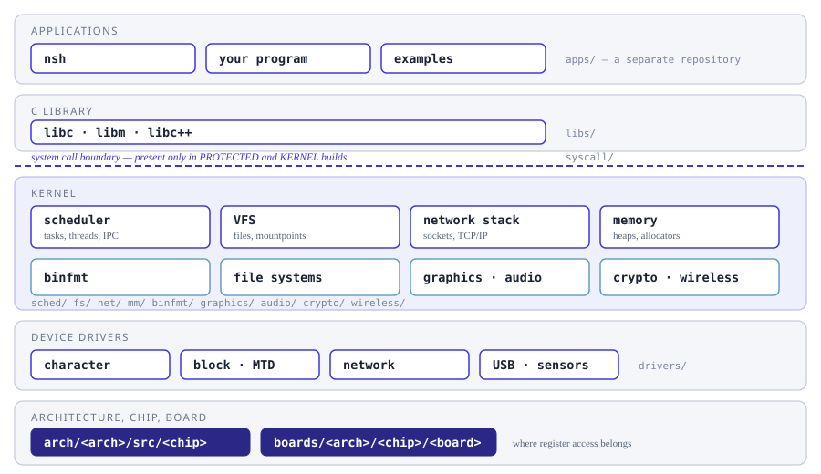
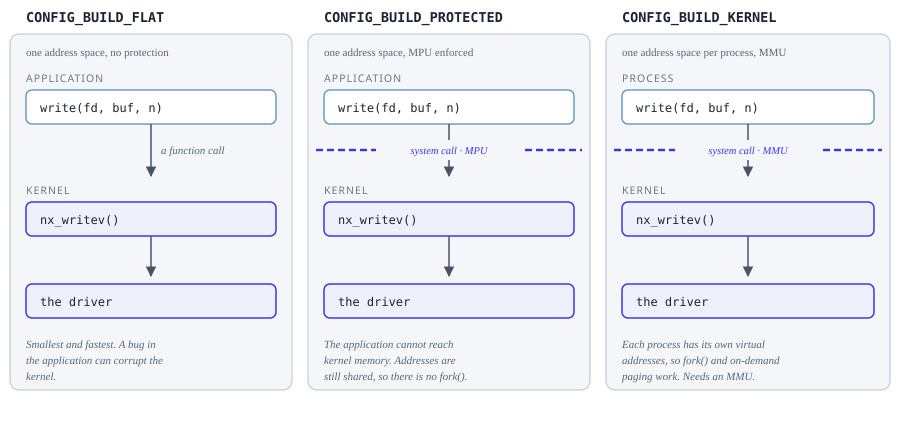

=========
OS Design
=========

How NuttX is put together, subsystem by subsystem.  The sections follow the source
tree: what lives under ``sched/`` is described in :doc:`scheduling/index`,
what lives under ``fs/`` in :doc:`filesystem/index`, under ``drivers/`` in
:doc:`drivers/index`, and so on.  Each subsystem is described once, going
from what it is, to how it works, to the interfaces it offers.

For the POSIX interface an application sees, go to
:doc:`/reference/user/index` instead.  That is a different question -- what
you may call -- and it has its own section.

         and the system call boundary to the kernel subsystems, the device
         drivers, and the architecture, chip and board code.

   Where each section of this documentation sits in the system, and which
   directory of the source tree it describes.

Build modes
===========

Before reading any subsystem page it is worth knowing which **build mode**
you are in, because it decides whether there is a boundary between your
application and the kernel at all.  The Kconfig choice that selects it is
called *Memory organization*, under *Build Configuration*.

         call in a flat build, a system call across an MPU boundary in a
         protected build, and a system call into a separate address space in
         a kernel build.

   The same ``write()`` under ``CONFIG_BUILD_FLAT``,
   ``CONFIG_BUILD_PROTECTED`` and ``CONFIG_BUILD_KERNEL``.

A flat build is one program: calling ``write()`` is a function call, and an
application bug can corrupt the kernel.  A protected build is two blobs, one
privileged and one unprivileged, with an MPU between them, so the same call
becomes a system call; no address mapping is performed, so the two blobs
still share one set of addresses.  A kernel build gives each process its own
address environment through an MMU.  That is what ``fork()`` needs -- the
child gets its own copy of the parent's memory *at the same virtual
addresses* -- and what ``CONFIG_PAGING`` requires as well.

Much of what the pages below say depends on this choice, which is why it is
worth settling first.  That is the short version; the page below is the long
one, and takes each mode in turn, with on-demand paging and address
environments described alongside them.

.. toctree::
   :maxdepth: 1

   build_modes.rst

The kernel
==========

.. toctree::
   :maxdepth: 1

   scheduling/index.rst
   ipc/index.rst
   concurrency/index.rst
   time/index.rst
   interrupts/index.rst
   memory/index.rst

Device drivers
==============

By far the largest part of the OS: ``drivers/`` holds 59 subdirectories, of
which storage is five.  Everything a board talks to goes through here.

.. toctree::
   :maxdepth: 1

   drivers/index.rst

File systems and networking
===========================

.. toctree::
   :maxdepth: 1

   filesystem/index.rst
   networking/index.rst

Running programs
================

.. toctree::
   :maxdepth: 1

   binfmt/index.rst
   syscall.rst
   libs/index.rst

Media and security
==================

.. toctree::
   :maxdepth: 1

   graphics/index.rst
   audio/index.rst
   video.rst
   crypto.rst
   wireless.rst

Portability
===========

.. toctree::
   :maxdepth: 1

   arch/index.rst
   openamp.rst

Reference
=========

.. toctree::
   :maxdepth: 1

   nuttx.rst
   app_vs_os.rst
   conventions.rst
   notifier.rst
