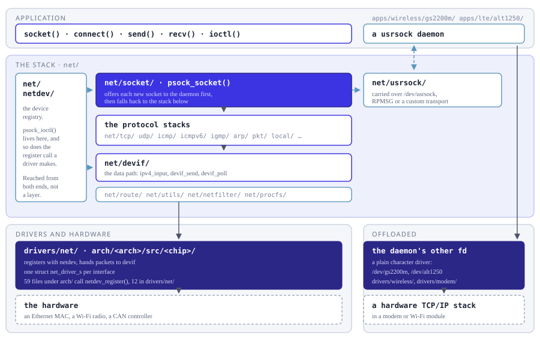

===============
Network Support
===============

.. toctree::
  :maxdepth: 1

  sixlowpan.rst
  socketcan.rst
  pkt.rst
  ipfilter.rst
  nat.rst
  netdev.rst
  netdriver.rst
  mdio.rst
  netguardsize.rst
  netlink.rst
  slip.rst
  wqueuedeadlocks.rst
  tcp_network_perf.rst
  delay_act_and_tcp_perf.rst
  tcp_state_machine.rst

``net`` Directory Structure ::

  nuttx/
   |
   `- net/
       |
       +- arp        - Address resolution protocol (IPv4)
       +- bluetooth  - PF_BLUETOOTH socket interface
       +- can        - SocketCAN
       +- devif      - Stack/device interface layer
       +- icmp       - Internet Control Message Protocol (IPv4)
       +- icmpv6     - Internet Control Message Protocol (IPv6)
       +- ieee802154 - PF_IEEE802154 socket interface
       +- igmp       - IGMPv2 client
       +- inet       - PF_INET/PF_INET6 socket interface
       +- ipforward  - IP forwarding logic
       +- ipfilter   - IP packet filter
       +- ipfrag     - Fragmentation and reassembly
       +- local      - Unix domain (local) sockets
       +- mld        - Multicast Listener Discovery (MLD)
       +- nat        - Network Address Translation (NAT)
       +- neighbor   - Neighbor Discovery Protocol (IPv6)
       +- netdev     - Socket network device interface
       +- netfilter  - Iptables Interface
       +- netlink    - Netlink IPC socket interface
       +- pkt        - "Raw" packet socket support
       +- procfs     - net devices PROCFS support
       +- route      - Routing table support
       +- rpmsg      - Rpmsg domain (remote) sockets
       +- sixlowpan  - 6LoWPAN implementation
       +- socket     - BSD socket interface
       +- tcp        - Transmission Control Protocol
       +- udp        - User Datagram Protocol
       +- usrsock    - User socket API for user-space networking stack
       `- utils      - Miscellaneous utility functions

         usrsock daemon first and falls back to the in-kernel protocol
         stacks, which reach the drivers through devif. net/netdev sits
         beside the stack rather than under it, reached from the socket
         layer for ioctl and from the drivers for registration. On the
         right, the usrsock daemon holds two file descriptors: one is
         /dev/usrsock, the other an ordinary character driver through
         which it reaches a TCP/IP stack inside the module.

   From ``socket()`` down to the wire.  Note ``net/netdev/``: it is not a
   layer in the path a packet takes, but a registry reached from both ends
   -- ``psock_ioctl()`` lives there, and so does the ``netdev_register()``
   a driver calls.  The data path is ``net/devif/``.

One thing the picture cannot show is how little of the driver work happens in
``drivers/net/``.  Twelve files there call ``netdev_register()``, against **59**
under ``arch/`` -- ``arch/arm/src/`` alone accounts for 41 -- because the common
case is a MAC built into the SoC, driven by chip-specific code that has to live
with the chip.  What stays in ``drivers/net/`` is what is *not* tied to one SoC:
external MAC chips on a bus (``enc28j60``, ``encx24j600``, ``dm90x0``,
``lan9250``, ``lan91c111``, ``w5500``, ``ftmac100``), the software interfaces
``loopback``, ``tun`` and ``slip``, the shared ``netdev_upperhalf.c``, and
``skeleton.c``, which is a template to copy rather than a driver.  Where a driver
sits changes nothing about how it joins the stack: it fills in a
``net_driver_s`` and registers it.

The right-hand column is the other way a NuttX system can have a network:
no stack in ``net/`` at all, but a TCP/IP stack running inside the module,
with NuttX forwarding each socket call out to it.  ``net/usrsock/`` carries
the call to a user-space daemon, and the daemon holds a *second* file
descriptor -- a plain character driver -- through which it reaches the
hardware.  Both daemons in ``apps/`` are built this way:
``apps/wireless/gs2200m/`` opens ``/dev/usrsock`` and ``/dev/gs2200m``, and
``apps/lte/alt1250/`` opens ``/dev/usrsock`` and ``/dev/alt1250``.  Nothing
on that path passes through the protocol stacks or ``net/devif/``.

One consequence is worth knowing, because it reads like a bug the first time
you meet it: such a driver may register a network device that has no data
path at all.  ``drivers/wireless/gs2200m.c`` calls ``netdev_register()``
with ``NET_LL_IEEE80211`` -- which is what names the interface ``wlan0`` --
and never fills in ``d_ifup`` or ``d_txavail``.  The comment beside the call
says what it is for: setting ``d_pktsize`` and ``d_llhdrlen`` "to show mtu
info correctly".  The device exists so that the interface has a name and an
MTU to report; the packets go the other way, through the daemon.

Congestion Control
==================

.. toctree::
   :maxdepth: 1

   newreno.rst
