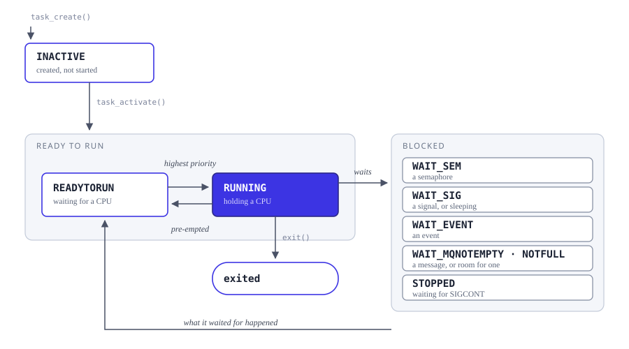
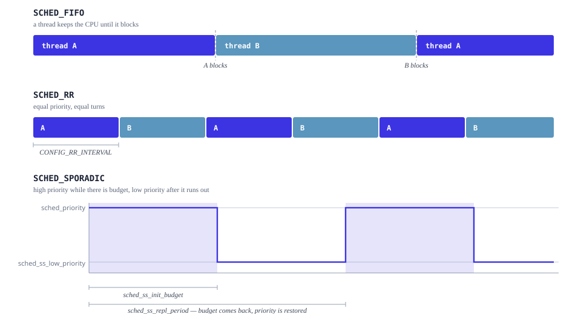

==========
Scheduling
==========

NuttX decides which thread runs, and when.  This page describes that
decision: the states a thread moves through, the policies that order threads
of equal priority, and the interface an application uses to choose between
them.

The code lives under ``sched/``.

Priority comes first
====================

NuttX is a **strict priority** scheduler.  The thread that runs is always
the ready-to-run thread with the highest priority.  A lower-priority thread
runs only while no higher-priority thread is ready; the moment a
higher-priority one becomes ready, it takes the CPU.  NuttX is fully
pre-emptible, so that happens immediately, including from inside an
interrupt handler.

Priority alone does not say what happens when two ready threads share the
same priority.  That is what the scheduling policies decide, and it is the
only thing they decide.

Thread states
=============

Every thread is in exactly one state, held in its task control block.  The
states are defined by ``enum tstate_e`` in ``include/nuttx/sched.h``, and the
comment beside each one sorts it into a group: ``INVALID`` for a TCB that has
not been initialised, ``READY_TO_RUN``, and ``BLOCKED``.

         CPU, blocks waiting for a resource, and finally exits.

   The states of ``enum tstate_e``, and what moves a thread between them.

``INACTIVE`` carries the ``BLOCKED`` comment as well, though it is not
waiting on anything: it is a task that has been created and not yet
activated.

Two ready-to-run states are left off the diagram to keep it readable, and
they are not alike.  ``ASSIGNED`` is ``READYTORUN`` with a CPU already
picked, and it is the conditional one -- it exists only under
``CONFIG_SMP``.  ``PENDING`` is always compiled, and it is narrower than its
name suggests: a thread goes there only if it became ready while another
thread held ``sched_lock()`` **and** would have pre-empted it.
``nxsched_add_readytorun()`` tests both halves --
``nxsched_islocked_tcb(rtcb)`` and a new priority higher than the running
thread's -- so a thread that becomes ready at equal or lower priority under
the lock joins the ordinary ready-to-run list instead.

A thread in any *ready-to-run* state is runnable; only one per CPU is
``RUNNING``.  A thread in any *blocked* state is waiting for something
specific, and the state says what: a semaphore, a signal, an event, a
message arriving, or room to put one.  ``STOPPED`` waits for ``SIGCONT``
under ``CONFIG_SIG_SIGSTOP_ACTION``, and one more state is off the diagram
too: ``WAIT_PAGEFILL``, under ``CONFIG_LEGACY_PAGING``.  Sleeping is not a
state of its own -- ``TSTATE_SLEEPING`` is defined as another name for
``TSTATE_WAIT_SIG``.  This is why a stack dump tells you not just that a
thread is stuck but what it is stuck on.

Scheduling policies
===================

The policy applies **between threads of equal priority**.  It never lets a
lower-priority thread run ahead of a higher-priority one.

         SCHED_RR threads of equal priority take turns; under
         SCHED_SPORADIC a thread runs at a high priority while it has
         budget and drops to a low one when the budget is spent.

   The same two threads under each policy, and what the sporadic parameters
   mean.

``SCHED_FIFO`` -- run to completion
-----------------------------------

A thread runs until it blocks, exits, or is pre-empted by something of
higher priority.  Two threads of the same priority do not share the CPU: the
first one to start keeps it until it gives it up.

This is the most predictable policy and the cheapest one, and it is what a
new task gets -- but only while round robin is switched off.
``nxthread_setup_scheduler()`` picks the policy for every new TCB with a
compile-time test, not a runtime one: ``TCB_FLAG_SCHED_RR`` and a timeslice
of ``CONFIG_RR_INTERVAL`` when that value is positive,
``TCB_FLAG_SCHED_FIFO`` otherwise.  So ``CONFIG_RR_INTERVAL`` is not a
per-thread opt-in; setting it changes the default policy of the whole
system.

``SCHED_RR`` -- take turns
--------------------------

Same as ``SCHED_FIFO``, except that a thread which has been running for
``CONFIG_RR_INTERVAL`` milliseconds is moved to the back of the queue of
threads at its own priority, and the next one runs.

``CONFIG_RR_INTERVAL`` counts milliseconds and defaults to 0, which disables
the policy entirely -- and *entirely* is literal: at 0 the ``SCHED_RR`` case
is not compiled into ``nxsched_set_scheduler()`` at all, so asking for the
policy at run time fails rather than being ignored.  Set it to a positive
value and, as above, every task starts out round-robin.  Use it when several
threads of the same priority have to make progress together, and none of
them blocks often enough to give the others a chance on its own.

``SCHED_SPORADIC`` -- a budget per period
-----------------------------------------

Enabled by ``CONFIG_SCHED_SPORADIC``.  This one is worth understanding
before reaching for it, because it behaves unlike the other two.

A sporadic thread has **two** priorities and a **budget**:

.. list-table::
   :header-rows: 1
   :widths: 34 66

   * - ``struct sched_param`` field
     - Meaning
   * - ``sched_priority``
     - The high priority.  The thread runs at this priority while it still
       has budget left.
   * - ``sched_ss_low_priority``
     - The low priority.  The thread drops to this once the budget is spent.
   * - ``sched_ss_init_budget``
     - How much CPU time the thread may spend at the high priority.  A
       ``struct timespec``.
   * - ``sched_ss_repl_period``
     - The length of one cycle, budget included.  Also a ``struct
       timespec``.
   * - ``sched_ss_max_repl``
     - How many replenishments may be pending at once
       (``CONFIG_SCHED_SPORADIC_MAXREPL``).

While the thread has budget it competes at ``sched_priority``.  When the
budget runs out it is demoted to ``sched_ss_low_priority``, so it keeps
running only if nothing else wants the CPU.  Then the cycle repeats.

The period *contains* the budget rather than following it, which is the part
worth reading twice.  ``sched_sporadic.c`` asserts
``repl_period >= budget`` and spends the difference at the low priority::

  remainder = sporadic->repl_period - sporadic->budget;

Give a thread a 10 ms budget and a 100 ms period and it runs high for up to
10 ms, low for the other 90, and is promoted again 100 ms after the cycle
began -- not 100 ms after the budget ran out.  ``sched_ss_max_repl`` bounds a
second mechanism rather than this one: when the thread is pre-empted part-way
through its budget, each fragment is replenished one period after it was
consumed, and the field caps how many such replenishments may be outstanding
at once.

What this buys you is a **bounded** amount of high-priority CPU time for a
thread whose workload you do not fully trust: an event handler that is
usually short but occasionally is not.  It gets to respond quickly, and it
cannot starve the rest of the system if it misbehaves.  A thread that would
otherwise have to be given a low priority -- and therefore a poor response
time -- can be given a high one safely.

Choosing a policy
=================

.. list-table::
   :header-rows: 1
   :widths: 22 78

   * - Policy
     - Use it when
   * - ``SCHED_FIFO``
     - The normal case.  Threads are ordered by priority and each runs until
       it blocks.
   * - ``SCHED_RR``
     - Several threads sit at the same priority and all have to progress,
       for example a set of equivalent workers.
   * - ``SCHED_SPORADIC``
     - A thread needs a fast response but its running time is not bounded,
       and starving lower-priority work is not acceptable.

``SCHED_OTHER`` and ``SCHED_NORMAL`` exist for portability and are both 0;
``SCHED_NORMAL`` is defined as an alias of ``SCHED_OTHER``, which the header
describes as mapping to ``SCHED_FIFO`` or ``SCHED_RR``.  In the code that
mapping goes to ``SCHED_RR`` and only while ``CONFIG_RR_INTERVAL`` is
positive: ``nxsched_set_scheduler()`` compiles ``case SCHED_OTHER`` next to
``case SCHED_RR`` under that same test.

``include/sched.h`` also defines ``SCHED_BATCH`` and ``SCHED_IDLE``.  Neither
name appears anywhere else in the tree, and ``nxsched_set_scheduler()`` does
not accept either, so asking for one fails.  They are numbers reserved in a
header, not policies you can select.

Application interface
=====================

The POSIX interface to all of the above -- ``sched_setscheduler()``,
``sched_setparam()``, ``sched_yield()``, ``sched_rr_get_interval()`` and the
rest -- is documented in :doc:`/reference/user/02_task_scheduling`.

Two interfaces are specific to NuttX and worth naming here:

``sched_lock()`` / ``sched_unlock()``
   Hold off the scheduler without disabling interrupts.  Interrupts still
   run; what is suspended is the switch to another thread.  A thread that
   becomes ready while pre-emption is locked goes to ``PENDING``, provided it
   would have pre-empted the thread holding the lock.  This is
   cheaper and far less disruptive than disabling interrupts, and it is
   almost always the right tool when the goal is "do not switch away from
   me" rather than "do not interrupt me".  See
   :doc:`preemption_latency` for what each choice costs.

``sched_setaffinity()`` / ``sched_getaffinity()``
   Restrict a thread to a set of CPUs under ``CONFIG_SMP``.  See
   :doc:`smp`.

In this section
===============

.. toctree::
   :maxdepth: 1

   nuttx_tasking.rst
   tasks_vs_threads.rst
   kernel_threads_vs_pthreads.rst
   processes_vs_tasks.rst
   context_switches.rst
   preemption_latency.rst
   cancellation_points.rst
   smp.rst
   wqueue.rst
   tls.rst
   user_identity.rst
