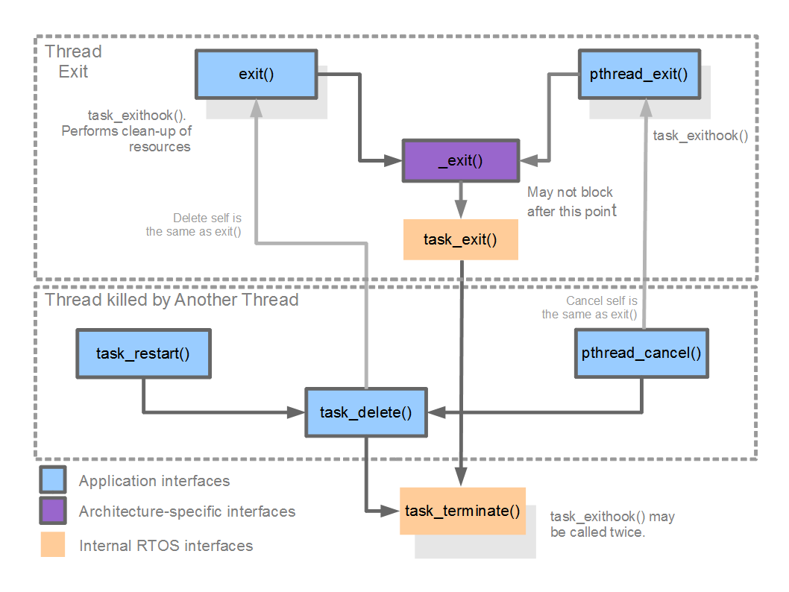

.. _nuttx-tasking:

=============
NuttX Tasking
=============

An RTOS as a library
====================

What is an RTOS? NuttX, as with all RTOSs, is a collection of various features
bundled as a library. It does not execute except when either:

1. The application calls into the NuttX library code, OR
2. An interrupt occurs.

There is no meaningful way to represent an architecture that is implemented
as a library of user managed functions with a diagram.
You can however, pick any subsystem of an RTOS and represent
that in some fashion.

Kernel Threads
==============

There are some RTOS functions that are implemented by internal threads,
for instance :ref:`kernel-threads-vs-pthreads`, :ref:`tasks-vs-threads`,
:ref:`kernel-modules`.

These are the threads the OS starts for itself.  Everything else running on
a NuttX system was started by an application.

.. list-table::
   :header-rows: 1
   :widths: 18 16 66

   * - Thread
     - Priority
     - What it is for
   * - ``Idle_Task``
     - 0
     - What runs when nothing else can.  It is not really created: the
       system boots into it, and its task control block is the statically
       allocated ``g_idletcb``, an array of ``CONFIG_SMP_NCPUS`` entries --
       so under ``CONFIG_SMP`` there is one idle thread per CPU, and CPU 0's
       is what starts the others.  The name differs there too: ``Idle_Task``
       is used only in a non-SMP build, while an SMP build names each one
       ``CPU0 IDLE``, ``CPU1 IDLE`` and so on.  Priority 0 is below anything
       a task can be given -- ``SCHED_PRIORITY_MIN`` is 1 -- so it never
       competes with real work, and the idle thread is the only one with
       both ``pid`` and ``sched_priority`` of 0.
   * - ``hpwork``
     - 224
     - The high priority work queue, enabled by ``CONFIG_SCHED_HPWORK``.
       This is where an interrupt handler sends work that has to happen soon
       but cannot happen in a handler.  The priority is high on purpose:
       work queued here is meant to run ahead of ordinary threads.
   * - ``lpwork``
     - 100
     - The low priority work queue, enabled by ``CONFIG_SCHED_LPWORK``.  For
       work that has to leave the handler but is not urgent, and for
       anything that might block for a while -- which is why a driver
       waiting on a bus uses this one rather than ``hpwork``.
   * - ``pgfill``
     - ``CONFIG_PAGING_DEFPRIO``
     - The page fill thread, started only with on-demand paging.  It reads
       in the pages that faulting threads are waiting for.  See
       :doc:`/os/memory/paging`.

Those names are the ones that show up in ``ps``, which makes them useful
when something is wrong: a system where ``lpwork`` is always running is
telling you that work is being queued faster than it is being drained.

Beyond these, a driver may start a thread of its own -- a sensor that polls,
a Bluetooth stack that needs somewhere to run its transmit path.  Those
belong to the driver rather than to the scheduler, and are documented with
it.

Last comes the thread the system exists for.  ``nx_bringup()`` starts the
application entry point -- ``CONFIG_INIT_ENTRYPOINT``, or a program named by
``CONFIG_INIT_FILEPATH`` -- as an ordinary task.  From there the OS is
running, and every thread after that one is the application's doing.

The Scheduler
=============

Schedulers and Operating Systems
--------------------------------

An operating system is a complete environment for developing applications.
One important component of an operating system is the scheduler.
That logic that controls when tasks or threads execute.

Actually, more than that; the scheduler really determines what a task
or a thread is! Most tiny operating systems are really not operating
“systems” in the sense of providing a complete operating environment.
Rather these tiny operating systems consist really only of a scheduler.
That is how important the scheduler is.

Task Control Block (TCB)
------------------------

In NuttX a thread is any controllable sequence of instruction execution
that has its own stack.
Each task is represented by a data structure called a task control block
or TCB. That data structure is defined in the header file
``include/nuttx/sched.h``.

Task Lists
----------

These TCBs are retained in lists.  The state of a task is indicated both by
the ``task_state`` field of the TCB and by a series of task lists, and the two
are tied together by ``g_tasklisttable[]``, built once at start-up by
``tasklist_initialize()`` in ``sched/init/nx_start.c``.  The table is indexed
by ``task_state``; each entry carries the list for that state plus attribute
bits saying whether it is prioritized, whether it is indexed by CPU, and
whether it holds running tasks.

Most of these lists are prioritized so that common list handling logic can be
used, but not all of them.  Three carry ``attr = 0`` in the table:
``g_inactivetasks``, ``g_waitingforsignal`` and ``g_stoppedtasks``.  A fourth
entry, ``TSTATE_TASK_INVALID``, has no list at all.

All new tasks start in an initial, non-running state:

.. code-block:: c

  dq_queue_t g_inactivetasks;

* This is the list of all tasks that have been initialized, but not yet
  activated.

* When the task is initialized, it is moved to a ready-to-run list.  Here are
  the ready-to-run threads:

.. code-block:: c

  dq_queue_t g_readytorun;

* This is the list of all tasks that are ready to run.  Without
  ``CONFIG_SMP``, the head of this list is the currently active task and the
  tail is always the idle task.  Under ``CONFIG_SMP`` its meaning narrows: it
  then holds only threads that are eligible to run but are **not** running and
  have not been assigned to a CPU, and the TCB running on CPU *n* is kept in
  ``g_assignedtasks[n]`` instead.

.. code-block:: c

  #ifndef CONFIG_SMP
  dq_queue_t g_pendingtasks;
  #endif

* This is the list of all tasks that are ready-to-run, but cannot be placed
  in the ``g_readytorun`` list because:

  1. They are higher priority than the currently active task at the head
     of the ``g_readytorun`` list, AND
  2. the currently active task has disabled pre-emption.

  These tasks stay in this holding list until pre-emption is again enabled, or
  until the currently active task voluntarily relinquishes the CPU.  The guard
  above is not decoration: there is no ``g_pendingtasks`` in an SMP build.

* Tasks in the ``g_readytorun`` list may become blocked.  Their TCB is then
  moved to whichever list ``g_tasklisttable[]`` names for the new state, and
  moved back to ``g_readytorun`` or ``g_pendingtasks`` once the thread is
  runnable again, depending on the priorities involved and on whether
  pre-emption is disabled.

Blocked threads are kept two different ways
~~~~~~~~~~~~~~~~~~~~~~~~~~~~~~~~~~~~~~~~~~~

This is where the table earns its keep, because blocked threads are not all
held in the same shape of list.  Three states have a global list of their own:

.. code-block:: c

  dq_queue_t g_waitingforsignal;   /* blocked waiting for a signal */

  #ifdef CONFIG_LEGACY_PAGING
  dq_queue_t g_waitingforfill;     /* blocked waiting for a page fill */
  #endif

  #ifdef CONFIG_SIG_SIGSTOP_ACTION
  dq_queue_t g_stoppedtasks;       /* stopped by SIGSTOP or SIGTSTP */
  #endif

The others have no global list at all.  Their queue lives *inside the object
being waited on*, and the table entry holds an offset into that object rather
than a pointer to a list:

.. code-block:: c

  tlist[TSTATE_WAIT_SEM].list = (FAR void *)offsetof(sem_t, waitlist);
  tlist[TSTATE_WAIT_SEM].attr = TLIST_ATTR_PRIORITIZED | TLIST_ATTR_OFFSET;

``TLIST_ATTR_OFFSET`` is the flag that marks the difference, and
``TLIST_HEAD()`` resolves it by adding the offset to the TCB's ``waitobj``
pointer.  Four states work this way:

* ``TSTATE_WAIT_SEM`` -- ``offsetof(sem_t, waitlist)``
* ``TSTATE_WAIT_EVENT`` -- ``offsetof(nxevent_t, waitlist)``, under
  ``CONFIG_SCHED_EVENTS``
* ``TSTATE_WAIT_MQNOTEMPTY`` and ``TSTATE_WAIT_MQNOTFULL`` --
  ``cmn.waitfornotempty`` and ``cmn.waitfornotfull`` inside
  ``struct mqueue_inode_s``, unless ``CONFIG_DISABLE_MQUEUE`` is set

So a semaphore carries its own queue of waiters, and releasing it reaches the
right thread by looking at the head of that queue rather than by scanning a
system-wide list.

One warning for anyone reading the source alongside this page:
``g_waitingforsemaphore``, ``g_waitingformqnotempty`` and
``g_waitingformqnotfull`` are **not** variables.  The first survives in three
comments and the other two in one comment each; none is declared anywhere.
Grepping for them finds the comments and no code.

Reference: ``sched/sched/sched.h`` for the declarations and the ``TLIST_*``
macros, and ``sched/init/nx_start.c`` for ``tasklist_initialize()``.

State Transition Diagram
========================

.. figure:: task_states.svg
   :align: center
   :width: 100%
   :alt: A task is created inactive, becomes ready to run, is given a CPU,
         may block waiting for a resource and return to ready, and finally
         exits.

   The values of ``task_state``, drawn as the states a thread moves
   through.  The lists above are the other half of the pair: this is what
   ``g_tasklisttable[]`` is indexed by.

Scheduling Policies
===================

Which of ``SCHED_FIFO``, ``SCHED_RR`` and ``SCHED_SPORADIC`` a thread runs
under decides only how threads of *equal* priority share the CPU.  The
policies, their parameters and when to choose each one are described in
:doc:`index`.

What matters here is where the decision lands in the data structures above:
the thread that runs is always the one whose TCB sits at the head of
``g_readytorun``, and a policy is no more than a rule for keeping that list
in the right order.

Task IDs
========

Each task is represented not only by a TCB but also by a numeric task ID.
Given a task ID, the RTOS can find the TCB.
Given a TCB, the RTOS can find the task ID.
So they are functionally equivalent.
Only the task ID, however, is exposed at the RTOS/application interfaces.

NuttX Tasks
===========

Processes vs. Threads
---------------------

In larger system OS such as BSD, Linux, or Windows you will often hear
the name process used to refer to threads managed by the OS.

A process is more than a thread as we have been discussing so far.
A process is a protected environment that hosts one or more threads.
By environment we mean the set of resources set aside by the OS but
in the case of the protected environment of the process we are specifically
referring its address space.

.. note::

  In order to implement the process' address space, the CPU must support
  a memory management unit (MMU).
  **The MMU is used to enforce the protected process environment.**

However, NuttX was designed to support the more resource constrained,
lower-end, deeply embedded MCUs. Those MCUs seldom have an MMU and,
as a consequence, can never support processes as are supported by BSD, Linux,
or Windows.

.. important:: NuttX does not support processes.

NuttX will support an MMU but it will not use the MMU to support processes.
NuttX operates only in a flat address space.
NuttX will use the MMU to control the instruction and data caches and
to support protected memory regions.
This may change in future, but this is how things are right now.

NuttX Tasks and Task Resources
------------------------------

All RTOSs support the notion of a task. A task is the RTOS's moral equivalent
of a process. Like a process, a task is a thread with an environment
associated with it.

This environment is like environment of the process but does not include
a private address space.
This environment is private and unique to a task.
Each task has its own environment.

This task environment consists of a number of resources
(as represented in the TCB). Of interest in this discussion are the following.
Note that any of these task resources may be disabled in the NuttX
configuration to reduce the NuttX memory footprint:

1. **Environment Variables**. This is the collection of variable assignments
   of the form: ``VARIABLE=VALUE``.

2. **File Descriptors**. A file descriptor is a task specific number
   that represents an open resource (a file or a device driver, for example).

3. **Sockets**. A socket descriptor is like a file descriptor, but
   the open resource in this case is a network socket.

4. **Streams**. Streams represent standard C buffered I/O.
   Streams wrap file descriptors or sockets to provide a new set of interface
   functions for dealing with the standard C I/O (like ``fprintf()``,
   ``fwrite()``, etc.).

In NuttX, a task is created using the interface ``task_create()``.

NuttX Task Exit Sequence
------------------------

   Task Exit Sequence diagram.

The Pseudo File System and Device Drivers
=========================================

A full discussion of the NuttX file system belongs elsewhere,
see :ref:`nuttx-filesystem` for more details.
But in order to talk about task resources, we also need to have
a little knowledge of the NuttX file system.

NuttX implements a Virtual Files System (VFS) that may be used to communicate
with a number of different entities via the standard ``open()``, ``close()``,
``read()``, ``write()``, etc, interfaces.
Like other VFSs, the NuttX VFS will support file system mount points,
files, directories, device drivers, etc.

Also, as with other VFSs, the NuttX file system will support
pseudo-file systems, that is, file systems that appear as normal media
but are really presented under programmatic control.
In Linux, for example, you have the ``/proc`` and the ``/sys``
psuedo-file systems.
There is no physical media underlying the pseudo-file system.

The NuttX root file system is always a psuedo-file system.
This is just the opposite from Linux. With Linux the root file system
must always be some physical block device (if only an initrd ram disk).
Then once you have mounted the physical root file system, you can mount
other file systems – including Linux pseudo-filesystems like ``/proc``
or ``/sys``.

With NuttX, the root file system is always
a pseudo-file system that does not require any underlying block driver
or physical device.
Then you can mount real filesystem in the pseudo-filesystem.

This arrangement makes life much easier for the tiny embedded world (but also
has a few limitations — like where you can mount file systems).

**NuttX interacts with devices via device drivers** – that is via software
that controls hardware and conforms to certain NuttX conventions
(see ``include/nuttx/fs/fs.h``). Device drivers are represented
by device nodes in the pseudo-file system.
By convention, these device nodes are created in the ``/dev`` directory.

Now that we have digressed a little to introduce the NuttX file system
and device nodes, we can return to our discussion of task resources.

``/dev/console`` and Standard Streams
-------------------------------------

There are three special cases of I/O: ``stdin``, ``stdout``, and ``stderr``.
These are type ``FILE*`` and correspond to file descriptors ``0``, ``1``,
and ``2`` respectively.
When the very first thread is created (called the IDLE thread),
the special device node ``/dev/console`` is opened. ``/dev/console`` provides
the ``stdin``, ``stdout``, and ``stderr`` for the initial task.

Inheritance of the Task Environment and I/O Redirection
=======================================================

When one task creates a new task, that new task inherits the task resources
of its parent. This includes all of the environment variables,
file descriptors, and sockets.

.. note::

  Task resources inheritance can be limited by special options
  in the NuttX configuration.

So, if nothing special is done, then every task will use ``/dev/console``
for the standard I/O. However, a task may close file descriptor
``0`` through ``2`` and open a new device for standard I/O.
Then any children tasks that are created will inherit that new re-directed
standard I/O as well.

This mechanism is used throughout NuttX.
For example in the THTTPD server to redirect socket I/O to standard I/O
for CGI tasks. In the Telnet server so that new tasks inherit the
Telnet session.

Tasks vs. Pthreads
==================

Systems like Linux also support POSIX pthreads.
In the Linux environment, the process is created with one thread running
in it. But by using interfaces like ``pthread_create()``, you can create
multiple threads that run and share the same process resources.

NuttX also supports POSIX pthreads and the NuttX pthreads also support
this behavior. That is, the NuttX POSIX pthreads also share the resources
of the parent task.

However, since NuttX does not support process address environments,
the difference is not so striking.
When a task creates a pthread, the newly create pthread will share
the environment variables, file descriptors, sockets, and streams
of the parent task.

.. note::

  Task resources are reference counted and will persist
  as long as a thread in the task group is still active.

See :ref:`tasks-vs-threads` for more details.

Process IDs / Task IDs / Pthread IDs
====================================

The term process ID is standard (usually abbreviated as pid) and used to
identify a task in NuttX. So, more technically, this number is a task ID
as was described above.
Pthreads are also described by a ``pthread_t`` ID.
In NuttX, the ``pthread_t`` ID is also the same task ID.
