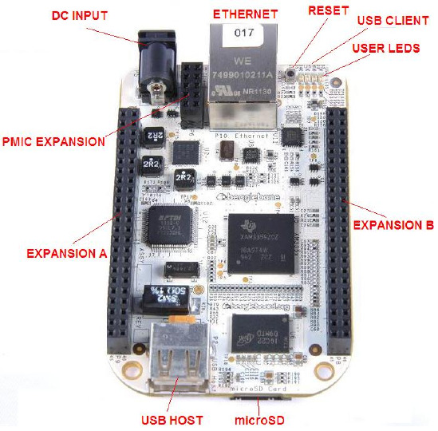

==========
BeagleBone
==========

.. tags:: arch:arm, chip:am335x

   The BeagleBone

This directory contains the port of NuttX to the original (white) BeagleBone.
See https://www.beagleboard.org/boards/beaglebone-original for more information.
This board is based around the TI AM335x Sitara Cortex-A8 CPU.

===================  =============================================================
ITEMS                DETAILS
===================  =============================================================
CPU                  720MHz ARM Cortex-A8
FPU                  NEON SIMD Coprocessor
I-Cache              32KB
D-Cache              32KB
L2 Cache             256KB L2 Cache with ECC
DRAM                 256MB DDR2
On-Chip SRAM         64KB
Dedicated SRAM       64KB
On-Chip Boot ROM     176KB
Onboard Storage      microSD card (TF) slot
Extension Interface  2.54mm Headers, 92 pins
Network interface    10/100Mbps RJ45
Power                5V, 1000mA
===================  =============================================================

Peripheral Support
==================

The following list indicates the state of peripherals' support in NuttX:

=========== ======= ====================
Peripheral  Support NOTES
=========== ======= ====================
ADC          No
Ethernet     No
CAN          No
DMA          No
GPIO         Yes
I2C          Yes
I2S          No
LED          Yes
SD           No
SPI          No
Timers       Yes
UART         Yes
USB Client   No
USB Host     No
Watchdog     Yes
=========== ======= ====================

Serial Console
==============

By default, the serial console will be provided on UART0 in all of these
configurations.

UART0 is available on the USB client port.

Booting NuttX from a microSD card
=================================

It is assumed that the microSD already boots to the U-Boot prompt.

These are the steps to run nuttx.bin from the microSD Card:

#. Configure and build the NuttX BeagleBone configuration.  You
   should have a file called nuttx.bin when the build completes.

#. Insert a microSD into the host PC.

#. Copy nuttx.bin into the microSD.

#. Remove the microSD from the host PC and insert into the BeagleBone
   microSD slot.

#. Connect a Mini-USB cable to the BeagleBone and open a serial
   terminal on the host PC to communicate with the target.

#. Reset and stop the BeagleBone boot.  You should see output from
   U-boot in the serial console.

#. Load NuttX into memory from the U-Boot prompt and run NuttX as shown
   below.

.. code-block:: console

  => load mmc 0 0x80300000 nuttx.bin
  414356 bytes read in 37 ms (10.7 MiB/s)
  => go 0x80300000
  ## Starting application at 0x80300000 ...

  NuttShell (NSH) NuttX-13.0.1-RC0
  nsh>

Configurations
==============

Information Common to All Configurations
----------------------------------------

Each BeagleBone configuration is maintained in a sub-directory and
can be selected as follow:

  *tools/configure.sh [OPTIONS] beaglebone:<subdir>*

Where [OPTIONS] include -l to configure for a Linux host platform.
-h will give you the list of all options.

Before building, make sure the PATH environment variable includes the
correct path to the directory that holds your toolchain binaries.

Build NuttX by typing the following:

  *make*

At the conclusion of the make, the nuttx binary will reside in an ELF file
called nuttx.

The ``<subdir>`` that is provided above as an argument to the tools/configure.sh
must be one of the following.

Configuration Sub-directories
-----------------------------

nsh
---

This configuration directory provides the NuttShell (NSH).

knsh
----

This is the kernel build configuration. User applications are included in the
final nuttx.bin image.

Steps to build the kernel image with userspace apps in ROMFS:

.. code-block:: console

   ./tools/configure.sh -l beaglebone/knsh
   make && make export
   pushd ../apps
   tools/mkimport.sh -z -x ../nuttx/nuttx-export-*.tar.gz
   make import
   cp -a bin /tmp
   tools/mkromfsimg.sh
   mv boot_romfsimg.h ../nuttx/boards/arm/am335x/beaglebone/include/bin_romfsimg.h
   popd
   make clean clean_context
   make

Run the nuttx.bin as previously described.

.. code-block:: console

   => load mmc 0 0x80300000 knsh.bin
   414356 bytes read in 41 ms (9.6 MiB/s)
   => go 0x80300000
   ## Starting application at 0x80300000 ...

   NuttShell (NSH) NuttX-13.0.1-RC0
   knsh> uname -a
   NuttX 13.0.1-RC0 3b7e453012-dirty Aug 17 2026 20:07:55 arm beaglebone
   knsh> ls /bin
   /bin:
    dd
    getprime
    hello
    init
    sh
   knsh> /bin/hello
   Hello, World!!
   knsh>
