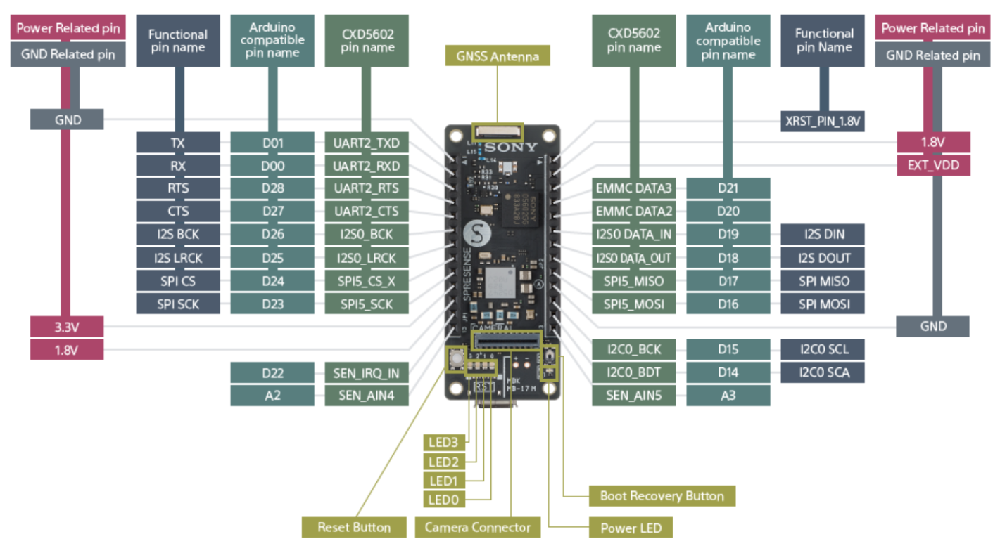
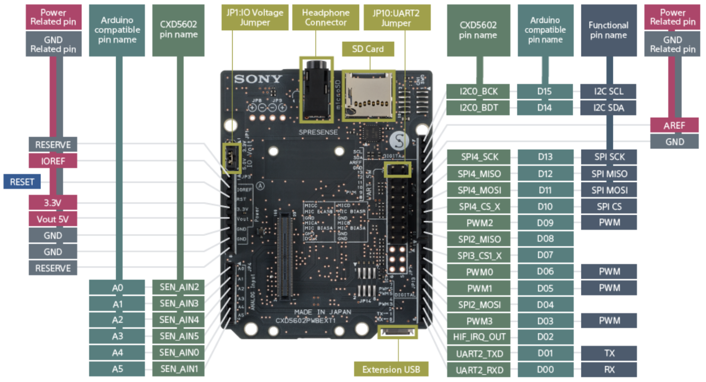
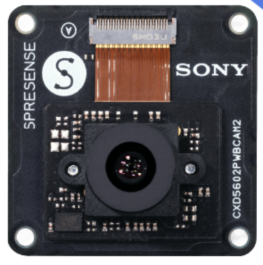

==============
Sony Spresense
==============

.. tags:: chip:cxd56xx, chip:cxd5602

The `Spresense <https://developer.sony.com/develop/spresense/>`_ is a compact
development board based on Sony's power-efficient multicore microcontroller
CXD5602. It allows developers to create IoT applications in a very short time
and is supported by the Arduino IDE as well as the more advanced NuttX based
SDK.

Key features:

- **Integrated GNSS**: the embedded GNSS with support for GPS, QZSS and
  GLONASS enables applications where tracking is required.
- **Hi-res audio output and multi mic inputs**: advanced 192 kHz/24 bit audio
  codec and amplifier for audio output, and support for up to 8 mic input
  channels.
- **Multicore microcontroller**: Spresense is powered by Sony's CXD5602
  microcontroller (ARM® Cortex®-M4F × 6 cores), with a clock speed of 156 MHz.

   Spresense main board pinout (functional, Arduino-compatible and CXD5602
   pin names)

Extension Board
===============

The Spresense extension board exposes the main board signals on an
Arduino-compatible header layout and adds a microSD card slot, a headphone
jack and multiple microphone inputs.

   Spresense extension (base) board pinout

Camera Board
============

The CXD5602PWBCAM2 camera board connects to the dedicated camera connector on
the main board and is supported by the ``video``/``imager`` drivers.

   Spresense camera board (CXD5602PWBCAM2)

Features
========

- Sony CXD5602 microcontroller (ARM® Cortex®-M4F × 6 cores @ 156 MHz)
- 8 MB SPI-Flash (main board), 1.5 MB SRAM
- Integrated GNSS (GPS, QZSS, GLONASS)
- Hi-res audio codec, up to 8 mic input channels
- Camera interface (CXD5602PWBCAM2 support)
- Arduino Uno compatible pin layout (via extension board)
- microSD card slot (via extension board)
- 4 user LEDs and Reset / Boot Recovery buttons

.. note::

   To run NuttX, the bootloader for Spresense SDK 2.1.0 or later must be
   installed on the board. See `Flashing the bootloader`_ below.

Serial Console
==============

The default serial console is **UART2**, exposed on the ``D00`` (RX) and
``D01`` (TX) Arduino-compatible pins and routed to the USB connector through
the on-board USB-to-serial bridge. It shows up on the host as
``/dev/ttyUSB0`` (Linux) or ``/dev/cu.SLAB_USBtoUART`` (macOS) at 115200 baud,
8N1.

Buttons and LEDs
================

The main board provides four user LEDs (``LED0`` .. ``LED3``), a power LED, a
Reset button and a Boot Recovery button. The user LEDs are available to
software through the standard NuttX user LED interface.

Flashing the bootloader
=======================

Before flashing any NuttX image, the Spresense loader/bootloader binaries must
be installed. Download the loader package matching your SDK version from the
`Spresense firmware download page
<https://developer.spresense.sony-semicon.com/downloads/main-board#firmware>`_
and flash **all** of its files at once with ``flash_writer.py``::

    ./tools/flash_writer.py -s -c /dev/ttyUSB0 -d -b 115200 -n \
        /path/to/spresense-binaries/*.espk \
        /path/to/spresense-binaries/*.spk

The ``-n`` (``--no-set-bootable``) option is used because these are loader
components, not the bootable application. The tool relies on the Python
``xmodem`` module (``pip install xmodem`` or ``apt install python3-xmodem``).

Building and Flashing
=====================

Once the bootloader is in place, configure, build and flash any of the
board configurations below. Replace ``<example>`` with the configuration
name you want (e.g. ``wifi``, ``smp``, ``elf``)::

    $ ./tools/configure.sh spresense:<example>
    $ make -j
    $ ./tools/flash_writer.py -s -c /dev/ttyUSB0 -d -b 115200 nuttx.spk

The resulting ``nuttx.spk`` is flashed **without** ``-n`` so it is marked as
the bootable application. Adjust ``/dev/ttyUSB0`` to match the serial port of
your board.

Configurations
==============

Each of the following can be selected as ``<example>`` in the
`Building and Flashing`_ step above.

audio
-----

Audio playback and capture using the CXD5602 on-chip audio subsystem
(``CONFIG_AUDIO_CXD56``).

audio_sdk
---------

Audio configuration using the SDK audio stack with microSD storage
(``CONFIG_AUDIO`` together with SDIO/MMCSD).

camera
------

Camera capture using the ISX012/ISX019 image sensors through the NuttX video
stream interface.

charger
-------

Battery charger example (``apps/examples/charger``) exercising the CXD5602
power-management/charger interface.

coremark
--------

EEMBC CoreMark CPU benchmark (``CONFIG_BENCHMARK_COREMARK``).

elf
---

Tests ``apps/examples/elf`` (loading and running ELF programs).

example_camera
--------------

Camera capture example with live preview on an attached LCD
(``apps/examples/camera``).

example_lcd
-----------

NX graphics demos (``nxdemo``, ``nxhello``, ``nxlines``) rendered on an
attached LCD.

fmsynth
-------

FM sound synthesizer example (``apps/examples/fmsynth``).

getprime
--------

``getprime`` timing/stress test (``apps/testing/getprime``).

lcd
---

LCD support together with a USB composite device (CDC/ACM + mass storage).

lte
---

LTE connectivity using the Spresense LTE extension board (Altair ALT1250
modem).

module
------

Tests ``apps/examples/module`` (loadable kernel modules).

mpy
---

Peripheral demonstration enabling the on-chip ADC, PWM, the camera interface
and microSD automount, started from the board ``spresense_main`` entry point.

nsh
---

Basic NuttShell (NSH) console over the serial port.

nsh_automount
-------------

NSH with automatic mounting of an inserted microSD card.

nsh_trace
---------

NSH with the system trace subsystem enabled for scheduler/syscall tracing.

ostest
------

Standard NuttX OS test suite (``apps/testing/ostest``).

posix_spawn
-----------

Tests ``apps/examples/posix_spawn``.

rndis
-----

USB RNDIS Ethernet gadget with networking examples (FTP client/server, web
server and tcpblaster).

rndis_composite
---------------

Same as ``rndis`` but exposed as part of a USB composite device.

rndis_smp
---------

Same as ``rndis`` but running in SMP mode across the CXD5602 cores.

smp
---

Runs Spresense in SMP (symmetric multiprocessing) mode.

usbmsc
------

USB Mass Storage device example, exposing a microSD card as a USB drive via a
composite (CDC/ACM + MSC) gadget.

usbnsh
------

NuttShell console over USB CDC/ACM instead of the physical UART.

wifi
----

This is a configuration for Spresense + Wi-Fi add-on (Telit GS2200M) module.
With this configuration you can either (1) connect Spresense to an existing
Wi-Fi access point (2.4 GHz 802.11b/g/n are supported) or (2) make Spresense
act as a Wi-Fi access point. In both cases you can log in to the Spresense over
telnet and access a web server (NOTE: for this you need an extension board with
a microSDHC card).

**(1) Station (STA) mode**

To run the module in Station mode (i.e. to connect to an existing Wi-Fi access
point), specify the SSID with its passcode::

    nsh> gs2200m ssid-to-connect passcode &

If the connection succeeded, an IP address is statically assigned::

    nsh> ifconfig
    wlan0   Link encap:Ethernet HWaddr 3c:95:09:00:69:92 at UP
    inet    addr:10.0.0.2 DRaddr:10.0.0.1 Mask:255.255.255.0

You can then run the DHCP client (``renew`` command) to obtain an IP address as
well as DNS server information. (NOTE: in the current configuration the DHCP
client on the GS2200M is disabled. If you enable the internal DHCP client you
cannot use the DNS client on NuttX)::

    nsh> renew wlan0 &
    renew [6:100]
    nsh> ifconfig
    wlan0   Link encap:Ethernet HWaddr 3c:95:09:00:69:92 at UP
    inet    addr:192.168.1.101 DRaddr:192.168.1.1 Mask:255.255.255.0

Now you can run ``telnetd`` and the web server on Spresense::

    nsh> telnetd &
    telnetd [7:100]
    nsh> webserver &
    webserver [9:100]
    nsh> Starting webserver

You can also run the NTP client to adjust the RTC on Spresense. (NOTE: this
assumes your network can reach pool.ntp.org, otherwise specify
``CONFIG_NETUTILS_NTPCLIENT_SERVER``)::

    nsh> date
    Jan 01 00:00:36 1970
    nsh> ntpcstart
    Started the NTP daemon as PID=11
    nsh> date
    Jul 30 06:42:13 2019

**(2) Access Point (AP) mode**

To run the module in AP mode, specify the SSID to advertise and a WPA2-PSK
passphrase or WEP key. (NOTE: in AP mode you can also specify the channel number
to use. Also, set ``CONFIG_WL_GS2200M_ENABLE_WEP=y`` if you want to use WEP
instead of WPA2-PSK)::

    nsh> gs2200m -a ssid-to-advertise 8-to-63-wpa2-psk-passphrase &
    or
    nsh> gs2200m -a ssid-to-advertise 10-hex-digits-wep-key &

If the module was initialized in AP mode, a new IP address is assigned::

    nsh> ifconfig
    wlan0   Link encap:Ethernet HWaddr 3c:95:09:00:69:93 at UP
    inet    addr:192.168.11.1 DRaddr:192.168.11.1 Mask:255.255.255.0

Now you can connect your PC to the AP with the above SSID and WPA2-PSK
passphrase or WEP key that you specified.

wifi_smp
--------

Same as `wifi`_ but running in SMP mode across the CXD5602 cores.
