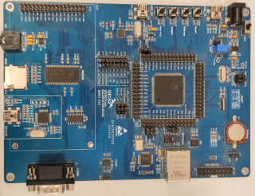

===============
gd32f470zk-eval
===============

The GD32F470Z-EVAL board is a hardware platform that enables prototyping
on GD32F470ZK Cortex-M4F Stretch Performance MCU.

The GD32F470ZK features a single-core ARM Cortex-M4F MCU which can run up
to 240 MHz with flash accesses zero wait states, 3072kiB of Flash, 256kiB
of SRAM and 114 GPIOs.

