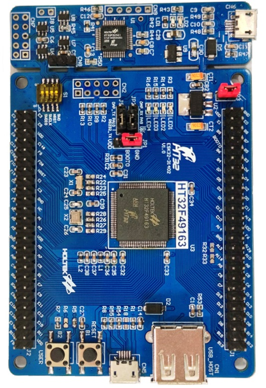

==================
ESK32 (HT32F49163)
==================

.. tags:: arch:arm, chip:ht32f491x3, chip:ht32f49163, vendor:holtek

The ESK32 is a development board based on the Holtek HT32F49163 MCU.
The current NuttX port targets the HT32F49163 device used on the
HT32F49163 development kit and focuses on a working serial-console NSH
configuration with basic board bring-up.

For additional hardware details, refer to Holtek's
`HT32F491x3 Starter Kit User Guide <https://www.holtek.com/webapi/106680/HT32F491x3_StarterKitUserManualv100.pdf>`_.

   HT32F491x3 Starter Kit board photo

Features
========

The current port provides:

* Holtek HT32F49163 MCU from the HT32F491x3 family
* ARM Cortex-M4 core with FPU support
* Boot and clock initialization for the ESK32 8 MHz external crystal
* System clock configured to 150 MHz
* USART1 serial console at 115200 8N1
* ``/bin`` mounted through ``binfs``
* ``/proc`` mounted through ``procfs``
* User LED registration through ``/dev/userleds``
* Basic internal GPIO helpers used by the console and LED support

The default ``esk32:nsh`` configuration also enables these built-in
applications:

* ``hello``
* ``ostest``
* ``dumpstack``
* ``leds``

Buttons and LEDs
================

Board LEDs
----------

Three user LEDs from the development kit are currently mapped by the board
port. They are active-low and are exposed through the standard NuttX
``USERLED`` interface and the ``/dev/userleds`` device.

===== =========== ==========
LED   Port/Pin    Notes
===== =========== ==========
LED2  PD13        Active-low
LED3  PD14        Active-low
LED4  PD15        Active-low
===== =========== ==========

The generic ``leds`` example from ``nuttx-apps`` can be used to validate the
LED interface.

Board Buttons
-------------

No button is currently exposed by the board port.

Pin Mapping
===========

The current port uses the following MCU pins:

===== ========== ==========
Pin   Signal     Notes
===== ========== ==========
PA9   USART1_TX  Default serial console TX
PA10  USART1_RX  Default serial console RX
PD13  LED2       User LED, active-low
PD14  LED3       User LED, active-low
PD15  LED4       User LED, active-low
===== ========== ==========

Flashing
========

The board directory includes a helper script for flashing through Holtek's
Windows OpenOCD package from a WSL-based development environment:

.. code-block:: console

   $ ./boards/arm/ht32f491x3/esk32/tools/flash.sh

The script expects:

* ``nuttx.bin`` already generated in the ``nuttx`` directory
* Holtek xPack OpenOCD installed under
  ``C:\Program Files (x86)\Holtek HT32 Series\HT32-IDE\xPack\xpack-openocd-0.11.0-4``
* an HT32-Link compatible debug connection
* Holtek xPack OpenOCD can be installed together with the HT32 IDE, available
  from Holtek's website: `Holtek Downloads <https://www.holtek.com/page/index>`_

Useful options:

.. code-block:: console

   $ ./boards/arm/ht32f491x3/esk32/tools/flash.sh --dry-run
   $ ./boards/arm/ht32f491x3/esk32/tools/flash.sh --device HT32F49163_100LQFP
   $ ./boards/arm/ht32f491x3/esk32/tools/flash.sh --openocd-root /mnt/c/path/to/openocd

Testing Notes
=============

The following commands are useful for validating the current port:

.. code-block:: console

   nsh> hello
   nsh> ostest
   nsh> dumpstack
   nsh> leds

When ``leds`` is executed, the example opens ``/dev/userleds`` and cycles
through the LED bitmasks supported by the board.

Current Limitations
===================

The current port is still intentionally small. In particular:

* only the ``nsh`` board configuration is maintained
* only USART1 routing is described by the board port
* LEDs are supported, but board buttons are not yet implemented
* internal GPIO helpers exist, but there is not yet a board-level ``/dev/gpio``
  test interface in this port

Configurations
==============

nsh
---

This is the currently maintained configuration for the board. It provides a
serial console with the NuttShell and mounts ``/bin`` and ``/proc`` during
board bring-up.

Configure and build it from the ``nuttx`` directory:

.. code-block:: console

   $ ./tools/configure.sh -l esk32:nsh
   $ make -j

After boot, a typical prompt looks like:

.. code-block:: console

   NuttShell (NSH) NuttX-12.x.x
   nsh> ls /
   /:
    bin/
    dev/
    proc/

And the built-in applications can be listed with:

.. code-block:: console

   nsh> ls /bin
   dd
   dumpstack
   hello
   leds
   nsh
   ostest
   sh
