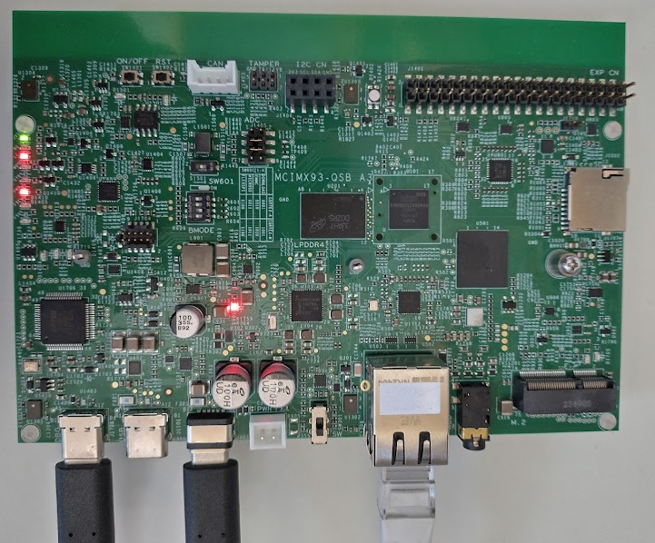
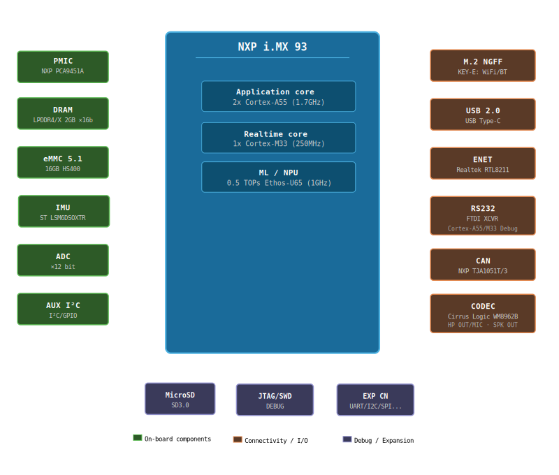

============
IMX93QSB-M33
============

.. tags:: arch:arm, arch:armv8m, arch:cm33, chip:imx93, vendor:nxp

The IMX93-QSB board is a platform made by NXP, designed to show the most commonly
used features of the `i.MX 93 applications processor <https://www.nxp.com/products/processors-and-microcontrollers/arm-processors/i-mx-applications-processors/i-mx-9-processors/i-mx-93-applications-processor-family-arm-cortex-a55-ml-acceleration-power-efficient-mpu:i.MX93>`_.

Be sure to visit the `IMX93QSB product page <https://www.nxp.com/design/design-center/development-boards-and-designs/IMX93QSB>`_.

   i.MX93-QSB board Layout

   i.MX93-QSB simplified block diagram

Features
========

- Multicore Processing [1]_
    - 2x Arm Cortex-A55
    - 1x Arm Cortex-M33
- Memory
    - On-Chip Memory
        - 256kB TCM (ITCM + DTCM)
        - 640kB OCRAM
    - External Memory
        - 2GB LPDDR4X
- Storage
        - 16GB eMMC
        - 1x Octal SPI, including support for SPI NOR and SPI NAND memories
        - µSDcard
- Connectivity
    - CAN FD
    - UART/USART
    - I²C
    - SPI
    - SAI
    - Ethernet
    - WiFi/BT (Through M2 module)
- On board peripherals
    - IMU (ST LSM6DSOXTR)
    - Audio CODEC (Cirrus WM8962B)

Note that by default the interfaces and peripherals are configured for use by the A55
core in Linux.

.. warning::

   Other than LPUART2 as console, as of today no other interfaces have been tested
   from the M33 core in NuttX.

.. [1] NuttX is supported on both cores. This port is for the M33. Look in
       ARM64 for the A55 port (targets a slightly different board, IMX93-EVK).

USB-to-UART bridge
==================

The "DBG" USB-C connector connects to an FTDI 4232 chip. It has four channels:

1. SWD/JTAG interface (OpenOCD)
2. I2C master
3. Debug UART for A55 core
4. Debug UART for M33 core (typically /dev/ttyUSB3)

Default settings for the debug UARTs are 115200 8N1.

Firmware Location
=================

Instruction Tightly Coupled Memory (ITCM)
-----------------------------------------

The Tightly-Coupled Memory (TCM) provides low-latency, deterministic access
without cache unpredictability. By default, firmware is located in ITCM
(128kB). This is the preferred location for real-time and latency-sensitive
workloads but gets full quite fast.

DDR
---

DDR memory can be used when the code or data footprint exceeds TCM capacity.
When running from DDR, the XCache (external cache) should be enabled to
achieve acceptable performance. The following adaptations are required on the
other core:

- imx-atf (Arm Trusted Firmware) - https://github.com/nxp-imx/imx-atf.git must
  grant the application M33 core access to the DDR region for code execution.

  The required change is in ``plat/imx/imx93/trdc_config.h``: for the ``MRC0`` DRAM entry
  belonging to the M33 (DID2), change the ``GLBAC`` index from 0 to 1 and the lock
  flag from true to false. This grants the M33 read/write access to the full DDR
  region using the permissive ``GLBAC1`` policy, matching the access configuration
  used by the A55 and other bus masters.

- Linux on A55 must reserve the DDR region in the device tree:

.. code:: devicetree

   / {
       reserved-memory {
           m33_reserved: m33@89000000 {
               no-map;
               reg = <0 0x89000000 0 0x1000000>;
           };
       };
   };
   &cm33 {
       memory-region = <&vdevbuffer>, <&vdev0vring0>, <&vdev0vring1>,
               <&vdev1vring0>, <&vdev1vring1>, <&rsc_table>, <&m33_reserved>;
   };

XCache
------

The i.MX93 Cortex-M33 can make use of the external cache (XCACHE) to improve
performance when executing from or accessing DDR memory. The ``nsh-ddr``
configuration enables XCACHE. Cache coherency with the A55 must be managed
carefully.

Installation
============

Except for the modifications documented here, the configurations should run from
the default Linux image as provided with the development kit.

It is highly advised to configure a yocto environment for development on the
Linux side of the i.MX93. More information on the NXP application notes and
manuals which you can find through the NXP iMX93 processor link above.

Building NuttX
==============

To configure and build NuttX you follow the standard NuttX flow:

.. code:: console

   $ cd nuttx
   $ tools/configure.sh imx93-qsb:rpmsg
   $ make

Board specific feature:
* ``CONFIG_IMX93_START_NSH_ON_RPMSG``: Start an extra NSH instance on a RPMSG UART

Launching
=========

The supported boot configuration is to boot the A55 first and from here
boot the auxiliary CPU (M33).

There are two supported options to start the NuttX image:

1. Use remoteproc in Linux
--------------------------

Copy the **ELF file** of the nuttx build (filename ``nuttx``) to
``/lib/firmware/rproc-imx-rproc-fw``, on the A55 core (Linux). This is
the default firmware name for this remoteproc. If using an alternative
name, be sure to enter this in ``/sys/class/remoteproc/remoteproc0/firmware``.

Then start the M33:

.. code:: console

   $ echo start > /sys/class/remoteproc/remoteproc0/state

2. From the bootloader
----------------------

Copy the **binary** file (``nuttx.bin``) to the boot partition in Linux,
typically this is ``/dev/mmcblk0p1``, but depends on the partitioning scheme.

In the bootloader, load the file and start the auxiliary CPU:

.. code:: console

   u-boot=> fatload mmc 0:1 0x89000000 nuttx.bin
   u-boot=> dcache flush
   u-boot=> bootaux 0x89000000

.. todo::

    Loading from the bootloader currently only works for DDR builds as the
    bootloader doesn't have access to ITCM by default. Also, the remoteproc
    initialisation in Linux fails when booting the A55 later.
    To be investigated.

Debugging
=========

Disable UART5 in the Linux devicetree for using the JTAG/SWD interface as there
is a pin conflict otherwise. You should also remove the M2 module from its slot.

In a devicetree overlay:

.. code:: devicetree

   &lpuart5 {
       /* BT */
       status = "disabled";
   };

The IMX93-QSB board provides a standard JTAG/SWD header for connecting an
external debug probe (e.g. J-Link or CMSIS-DAP) to debug the Cortex-M33 core.

For starting the J-Link gdb server:

.. code:: console

   $ JLinkGDBServer -device MIMX9322_M33 -if JTAG -speed 4000 -noir -rtos RTOSPlugin_NuttX.so

.. note::

   The default initialisation of JLink does not allow loading the ELF and starting the
   M33 when it is still in reset. Some CPU registers are not properly initialized. It is
   easiest to have remoteproc load and start the firmware first and only then connect the
   debugger. Loading the ELF through the debugger works afterwards.

The on-board debug interface can alternatively be used via the USB DEBUG connection
(see channel 1 above). In order for this to work, you need to set GPIO 4 (rc_sel) of the
I2C IO expander at address 0x21. This I2C bus can be accessed through the same
USB interface at channel 2. The ``enable_onboard_debug.py`` script in the ``tools``
directory accomplishes just that, using pyftdi.

Configurations
==============

Only a set of basic configurations are provided at this time. No IO's directly
connected to the M33, other than the debug UART, are tested as of today.

nsh
---

Very basic configuration which only spawns ``nsh`` on the debug serial port.
The firmware runs from ITCM. This configuration is focused on low-level,
command-line driver testing. Built-in applications are supported but none are
enabled by default.

nsh-ddr
-------

Identical to the ``nsh`` configuration but the firmware is linked to run from
DDR memory. The XCache (``CONFIG_ARCH_HAVE_XCACHE``) is enabled to compensate
for DDR latency. This configuration is useful when the firmware footprint
exceeds ITCM capacity.

.. note::

   See requirements for running from DDR above.

rpmsg
-----

Configures the NuttShell (nsh) running from ITCM and enables the Remote
Processor Messaging (RPMsg) service for heterogeneous inter-core communication
with the A55/Linux. A virtual UART (``CONFIG_RPMSG_UART_RAW``) is exposed over
RPMsg, allowing a terminal session to be opened from Linux. The physical UART
is still the main console and also hosts an NSH instance to help debugging.

After launching, simply open ``/dev/ttyRPMSG0`` on the Linux side:

.. code:: console

   $ minicom -D /dev/ttyRPMSG0
