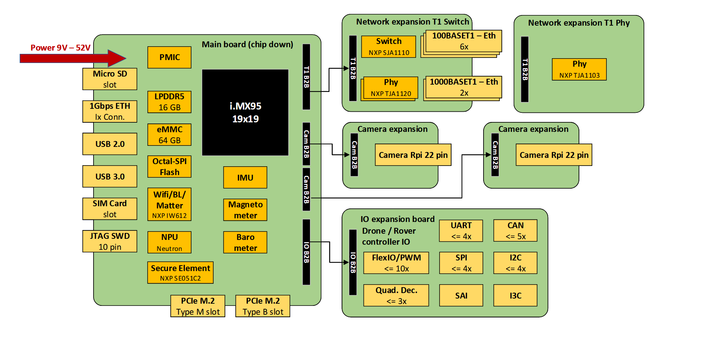

=========
MR-NAVQ95
=========

.. tags:: chip:imx9, chip:imx95, vendor:nxp

The `MR-NAVQ95 <https://github.com/NXP-Robotics/MR-NAVQ95>`_ is an open-source
development board designed for mobile robotics applications.
It is built around the `i.MX 95 automotive applications processor 
<https://www.nxp.com/products/iMX95>`_.
Its heterogeneous processing cores make it well-suited for running both 
real-time tasks and compute-intensive workloads.

Features
========

- Multicore Processing [1]_
    - 1x Arm Cortex-M7
    - 6x Arm Cortex-A55 multicore complex
    - 1x Arm Cortex-M33
- Memory
    - On-Chip Memory
        - 1376KiB SRAM (ECC)
    - External Memory
        - 16 GiB LPDDR5 (Up to 6.4GT/s, with Inline ECC & Inline Encryption)
        - 64 MiB MX25UM51345G (Octal SPI)

- Connectivity

    The MR-NAVQ95 is composed of a main board as its base and can be extended 
    with optional add-on modules.

.. [1] NuttX is currently supported exclusively on the Cortex-M7 core of the
       MR-NAVQ95

SD-card image
=============

The simplest way to run NuttX on the MR-NAVQ95's M7 core is to use the standard 
SD-card image. You can find the instructions for creating this image `here 
<https://github.com/NXP-Robotics/MR-NAVQ95>`_.

Serial Console
==============

By default the console is set to UART2.
The most convenient method to connect to the serial console is through the 
USB-C port on the I/O expansion board (J10).
The integrated FT2232HQ enables access to UART1 and UART2.
UART2 is additionally exposed on the main board at connector J2, which uses a 
JST-GH connector and therefore requires a special cable.

J-Link External Debug Probe
===========================

The MR-NAVQ95 board provides a 2x5-pin 1.27mm header
(J7) for connecting a JTAG debugger for debugging the i.MX95
processor.

PyOCD provides support for both the i.MX95's M33 and M7 cores. It also includes 
support for programming the MX25UM51345G external flash.

Firmware location
=================

Flash
-----

The external MX25UM51345G NOR flash on the MR_NAVQ95 is reserved for the M7 
firmware. In the standard SD-card image, the System Manager (M33) loads MCUBoot 
into ITCM.
After initialization, MCUBoot checks the external flash for a valid firmware 
image and, if one is found, executes it directly in place (XIP).
To allow MCUBoot to authenticate the firmware properly, the binary must include 
a valid MCUBoot header. This header can be added using the imgtool.py utility 
provided with MCUBoot.

Use the following commands to create the binary with header and to program it 
using pyocd:

.. code-block:: sh

    ./imgtool.py sign --version 1.0.0 --header-size 0x800\
        --slot-size 0x700000 --pad-header nuttx.bin\
        nuttx.mcuboot.bin

    pyocd flash -t mimx95_cm7_mx25um nuttx.mcuboot.bin

Instruction Tightly Coupled Memory (ITCM)
-----------------------------------------

The purpose of the Tightly-Coupled Memory (TCM) is to provide low-latency
memory that the processor can use without the unpredictability that is a
feature of caches. By default the firmware will be located in this area
(256K).

.. code-block:: sh

    pyocd flash -t mimx95_cm7 nuttx.bin

.. note::

    Please be aware that the standard SD-card uses the ITCM section to run 
    MCUboot

DDR
---

DDR memory can be used in case the code memory footprint becomes bigger than
the ITCM size. Using this configuration implies that other cores should be
aware of this.
The standard SD-card image for the MR-NAVQ95 allocates the 
0x90000000-0x90400000 memory region exclusively to the M7 core. The A55 
subsystem is configured to avoid this range.

Configurations
==============

nsh
---

Configures the NuttShell (nsh) located at examples/nsh.  This NSH
configuration is focused on low level, command-line driver testing. Built-in
applications are supported, but none are enabled. This configuration does not
support a network.

rpmsg
-----

This configuration is similar to nsh but in addition it offers the Remote
Processing Messaging (RPMsg) service to enable heterogeneous inter-core
communication. A virtual UART (CONFIG_RPMSG_UART) is made available on which
an OS running on the A55 cores can connect. There is also an option to use
the filesystem client feature in which a remote directory can be mounted to
a local directory (CONFIG_FS_RPMSGFS).

The default sd-card image has made the RPMsg UART driver and the RPMsg FS 
driver available who are compatible to NuttX.

