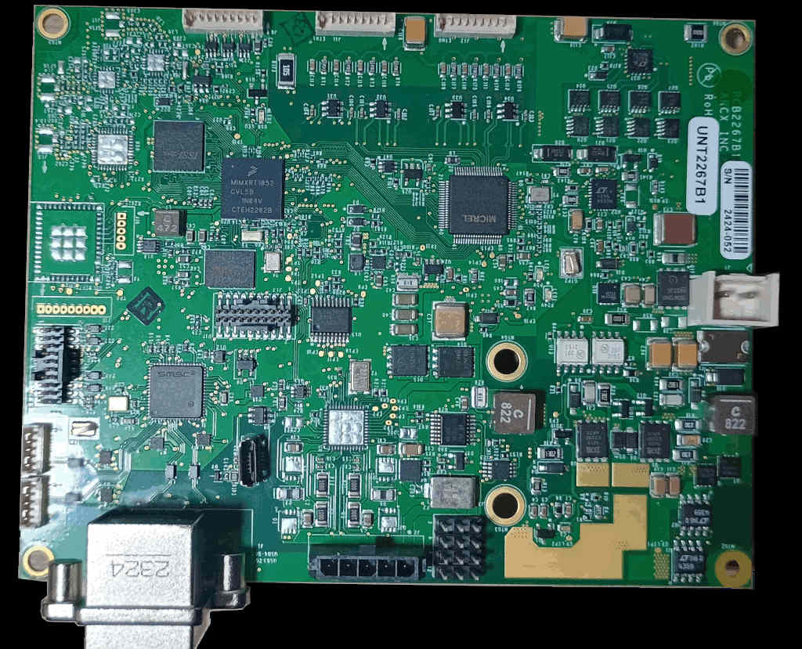

================
ARCX Socket Grid
================

The ARCX Socket Grid is an industrial board from ARCX. This boards uses the i.MX RT1052 crossover MCU with ARM Cortex M7 core.

Features
========

- Processor
    - MIMXRT1052DVL6A processor
- Memory
    - 256 Mb SDRAM memory
    - 512 Mb Hyper Flash
- Connectivity
    - USB host and OTG connectors
    - Ethernet (10/100T) connector
    - CAN transceivers
    - I/O-Link interfaces
    - 4-20mA interface
    - Sensors for voltage, current, temperature, etc

Serial Console
==============

The serial console is available through pins:

========= ============= ==========
UART1_TXD GPIO_AD_B0_12 LPUART1_TX
UART1_RXD GPIO_AD_B0_13 LPUART1_RX
========= ============= ==========

LEDs and buttons
================

LEDs
----

There are three LED status indicators located on the Board.  The
functions of these LEDs include:

==== =============
Pin  Description
==== =============
LED1  Power Supply
LED2  User LED
LED3  5V Power ON
==== =============

Only a single LED (LED2) is under software control.  It connects to
GPIO_AD_B0_08.

This LED is not used by the board port unless CONFIG_ARCH_LEDS is
defined.  In that case, the usage by the board port is defined in
include/board.h and src/imxrt_autoleds.c. The LED is used to encode
OS-related events as follows:

================ ======================= =====
SYMBOL           Meaning                 LED
================ ======================= =====
LED_STARTED      NuttX has been started  OFF
LED_HEAPALLOCATE Heap has been allocated OFF
LED_IRQSENABLED  Interrupts enabled      OFF
LED_STACKCREATED Idle stack created      ON
LED_INIRQ        In an interrupt         N/C
LED_SIGNAL       In a signal handler     N/C
LED_ASSERTION    An assertion failed     N/C
LED_PANIC        The system has crashed  FLASH
================ ======================= =====

Thus if the LED is statically on, NuttX has successfully  booted and is,
apparently, running normally.  If the LED is flashing at approximately
2Hz, then a fatal error has been detected and the system has halted.

Buttons
-------

There are no buttons in the Board:

Configurations
==============

nsh
---
    
Configures the NuttShell (nsh) located at examples/nsh.  This NSH
configuration is focused on low level, command-line driver testing.
Built-in applications are supported, but none are enabled.  This
configuration does not support a network.
