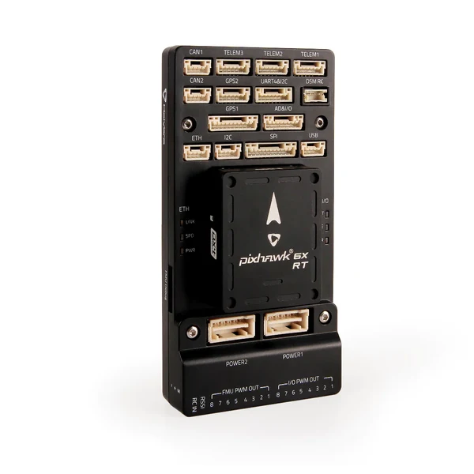

=====================
Holybro Pixhawk 6X-RT
=====================

.. tags:: chip:imxrt, chip:imxrt1176, vendor:holybro

   Holybro Pixhawk 6X-RT

The `Pixhawk 6X-RT <https://holybro.com/products/fmuv6x-rt-developer-edition>`_
is a flight controller from Holybro built to the Pixhawk FMUv6X-RT open
standard, using the i.MX RT1176 crossover MCU. This board port targets that
standard, so it also covers the
`NXP MR-VMU-RT1176 <https://www.nxp.com/design/design-center/development-boards-and-designs/VEHICLE-MANAGEMENT-UNIT>`_.

Features
========

* MIMXRT1176DVMAA, Cortex-M7 and Cortex-M4. This port clocks the M7 at 996 MHz
* 64 MB external QSPI flash, 2 MB RAM
* CAAM cryptographic accelerator with a hardware entropy source
* STM32F100 IO co-processor
* USB-C device connector
* 2 CAN buses, 100BASE-TX Ethernet, 16 PWM outputs
* Three IMUs on a vibration isolation system, two BMP388 barometers, BMM150 magnetometer
* microSD socket

Supported in NuttX: the CAAM entropy source through ``/dev/random`` and
``/dev/urandom``, LPUART, USB device and the FlexSPI boot path.

.. warning::

   The sensors, CAN, Ethernet and PWM outputs listed above are board features
   with no NuttX drivers in this port. Only the peripherals named as supported
   are wired up.

Buttons and LEDs
================

The board has no user buttons reachable from NuttX in this port. Its status
LEDs are driven by the flight stack rather than by board logic, and are not
used to signal NuttX state.

Serial Console
==============

LPUART1 is on the DEBUG connector at 57600 baud.

========== ================ ================
Pin        Signal           Notes
========== ================ ================
DEBUG TX   GPIO_DISP_B1_02  LPUART1_TX, ALT9
DEBUG RX   GPIO_DISP_B1_03  LPUART1_RX, ALT9
========== ================ ================

The ``nsh`` configuration uses the USB CDC/ACM console instead, so the DEBUG
connector is optional and a USB-C cable is enough.

Flash Layout
============

The board ships with the PX4 bootloader programmed at the base of QSPI flash.
It occupies the first 128 KB and starts the application at ``0x30020000``.
NuttX links to that address and is loaded by the bootloader rather than written
to the flash base.

=========== ============= ==========================
Address     Size          Contents
=========== ============= ==========================
0x30000000  128 KB        PX4 bootloader, as shipped
0x30020000  4 MB - 128 KB NuttX
=========== ============= ==========================

.. warning::

   Writing to the flash base removes the bootloader, and with it the ability to
   load firmware over USB. Recovering from that needs SWD.

Power Supply
============

The board is powered over USB-C for bench use, or from the vehicle power
module in flight. Nothing in this port manages power.

Installation
============

The toolchain is the same as for every i.MX RT board; see
:doc:`the platform page <../../index>`.

Flashing needs ``px_uploader.py`` from the PX4 source tree. The bootloader
enumerates as a USB CDC/ACM device for roughly five seconds after reset, so
start the uploader first and then reset the board:

.. code-block:: console

   $ python Tools/px_mkfw.py --prototype firmware.prototype --image nuttx.bin > nuttx.px4
   $ python Tools/px_uploader.py --port "/dev/serial/by-id/*PX4*" nuttx.px4

The uploader expects a ``.px4`` container rather than a raw binary.

Configurations
==============

nsh
---

The basic NuttShell configuration. The console is USB CDC/ACM, so the shell
appears on the same connector used for flashing, at ``/dev/ttyACM0`` on the
host. ``/dev/random`` and ``/dev/urandom`` are backed by the CAAM hardware
entropy source.
