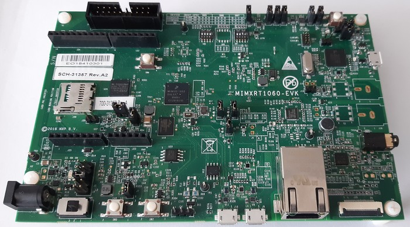

===============
i.MX RT1060 EVK
===============

`i.MX RT1060 EVK <https://www.nxp.com/design/development-boards/i-mx-evaluation-and-development-boards/mimxrt1060-evk-i-mx-rt1060-evaluation-kit:MIMXRT1060-EVK>`_
is an evaluation kit by NXP company. This kit uses the i.MX RT1060 crossover MCU with ARM Cortex M7 core.

   i.MX RT1060 EVK

Features
========

- Processor
    - MIMXRT1062DVL6A processor
- Memory
    - 1 Mb OCRAM memory
    - 256 Mb SDRAM memory
    - 512 Mb Hyper Flash - Populated but 0 ohm DNP
    - 64 Mb QSPI Flash
    - TF socket for SD card
- Display and Audio
    - Parallel LCD connector
    - Camera connector
    - Audio CODEC
    - 4-pole audio headphone jack
    - External speaker connection
    - Microphone
    - SPDIF connector
- Connectivity
    - Micro USB host and OTG connectors
    - Ethernet (10/100T) connector
    - CAN transceivers (including one CAN FD)
    - Arduino® interface
- Sensors
    - FXOS8700CQ 6-Axis Ecompass (3-Axis Mag, 3-Axis Accel)

Serial Console
==============

Virtual console port provided by OpenSDA:

========= ============= ==========
UART1_TXD GPIO_AD_B0_12 LPUART1_TX
UART1_RXD GPIO_AD_B0_13 LPUART1_RX
========= ============= ==========

Arduino RS-232 Shield:

=== == ======= ============= ==========
J22 D0 UART_RX GPIO_AD_B1_07 LPUART3_RX
J22 D1 UART_TX GPIO_AD_B1_06 LPUART3_TX
=== == ======= ============= ==========

LEDs and buttons
================

LEDs
----

There are four LED status indicators located on the EVK Board.  The
functions of these LEDs include:

=== ============
Pin Description
=== ============
D3  Power Supply
D18 User LED
D20 OpenSDA
D21 Reset LED
=== ============

Only a single LED, D18, is under software control.  It connects to
GPIO_AD_B0_09 which is shared with JTAG_TDI and ENET_RST

This LED is not used by the board port unless CONFIG_ARCH_LEDS is
defined.  In that case, the usage by the board port is defined in
include/board.h and src/imxrt_autoleds.c. The LED is used to encode
OS-related events as follows:

================ ======================= =====
SYMBOL           Meaning                 LED
================ ======================= =====
LED_STARTED      NuttX has been started  OFF
LED_HEAPALLOCATE Heap has been allocated OFF
LED_IRQSENABLED  Interrupts enabled      OFF
LED_STACKCREATED Idle stack created      ON
LED_INIRQ        In an interrupt         N/C
LED_SIGNAL       In a signal handler     N/C
LED_ASSERTION    An assertion failed     N/C
LED_PANIC        The system has crashed  FLASH
================ ======================= =====

Thus if the LED is statically on, NuttX has successfully  booted and is,
apparently, running normally.  If the LED is flashing at approximately
2Hz, then a fatal error has been detected and the system has halted.

Buttons
-------

There are five user interface switches on the MIMXRT1050 EVK Board:

  - SW1: Power Switch (slide switch fir power from J2)
  - SW2: ON/OFF Button
  - SW3: Power-on Reset button state forces to reset the system power except SNVS domain
  - SW9: Reset button
  - SW8: User button GPIO5-00

Only the user button is available to the software.  It is sensed on the
WAKEUP pin which will be pulled low when the button is pressed.

J-Link External Debug Probe
===========================

Install the J-Link Debug Host Tools and make sure they are in your search path.

Attach a J-Link 20-pin connector to J21. Check that jumpers J47 and J48 are
off (they are on by default when boards ship from the factory) to ensure SWD
signals are disconnected from the OpenSDA microcontroller.

Configurations
==============

can
---

This is an nsh configuration (see below) with added support of CAN driver.
FlexCAN3 is chosen as default, the change can be made at System type peripheral
selection. Please note that only FlexCAN3 and FlexCAN2 is available on this board.

Bitrate and sample point can be also changed at System type peripheral selection,
basic values are 1 MHz for bitrate and 0.80 for sample point. The FlexCAN driver
for imxrt runs at 80 MHz clock frequency.

The configuration also includes CAN utilities as candump and cansend.

canfd
-----

This is an nsh configuration (see below) with added support of CAN_FD driver.
FlexCAN3 is chosen as default, please note that only FlexCAN3 is capable of
providing CAN_FD support.

Bitrate and sample point can be also changed at System type peripheral selection,
basic values are 1 MHz for bitrate and 0.80 for sample point for arbitration phase
and 4 MHz (bitrate) and 0.90 (sample point) for data phase. The FlexCAN driver
for imxrt runs at 80 MHz clock frequency.

The configuration also includes CAN utilities as candump and cansend.

knsh
----

This is identical to the nsh configuration below except that NuttX
is built as a protected mode, monolithic module and the user applications
are built separately. For further information about compiling and
running this configuration please refer to imxrt1064-evk documentation.

netnsh
------

This configuration is similar to the nsh configuration except that is
has networking enabled, both IPv4 and IPv6.  This NSH configuration is
focused on network-related testing.

nsh
---
   
Configures the NuttShell (nsh) located at examples/nsh.  This NSH
configuration is focused on low level, command-line driver testing.
Built-in applications are supported, but none are enabled.  This
configuration does not support a network.

lvgl
----

Configures the Littlev graphic library (lvgl) demo located under
examples/lvgldemo. This configuration needs the optional LCD model
RK043FN02H-CT from NXP. The LCD panel comes with the integrated
capacitive touchscreen sensor FT5336GQQ connected to the LPI2C1 bus,
address 0x38. NuttX support such touchscreen device via the driver
ft5x06 (drivers/input/ft5x06.c). At the moment only the polling
method is available, the board features an interrupt line connected
to the touchscreen sensor IC.

IMXRT1060 MCU provides the integrated LCD driver.

The LCD panel features:
    - size 4.3"
    - resolution 480×272 RGB
    - backlight driver
    - dimensions [mm]: 105.5 (W) x 67.2(H) x 4.35(D) Max.

To run the lvgl demo please type "lvgldemo" at nsh prompt::

    nsh> lvgldemo
