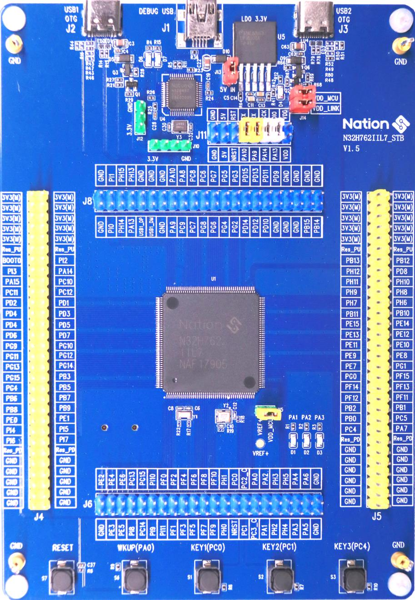

===========================
N32H762IIL7 Development Board
===========================

.. tags:: chip:n32h762, arch:armv7e-m, vendor:nations, usb, sdmmc, cordic

   N32H762IIL7 development board from Nations Technologies.

The N32H762IIL7 is a high-performance Cortex-M7 development board from Nations
Technologies, featuring a 600 MHz ARM Cortex-M7 core, 1.5 MB SRAM, and 2 MB
on-chip SIP Flash. It is designed for industrial control, IoT gateways, and
other compute-intensive applications.

Features
========

OsTest LogFile:

https://github.com/apache/nuttx/blob/17b96027359785bcb455342bfcaa900b46637540/arch/arm/src/n32h7/nuttx_test.log

The current NuttX BSP supports the following features:

- MCU: N32H762IIL7 (ARM Cortex-M7 @ 600 MHz)
- 1.5 MB SRAM (configurable as ITCM/DTCM/AXI SRAM)
- 2 MB SIP Flash (with cache limitations, see note)
- GPIO, EXTI, RCC, UART (console)
- TIM: timer, PWM, oneshot, tickless
- DMA (chained transfers)
- USBHS (Device and Host modes, external ULPI PHY required for HS)
- SDMMC (ADMA2 support)
- CORDIC hardware accelerator
- FLASH (MTD driver)
- UID

**Not yet supported:** ADC, DAC, I2C, SPI, ETH, CAN/FDCAN, RTC, WDT.

.. note::
   The SIP Flash on this chip does not work well with cache. For maximum
   performance, critical code should be placed in ITCM (zero-wait memory).

Buttons and LEDs
================

The board provides three user-controllable LEDs (Green, Blue, Red) and several
buttons.

- **LEDs**:
  - Green (LD1) - GPIO PA1
  - Blue (LD2)  - GPIO PA2
  - Red (LD3)   - GPIO PA3
  (All active high)

- **Buttons**:
  - Wakeup (B1) - GPIO PA0
  - Key1        - GPIO PC0
  - Key2        - GPIO PC1
  - Key3        - GPIO PC4
  (A high value when pressed)

Pin Mapping
===========

The following table lists the default pin assignments for the N32H762IIL7 board.
For a complete list, refer to `boards/arm/n32h7/n32h762iil7/include/board.h`.

===== ============ ===================================================
Pin   Signal       Function
===== ============ ===================================================
PA9   USART1_TX    Console output (default)
PA10  USART1_RX    Console input (default)
PA11  USBHS1_DM    USBHS1 data-
PA12  USBHS1_DP    USBHS1 data+
PB14  USBHS2_DM    USBHS2 data-
PB15  USBHS2_DP    USBHS2 data+
PD2   SDMMC1_CMD   SD card command
PC8   SDMMC1_D0    SD card data 0
PC9   SDMMC1_D1    SD card data 1
PC10  SDMMC1_D2    SD card data 2
PC11  SDMMC1_D3    SD card data 3
PC12  SDMMC1_CK    SD card clock
PC13  SDIO_NCD     Card detect (input, pull-up)
PC6   USBHS1_PWRON Power control for USBHS1 (output)
PD12  USBHS2_PWRON Power control for USBHS2 (output)
PE9   ATIM1_CH1    PWM channel 1 (TIM1)
PE11  ATIM1_CH2    PWM channel 2
PE13  ATIM1_CH3    PWM channel 3
PE14  ATIM1_CH4    PWM channel 4
PE5   GTIMB1_CH1   PWM channel 1 (TIMB1)
PE6   GTIMB1_CH2   PWM channel 2
PE0   GTIMB1_CH3   PWM channel 3
PE1   GTIMB1_CH4   PWM channel 4
PA6   GTIMA2_CH1   Capture input 1 (TIM2)
...   ...          ...
===== ============ ===================================================

Power Supply
============

The board can be powered via USB (5V) or an external DC supply. It includes an
on-board voltage regulator to generate 3.3V for the MCU and peripherals.

Installation
============

To build NuttX for this board, you will need the standard ARM GCC toolchain
(version 10.2 or later) or Clang (14+). Installation instructions are the same
as for other Cortex-M boards. For details, see the
:doc:`/quickstart/install` guide.

Building NuttX
==============

This board supports both the traditional Makefile build system and the newer
CMake/Ninja build system.

Makefile (GCC):
  .. code:: console

     $ cd nuttx
     $ ./tools/configure.sh n32h762iil7:nsh
     $ make -j$(nproc)

Makefile (Clang):
  .. code:: console

     $ ./tools/configure.sh n32h762iil7:nsh
     $ make menuconfig   # select Clang toolchain
     $ make -j$(nproc)

CMake/Ninja (GCC only):
  .. code:: console

     $ cd nuttx
     $ cmake -B build -DBOARD_CONFIG=n32h762iil7:nsh -G Ninja
     $ ninja -C build

The resulting image (`nuttx.bin` or `nuttx.elf`) can be found in the build
directory.

Flashing and Debugging
======================

The N32H762IIL7 can be programmed via JTAG/SWD using a debug probe.

**Supported debugger**: J-Link + Ozone (the J-Link patch must be obtained from
Nations Technologies or extracted from the vendor’s .pack file). Other probes
(e.g., ST-Link, CMSIS-DAP) are not currently supported.

The exact procedure depends on your J-Link configuration. Typically, you would
use Ozone to load the ELF file and flash it.

.. todo::
   Provide exact Ozone project settings if possible.

Configurations
==============

The board identifier for `tools/configure.sh` is `n32h762iil7`. Currently, only
one configuration is provided:

nsh
---

This configuration provides the NuttShell (NSH) over the USART1 console at
115200 baud. It includes **all currently supported drivers** and a selection of
example applications (CoreMark, ostest, sdbench, osperf, ramspeed, etc.). It is
the recommended starting point for evaluation.

  .. code:: console

     $ ./tools/configure.sh n32h762iil7:nsh
     $ make

.. note::
   Additional configurations (e.g., ``usb``, ``sdmmc``) may be added in the
   future as more peripherals are ported.

License Exceptions
==================

The N32H7 port is entirely original work and is licensed under the Apache 2.0
license, with no third-party proprietary code included.
